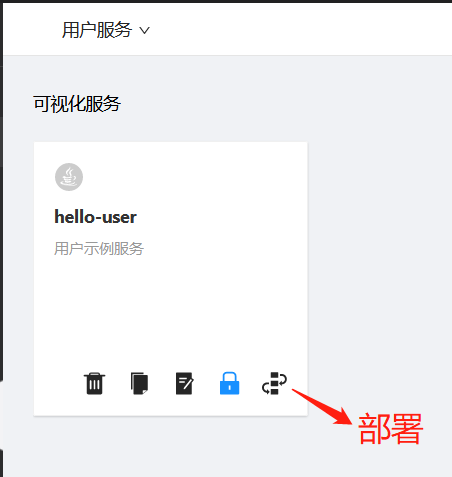
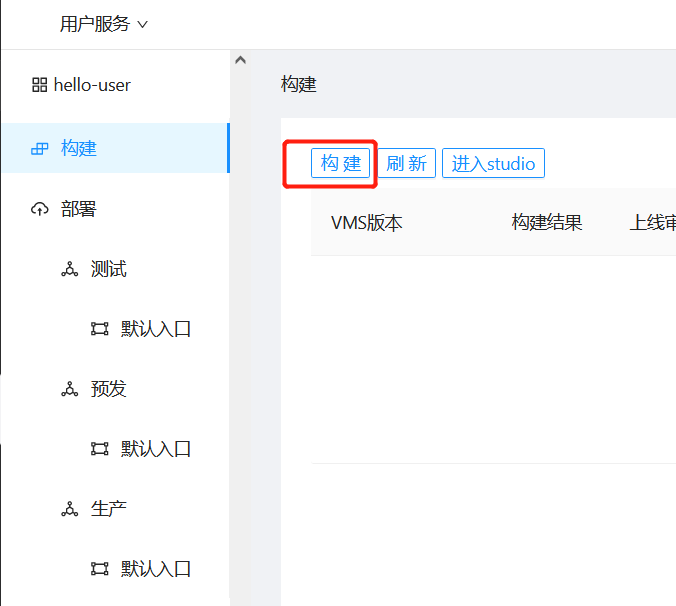
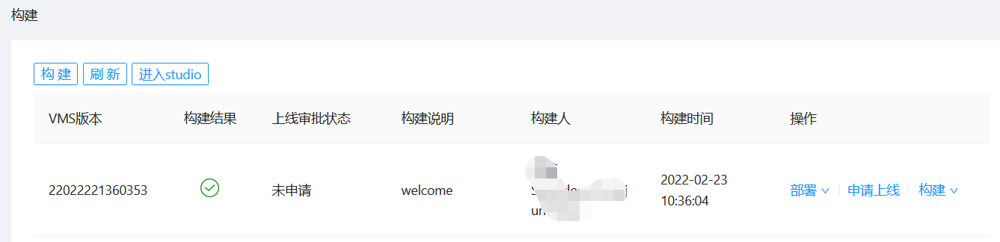
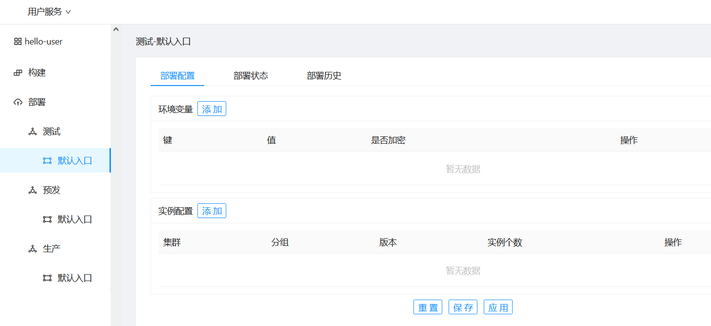
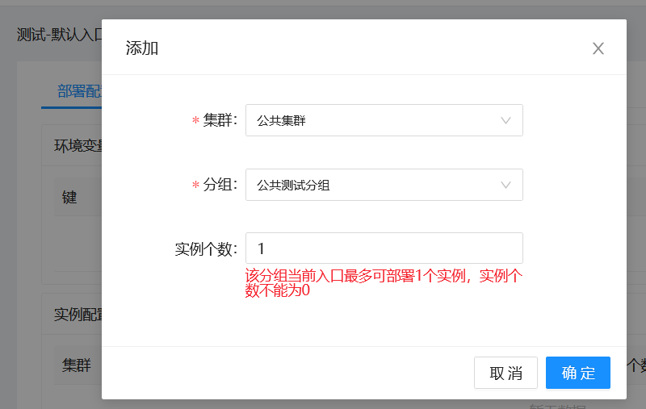
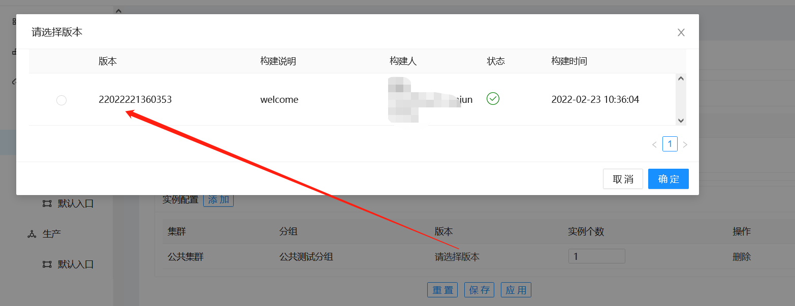
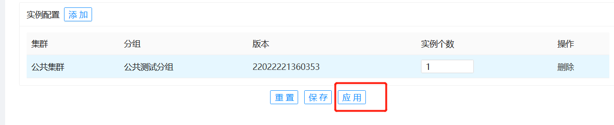
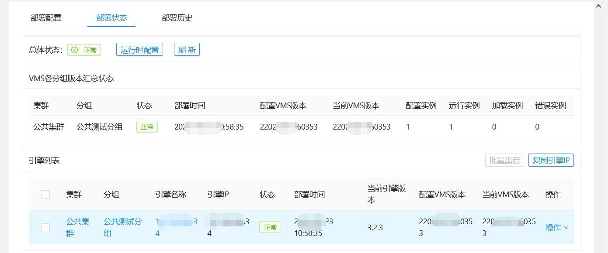
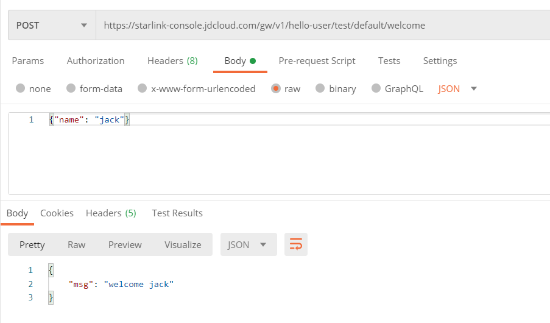

# 部署VMS

完成[开发VMS](Dev-VMS.md)后，回到星链控制台开始部署VMS，具体包括：

- 构建
- 部署配置
- 查看部署状态
- 访问服务

## 1. 构建

从VMS进入构建部署页，如下图所示：

点击部署后，出现构建和部署页面，点击构建，如下图所示：

构建完成后，如下图所示：

## 2. 部署配置
开始配置部署，以测试环境为例（部署预发和测试，如下图所示：

添加实例配置项，如下图所示：

点击确定后，配置要部署的构建版本，如下图所示：

配置好实例和版本后，点击应用，即可部署，如下图所示：

## 3. 查看部署状态

应用配置后，查看部署状态，如下图所示：

总体状态显示为`正常`，就可以访问服务了。

## 4. 访问服务

HTTP服务目前只支持POST方法，使用Postman工具访问HTTP服务，如下图所示：

响应符合预期。

### 相关入门指南

- [新建团队](Create-Team.md)
- [新建VMS](Create-VMS.md)
- [开发VMS](Dev-VMS.md)