# 开发VMS

完成[新建VMS](Create-VMS.md)后，点击开发VMS，打开一个新的窗口，显示星链Studio，如下图所示：

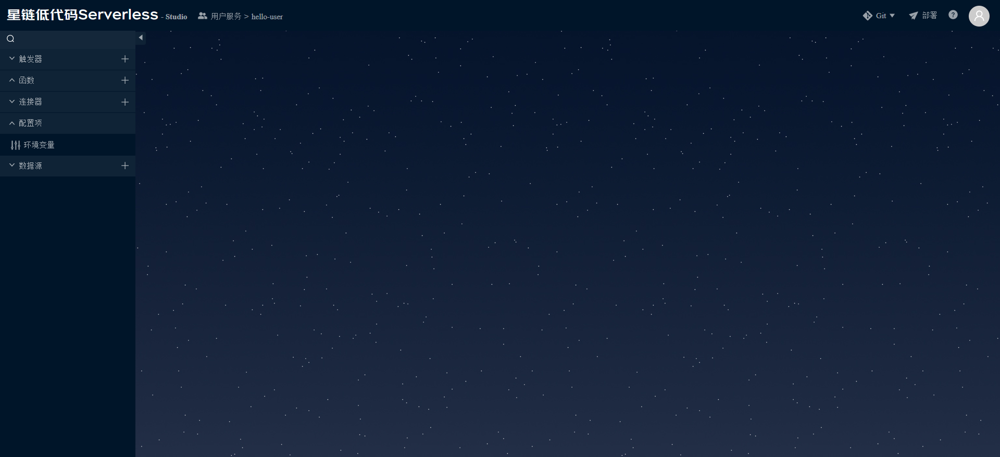

本节创建一个简单的Hello World HTTP服务，使用BPMN函数，包括如下步骤：

1. 创建BPMN函数
2. 调试BPMN函数
3. 配置HTTP触发器
4. 提交Git 

## 1. 创建BPMN函数

创建一个简单的BPMN函数，如下图所示：

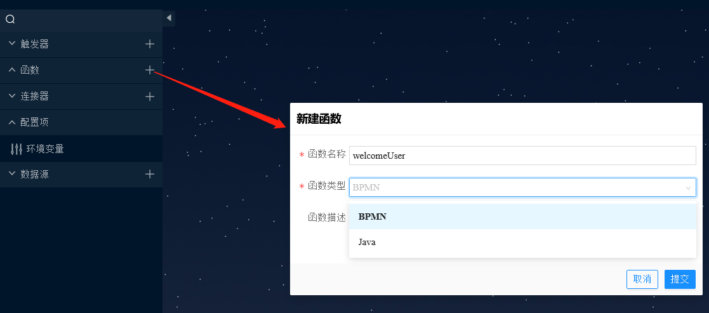

函数名称为：`welcomeUser`，类型为：BPMN。

创建后，打开BPMN面板，如下图所示：

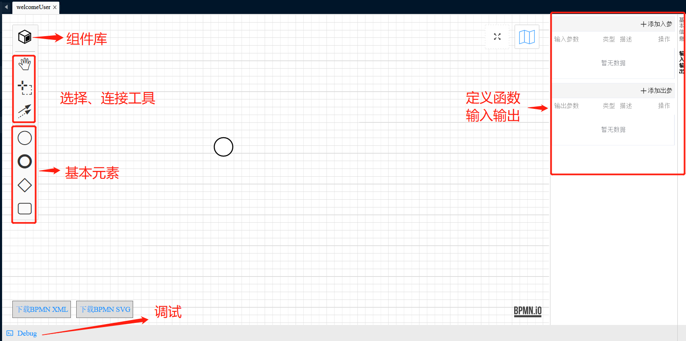

BPMN面板中包含如下要素：
- 左侧工具栏，具体包含：
    * 组件库：可以浏览和搜索团队和公共组件
    * 选择和连接工具
    * 基本元素：包括开始、结束、条件网关、任务节点
- 右侧面板：包含函数基本信息和输入、输出定义，点击某一个节点后，还会出现节点的属性面板
- 底部工具栏：主要是调试

定义BPMN函数的输入、输出，新增输入参数`name`，输出参数`msg`，如下图所示：

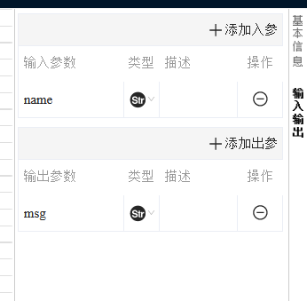

点击开始节点，弹出可选的操作，如下图所示：

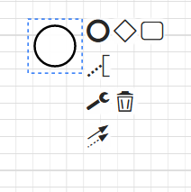

添加结束节点，点击结束节点，显示节点的属性面板，如下图所示：

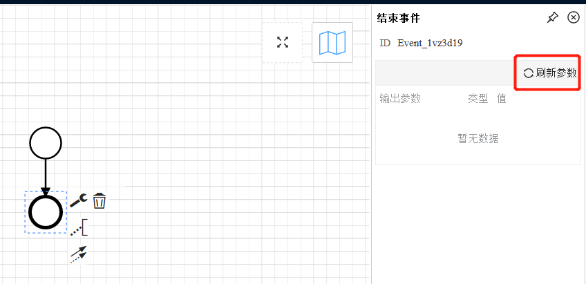

点击属性面板中的“刷新参数”，这将同步BPMN函数定义的输出结构，点击后，将显示参数`msg`，定义`msg`的输出值为一个固定值加上请求参数，这是使用表达式编辑器，如下图所示：

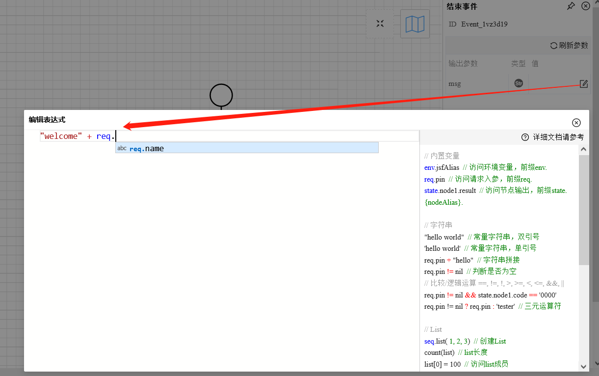

`req`是内置变量，`req.name`表示`name`请求参数的值。

这样，最基本的编排就完成，现在开始调试。

## 2. 调试BPMN函数

点击调试，展开调试工具栏，输入执行参数，使用JSON格式：`{"name": "zhangsan"}`，如下图所示：

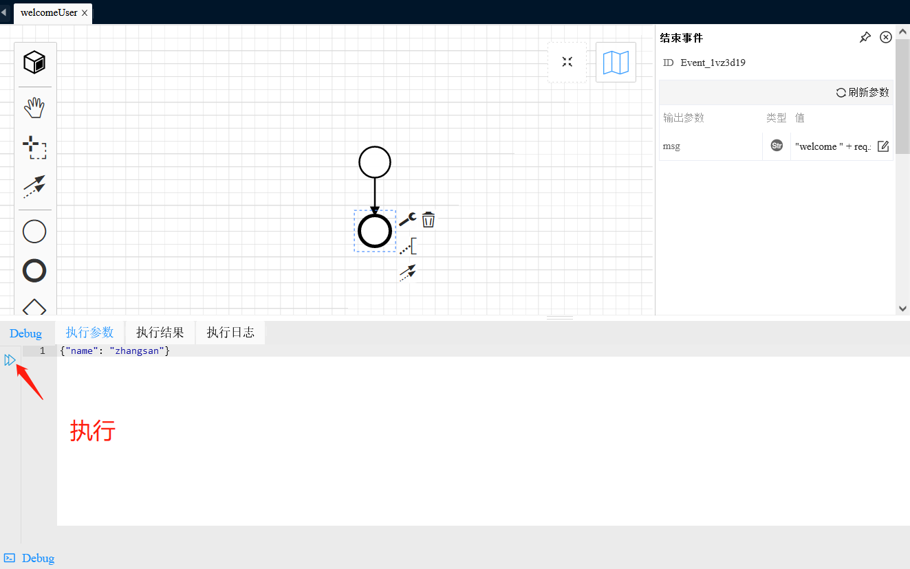

点击执行，执行结果如下：

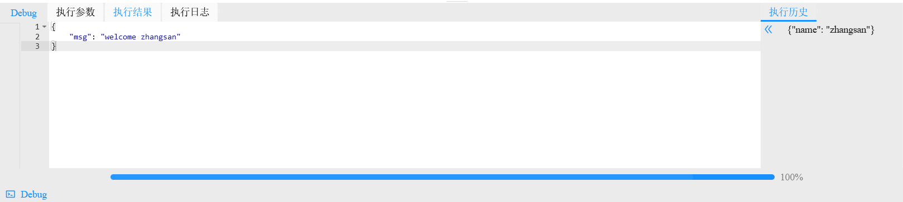

执行结果符合预期，接下来，把这个函数暴露为一个HTTP服务。

## 3. 配置HTTP触发器

新建HTTP触发器，如下图所示：

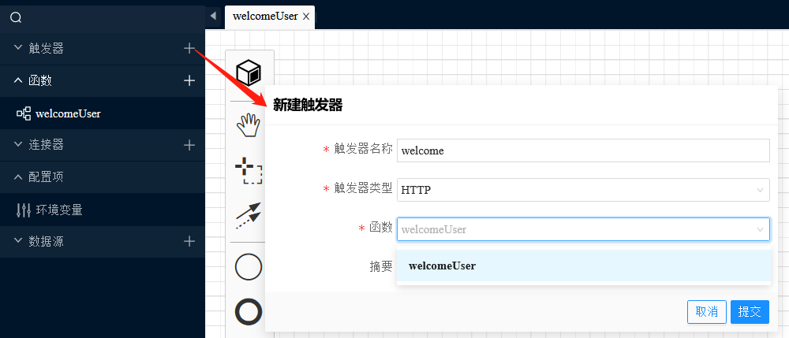

触发器类型选择HTTP，函数选择刚刚创建的函数。创建完成后，显示触发器详情，如下图所示：

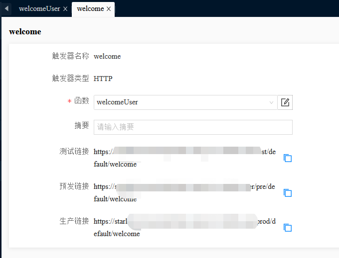

星链为每个环境（测试、预发、生产）生成了URL，在对应环境部署后，即可通过该URL访问函数。需要说明的是，目前请求只支持POST方法，请求和响应格式都是JSON。

在VMS开发过程中，星链实时保存更改到远程工作区，但构建前，需要提交工作区修改至Git仓库。

## 4. 提交Git

Studio右上角有Git操作，如下图所示：

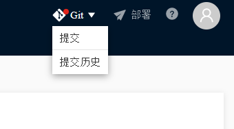

点击提交，输入提交消息，如下图所示：

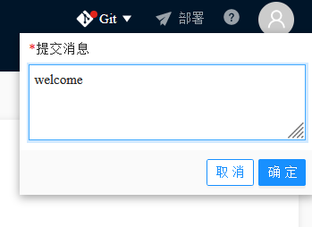

提交后，开始[部署VMS](Deploy-VMS.md)。

### 相关入门指南

- [新建团队](Create-Team.md)
- [新建VMS](Create-VMS.md)
- [部署VMS](Deploy-VMS.md)