# 部署

## 概述

点击 "可视化微服务"  - “部署按钮”
 

目前支持 测试、预发、生产，三个环境，如下图。
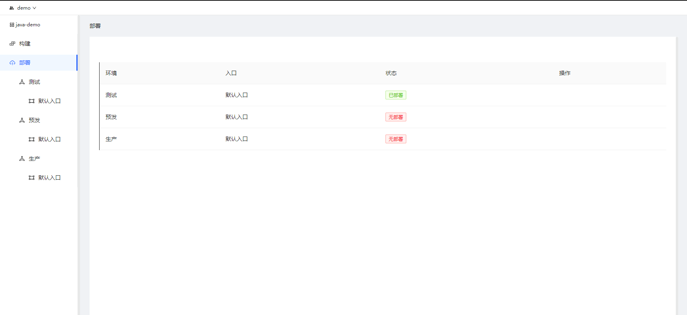

VMS部署，借鉴了K8S声明式部署模式，使用习惯上与大家熟悉的部署工具略有不同。

部署流程如下：

1.  发布版本构建。
2.  申请上线，生产环境只能看到审核通过的版本，需发起上线申请。
3.  部署配置，声明期望的部署状态。
4.  监控部署状态。

## 部署

### 部署VMS

以下是部署测试环境的说明，预发环境、生产环境部署方式相同。

>   测试环境、预发环境，构建成功即可部署。
>
>   生产环境，只能部署审批通过的版本。

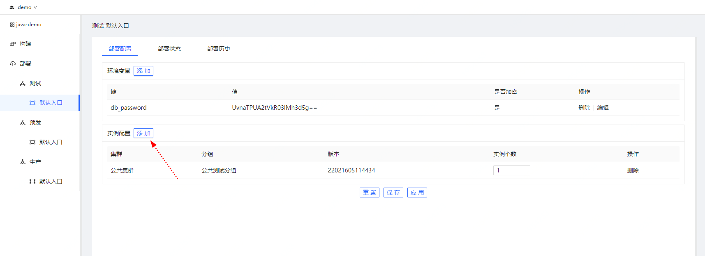

#### 环境变量

应用部署的时候，通常需要为不同的环境设置不同的参数，例如：数据库密码、token等。

>   注意事项:
>
>   -   这里设置的环境变量会覆盖studio里设置的同名环境变量。

如下图，单击“添加”按钮，可以为当前环境设置一个环境变量。

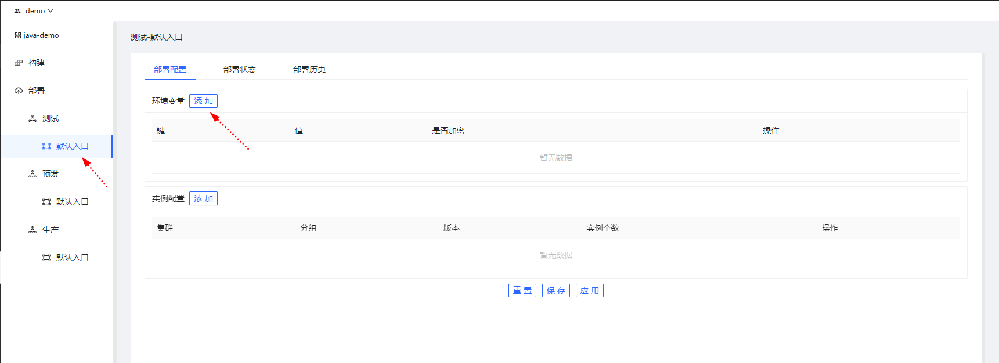

单击"添加"按钮弹出如下视图。
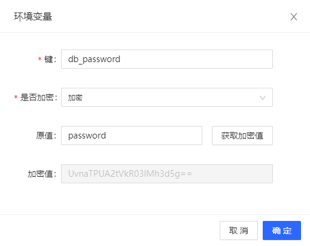

说明：

-   键

​		环境变量的key

-   是否加密

​		数据库密码等重要信息，可以选择加密，系统只会存储、传输加密的字符串。

-   原值

​		如果不加密，系统使用这个值。

-   加密值

​		输入原值后，单击“获取加密值”，系统将原值加密，生成密钥。

​		如果选择加密环境变量，系统使用加密值。

#### 部署配置

VMS部署需要设置3个内容：

1.   部署在哪里？
2.   部署vms的那个版本
3.   vms部署多少实例

设置好以上内容，单击"应用",引擎会按要求调度资源部署VMS，您可以在部署状态里查看是否部署成功。

**1、部署在哪里？**

单击"添加"按钮，弹出如下界面，可以选择部署在那个集群，部署几个实例。
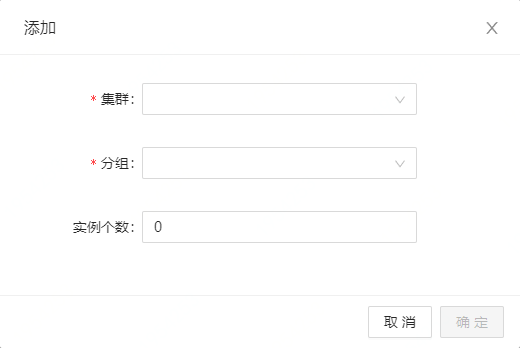

**2、部署那个版本**
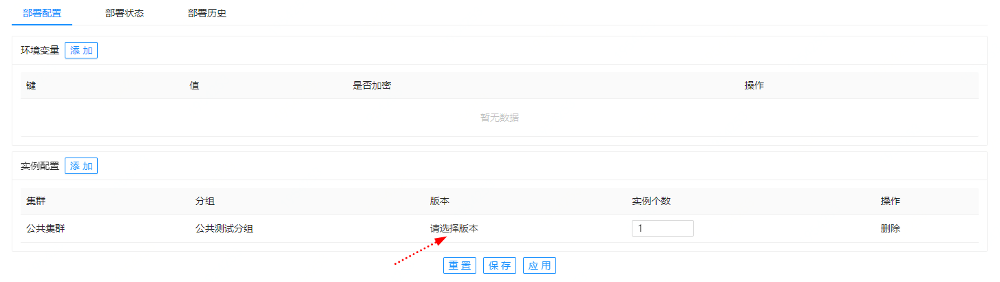

单击"请选择版本"，弹出如下界面，可以选择部署的VMS版本。

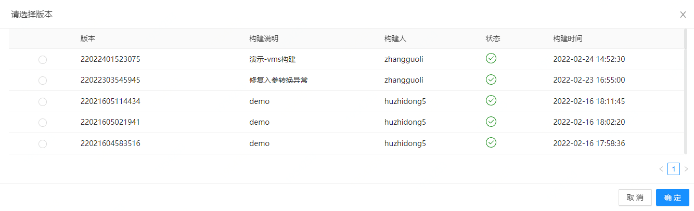

### 部署状态

单击"部署状态"，可以查看本次发布是否成功。
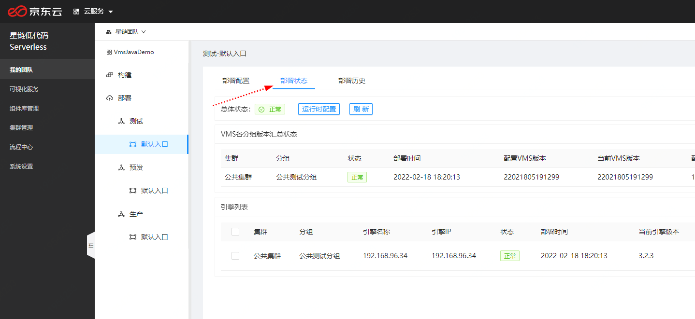

#### 部署成功
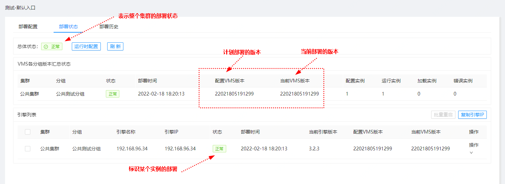

#### 部署异常
部署失败
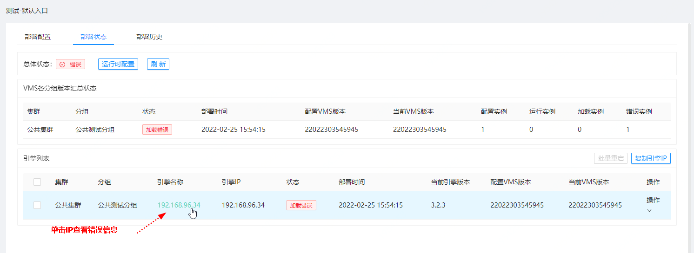

部署失败，异常日志
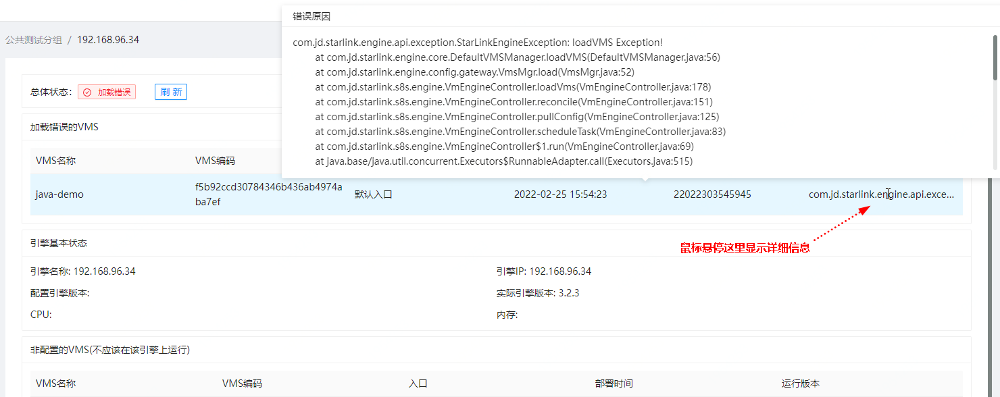

### 发布新版本

如下图，单击版本号，选择刚构建的版本。

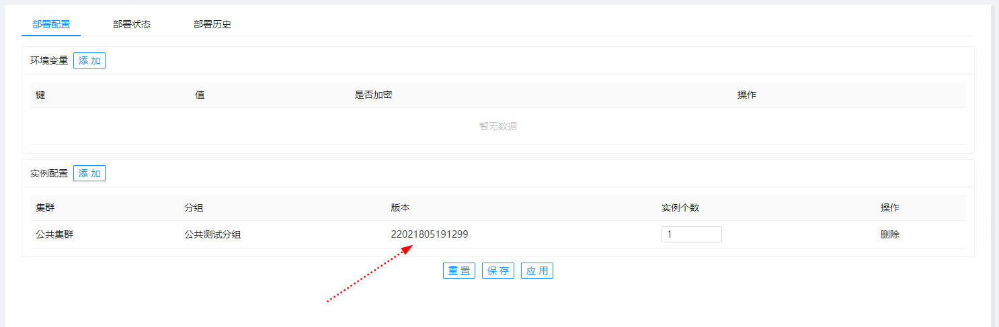

### 扩容/缩容
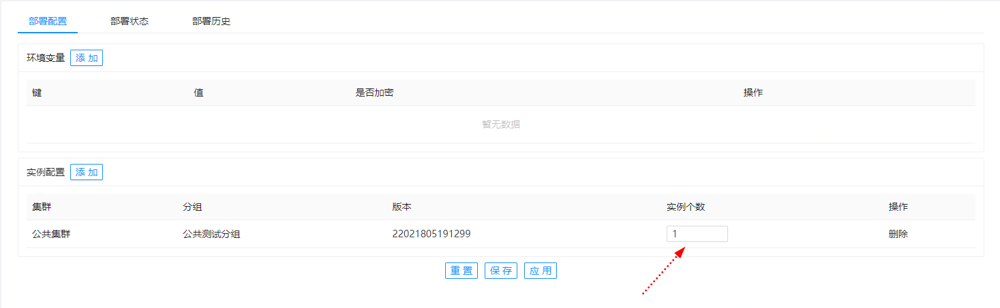

### 日志
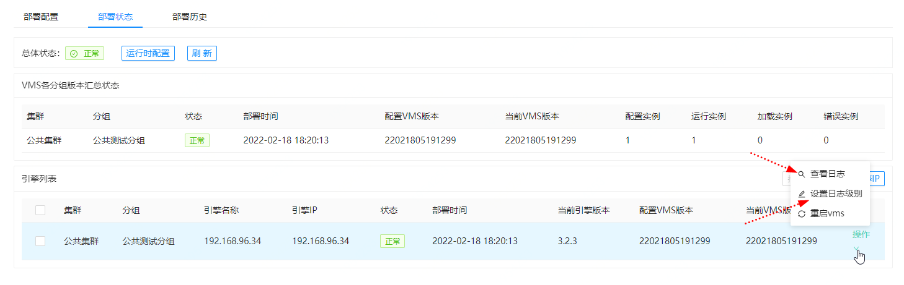

**查看部署日志**
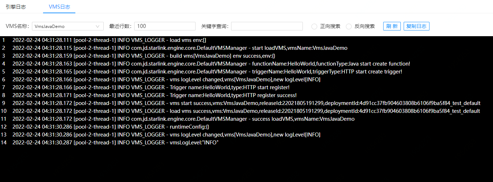

**设置日志级别**
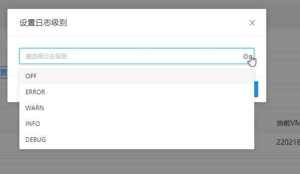