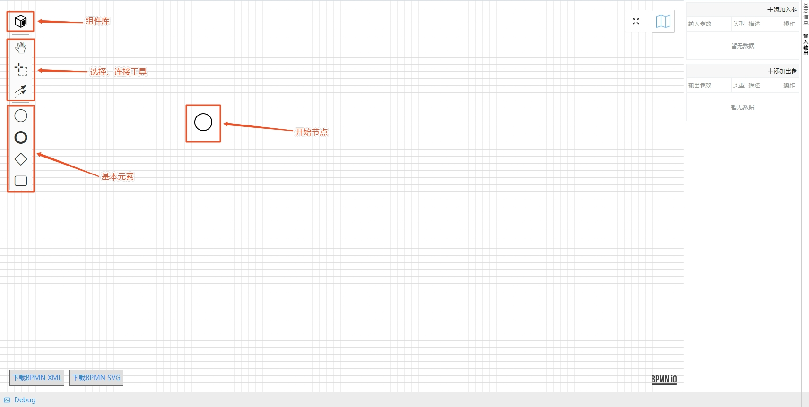
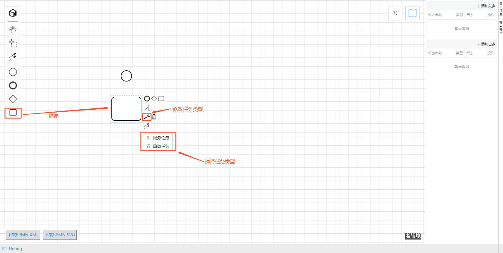
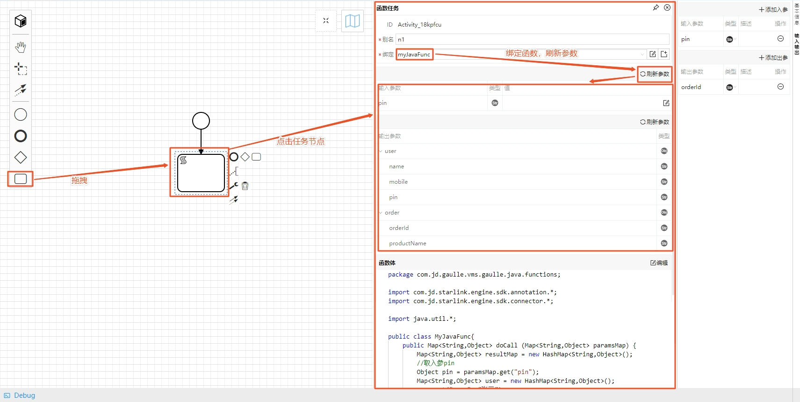
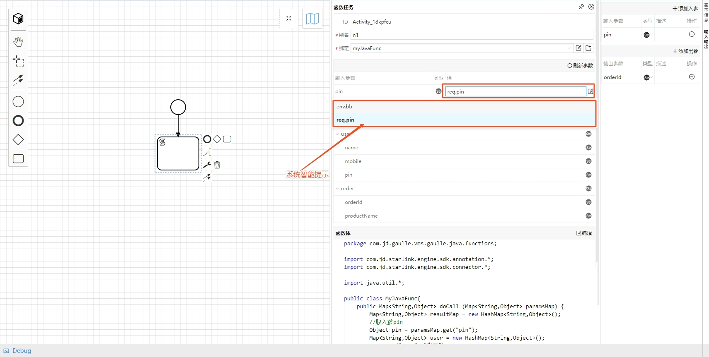
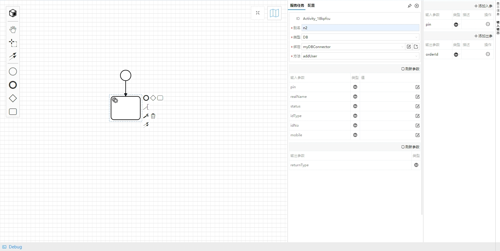
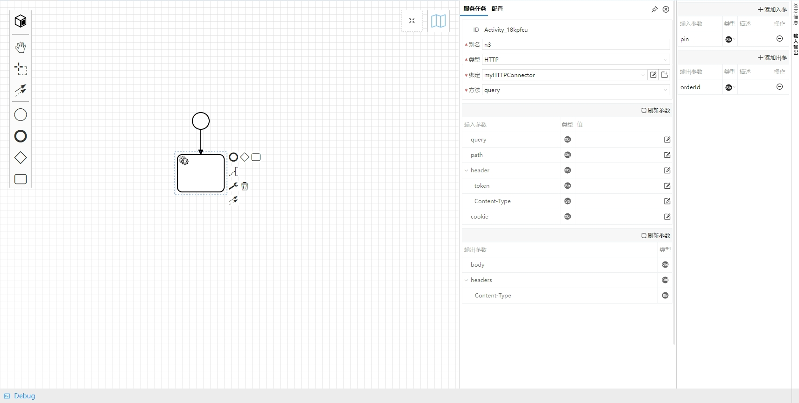
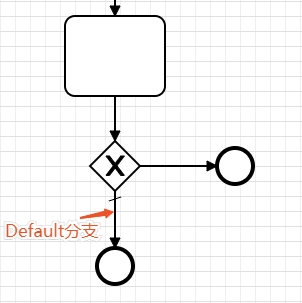
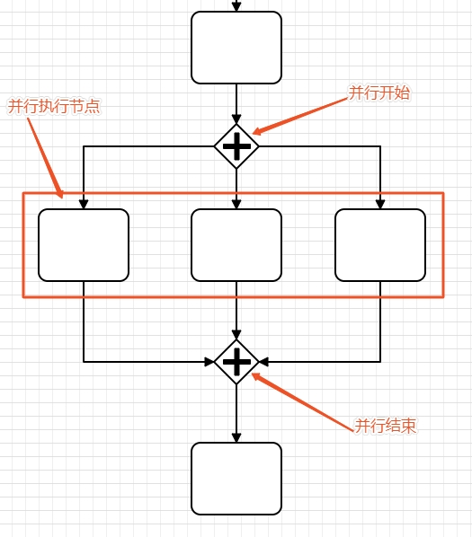
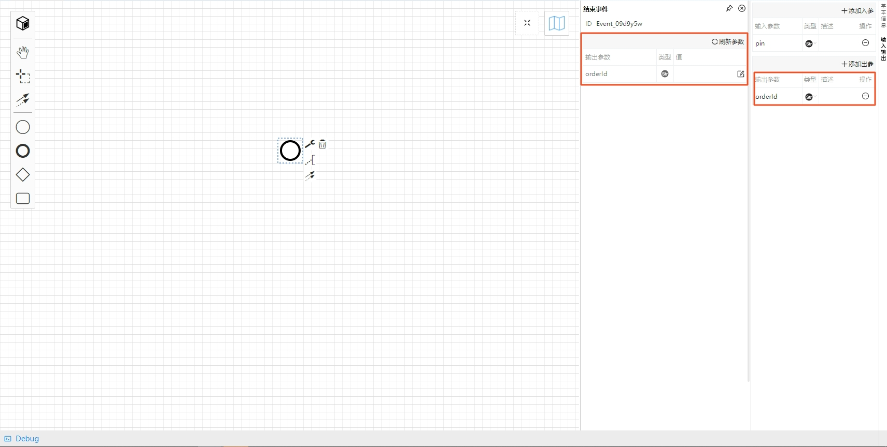
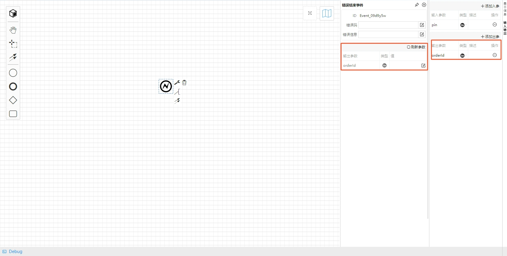

# BPMN流程编排
BPMN函数可以快速方便地进行服务编排，编排的服务可以是函数、连接器等。BPMN函数与Java、JavaScript、Groovy函数的主要区别仅仅在于BPMN函数编辑页对应的是BPMN画布，而其他函数则是一段代码。  
BPMN画布主要包含如下元素：

> - 基本元素：开始节点、任务节点、网关节点、结束节点
> - 选择、连接工具
> - 组件库

## 开始节点
每一个BPMN函数有且仅有一个开始节点。BPMN函数创建完成之后会默认生成一个开始节点。  
## 任务节点

### 函数任务
1. 拖拽一个任务节点至BPMN画布
2. 设置任务节点为函数任务
3. 点击任务节点，右侧显示函数任务面板
4. 输入节点别名，必填项
5. 选择并绑定函数
6. 点击“刷新参数”，自动将被绑定函数定义的输入输出参数以及函数体同步过来  

7. 点击输入参数值输入框，系统自动提示可供使用的赋值表达式，包括环境变量、函数入参、前置节点的输出参数等等，可以直接选择赋值，或者手动输入固定值进行赋值  

### 服务任务
#### DB服务任务

#### HTTP服务任务

## 网关节点
### 排他网关
- 排它网关相当于 if(){} elseif() {} elseif(){}  
- 只有一条线可以设置为default分支
  * default分支设置方法：单击连线，点击扳手图标，选择Default Flow
- default分支相当于 if() {} elseif() {} else {}
- 如果未设置default分支，排它网关运行时必须有且只有一条线的表达式结果为true，都是false或者2个以上的true都会抛异常
- 如果设置了default分支，如果除default外其它分支都为false，则默认走default分支
- default分支不需要设置条件

### 并行网关
1. 选择并行网关, 并行开始
2. 创建并行分支，设置并行执行的节点，分支可以是任何任务类型，比如函数任务、服务任务等
3. 所有并行节点连接到一个并行结束节点
4. 并行结束节点，只能有一根连出的线

## 结束节点
结束节点可以指定返回值，返回值参数通过在结束节点面板上点击“刷新参数”自动同步当前BPMN函数的输出参数。  
### 正常结束

### 异常结束
