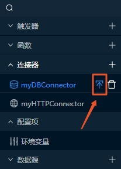
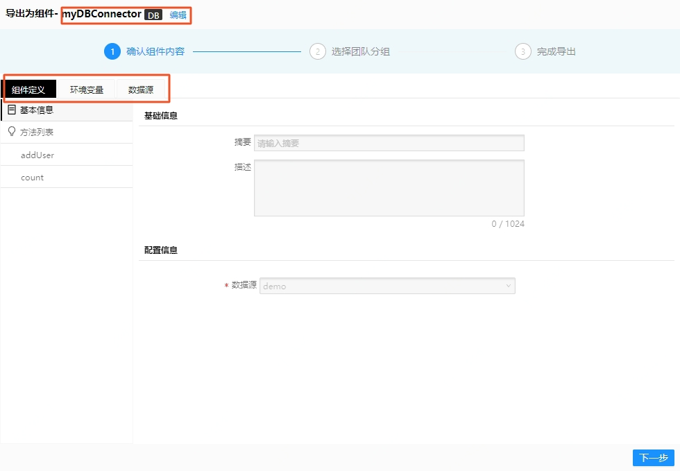
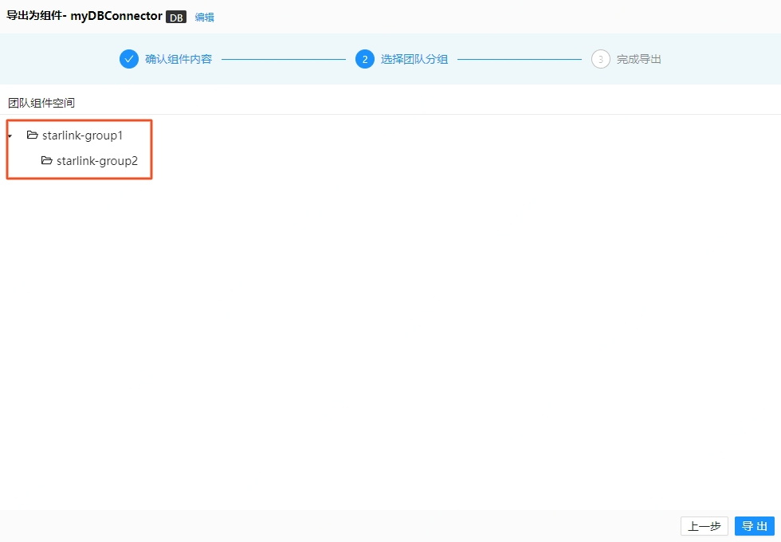
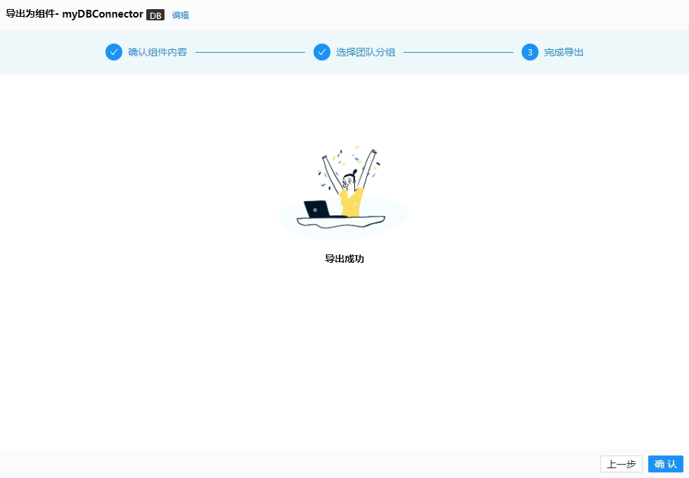
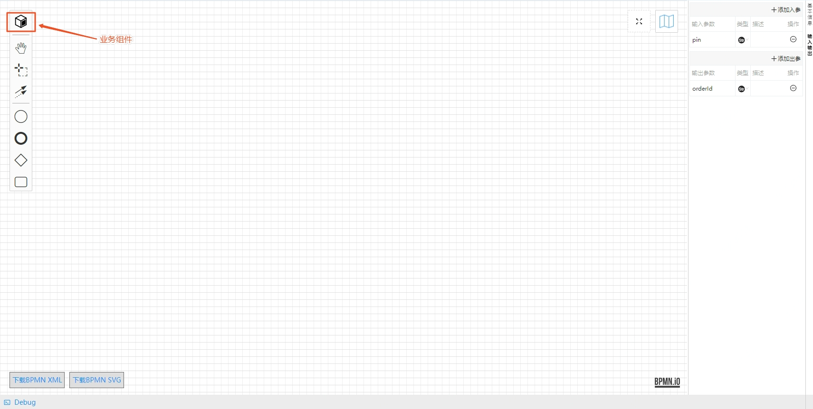
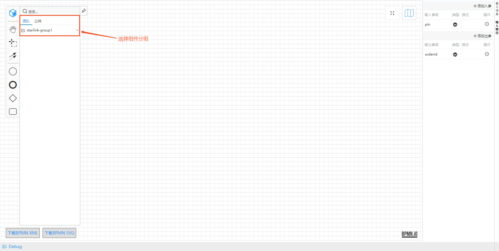
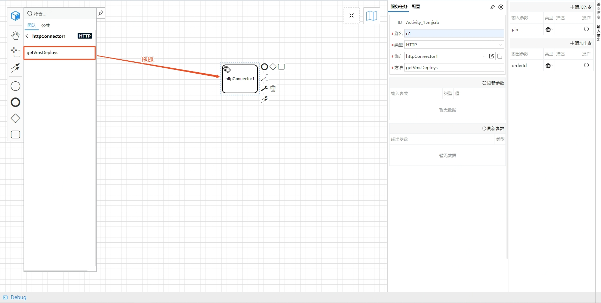

# 组件库
星链函数服务平台支持业务组件库，可以方便快捷地完成连接器等资源跨VMS甚至跨团队复用。目前组件分为两种：团队组件和公共组件，且暂时仅支持连接器导出为组件以及组件导入为连接器。  
## 导出组件
导出组件是指将连接器等资源导出为一个组件。导出过程会将包括连接器自身配置以及它的依赖项，如环境变量、数据源等资源一并打包导出。  
1. 将鼠标浮到资源库的对应的连接器上时会出现导出的按钮   

2. 点击导出按钮
3. 确认导出组件内容：
- 组件名，可修改
- 组件内容
- 环境变量
- 数据源
4. 点击“下一步”  

5. 选择组件导出分组（如无分组，请先在组件管理处创建分组）  

6. 点击“导出”
7. 导出成功确认  

## 导入组件
导入组件是指将已有组件导入为当前VMS的连接器等资源，目前仅支持在BPMN函数中使用导入组件功能。与导出过程类似，导入组件也会将组件内所有元素都导入为当前VMS的资源，以确保组件导入完整可用。  
1. 点击BPMN画布左上角的业务组件图标  

2. 选择组件分组  

3. 选择要导入的组件，并拖拽组件方法至BPMN画布  

4. 导入完成