# 开发连接器
连接器是对中间件和第三方服务的封装和抽象，目前支持访问数据库的DB连接器以及访问远程HTTP服务的HTTP连接器。
## 创建连接器
1. 点击星链Studio左侧资源库连接器旁边的“+”按钮
2. 输入连接器名称，建议小驼峰命名
3. 选择连接器类型，目前支持DB和HTTP两种连接器类型  

4. 点击“提交”完成连接器创建
## 删除连接器
1. 将鼠标浮到资源库的对应的连接器上时会出现删除的按钮   
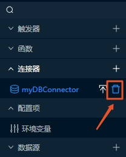
2. 点击删除即可完成连接器删除
## DB连接器
DB连接器用于访问数据库，依赖于数据源。目前仅支持MySQL数据源。  
### 开发数据源
#### 创建数据源
1. 点击星链Studio左侧资源库数据源旁边的“+”按钮
2. 输入数据源名称，建议小驼峰命名
3. 选择数据源类型  
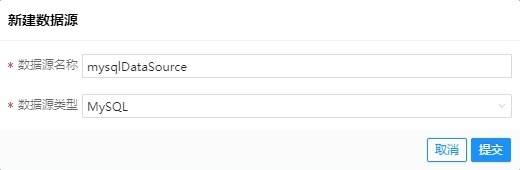
4. 点击“提交”完成数据源创建
#### 删除数据源
1. 将鼠标浮到资源库的对应的数据源上时会出现删除的按钮   
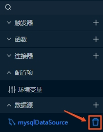
2. 点击删除即可完成数据源删除
#### MySQL数据源
MySQL数据源jdbcUrl、数据库用户名、密码等不同环境值不一样，可以通过环境变量进行配置，环境变量在数据源配置中使用方式为：`@环境变量key@`  
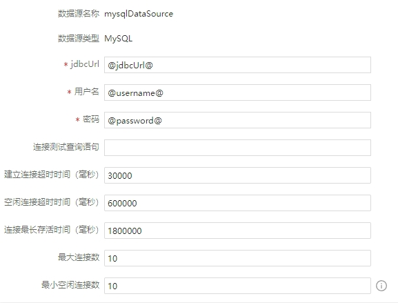
### 修改DB连接器
DB连接器基本信息包括基础信息和配置信息两部分，基础信息可编辑的包括摘要和描述信息，配置信息目前仅有数据源，每个DB连接器必须关联一个数据源。
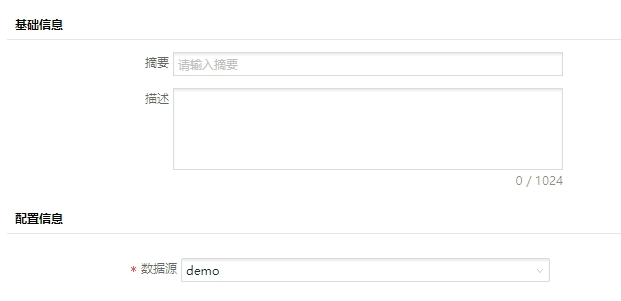
### 新增DB连接器方法
1. 点击DB连接器方法列表菜单右侧的新增按钮“+”
2. 输入方法名称
3. 选择方法类型（select/insert/update/delete）  
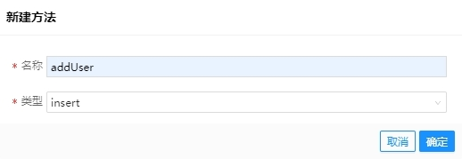
4. 点击“确定”完成DB连接器方法新增
### 修改DB连接器方法
DB连接器方法包括基础信息和方法定义两部分，基础信息可编辑的包括方法摘要和描述信息，方法定义包括请求参数、响应参数以及Mybatis Mapper语句定义。  
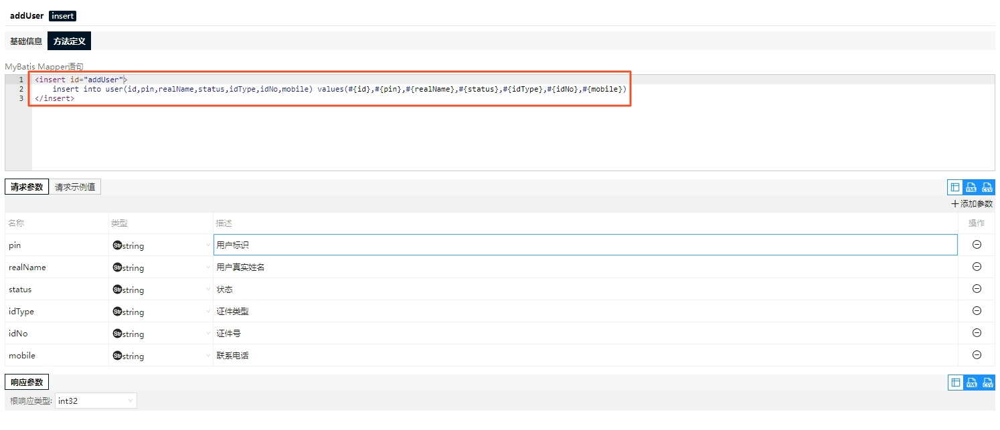
### 删除DB连接器方法
1. 将鼠标浮到连接器方法列表对应的方法上时会出现删除的按钮   
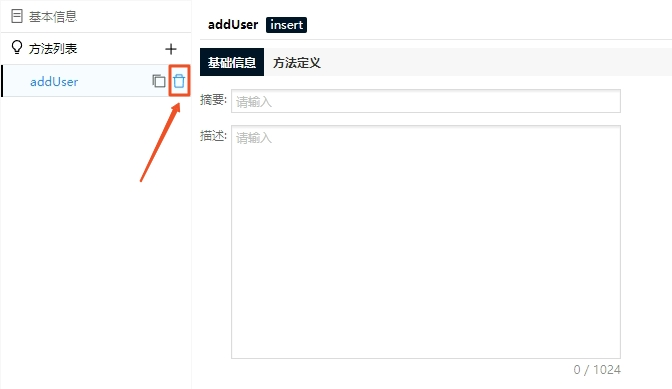
2. 点击删除即可完成方法删除
## HTTP连接器
### 修改HTTP连接器
HTTP连接器基本信息包括基础信息和配置信息两部分，基础信息可编辑的包括摘要和描述信息，配置信息包括根URL、连接超时时间、读写超时时间以及最大并发请求数等。  
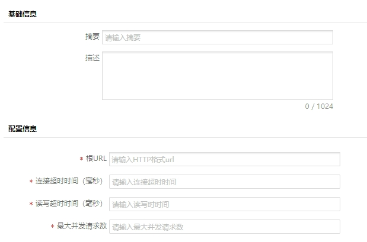
### 新增HTTP连接器方法
1. 点击HTTP连接器方法列表菜单右侧的新增按钮“+”
2. 输入方法名称、路径
3. 选择请求类型（GET/POST/PUT/DELETE）    
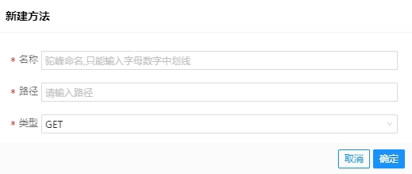
4. 点击“确定”完成HTTP连接器方法新增
### 修改HTTP连接器方法
HTTP连接器方法包括基础信息和方法定义两部分，基础信息可编辑的包括方法摘要和描述信息，方法定义包括请求类型、路径、请求参数以及响应参数等，其中请求类型一经定义无法修改。请求参数包含URL查询参数、URL路径参数、请求头参数以及cookie等定义，响应参数包含响应体、响应头以及根响应类型定义。    
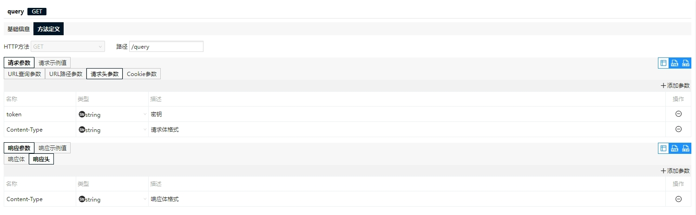
### 删除HTTP连接器方法
参考DB连接器方法删除。