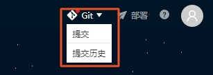
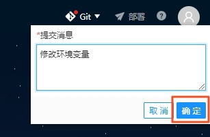
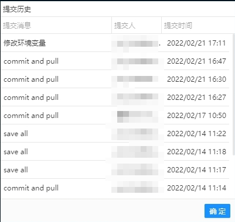

# Git操作
VMS数据是基于Git托管到京东云。开发VMS主要涉及到拉取、提交VMS数据以及查看提交历史。

## 拉取
每次在星链Studio刷新页面都会从远程仓库拉取最新数据到本地，该过程主要包含Git add、commit以及pull等操作。
## 提交
开发VMS时，如需将修改的数据同步到Git远程仓库，则需通过提交功能完成，该过程主要包含Git add、commit、pull以及push等操作。
1. 点击星链Studio右上角Git→提交  

2. 在弹框中输入提交信息，点击提交按钮完成提交  

## 查看提交历史
点击星链Studio右上角Git→提交历史，列表显示最近commit历史。  

