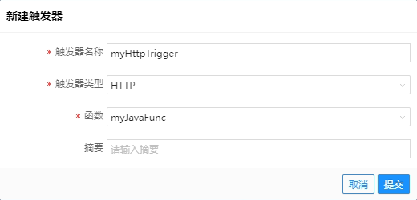
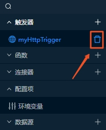
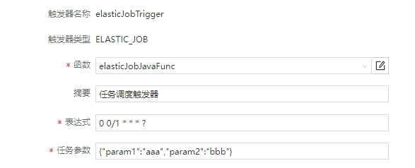
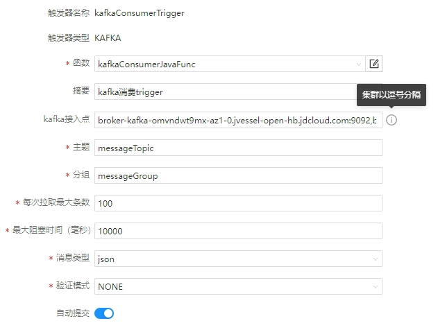
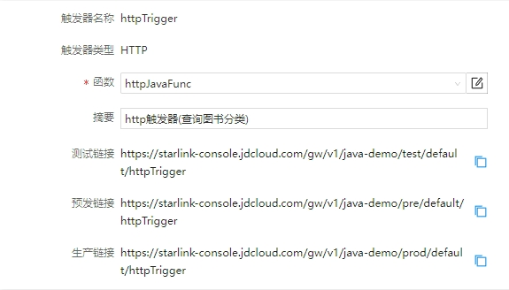

# 开发触发器
触发器定义了对外提供访问的方式，可以定义多个，每个触发器关联一个函数，目前支持的触发器类型包括ELASTIC_JOB、KAFKA和HTTP。  
## 创建触发器
1. 点击星链Studio左侧资源库触发器旁边的“+”按钮
2. 输入触发器名称、摘要（选填）
3. 选择触发器类型、关联函数  

4. 点击“提交”完成触发器创建
## 删除触发器
1. 将鼠标浮到资源库的对应的触发器上时会出现删除的按钮   

2. 点击删除即可完成触发器删除
## ELASTIC_JOB触发器
ELASTIC_JOB触发器支持将服务发布成一个ElasticJob分布式调度任务。暂不支持广播任务，只支持随机任务，即当同一服务部署多台时，任务调度只会调度其中一台执行。  
表达式支持CRON表达式语法。  

## KAFKA触发器
KAFKA触发器支持将服务发布成一个KAFKA消息的Listener。  

## HTTP触发器
HTTP触发器支持将服务以HTTP接口方式对外暴露。触发器创建成功之后系统会自动生成测试、预发及生产的访问链接，目前暂时只支持https协议。  

