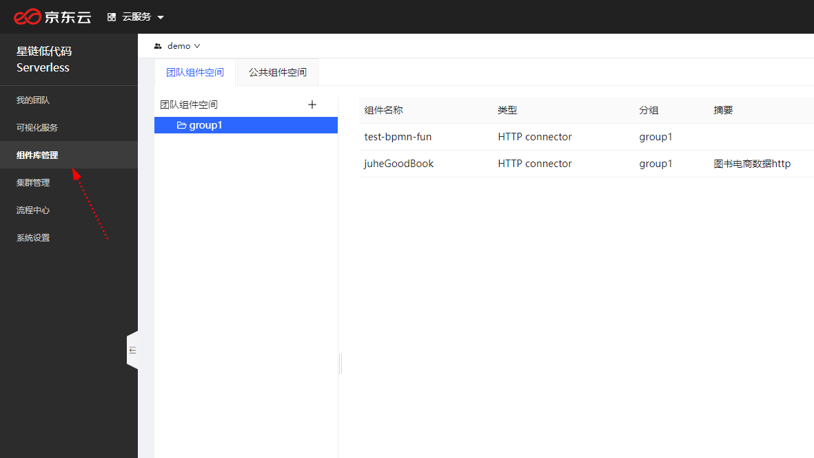
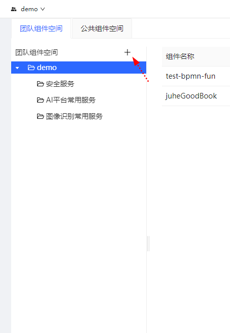
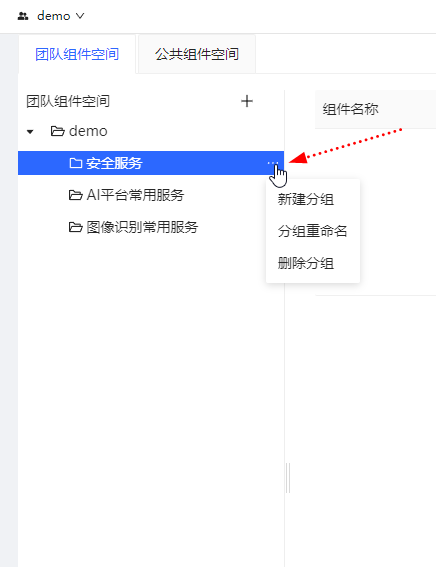

# 组件管理

如下图所示，单击"组件库管理"菜单，进入组件管理界面。

当前，星链支持团队组件空间、公共组件空间。

-   公共组件空间

​		公共组件空间，由星链团队维护，这个空间里的组件拥有全局作用域，系统里的VMS可以直接引用。

-   团队组件空间

​		这个空间里的组件，作用域仅限团队，同一个团队的VMS可以引用，不支持跨团队。

​		团队空间的组件由每个团队成员维护。

## 组件分组

目前分组支持树形结构。

如下图所示，单击"+"号新增一个一级分组。

在每个分组末尾单击"..."图标可以删除分组、分组重命名、新增一个子分组。

## 组件

如下图，选择一个分组，单击"新建连接器组件",可以增加一个新的连接器组件。设置内容与连接器相同。

