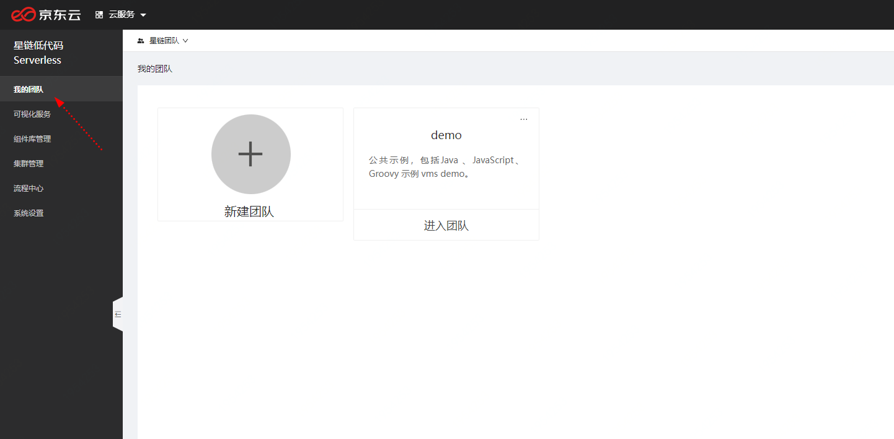
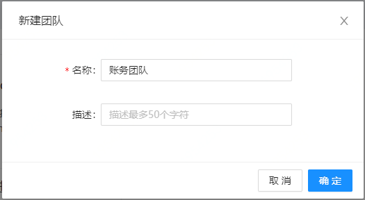
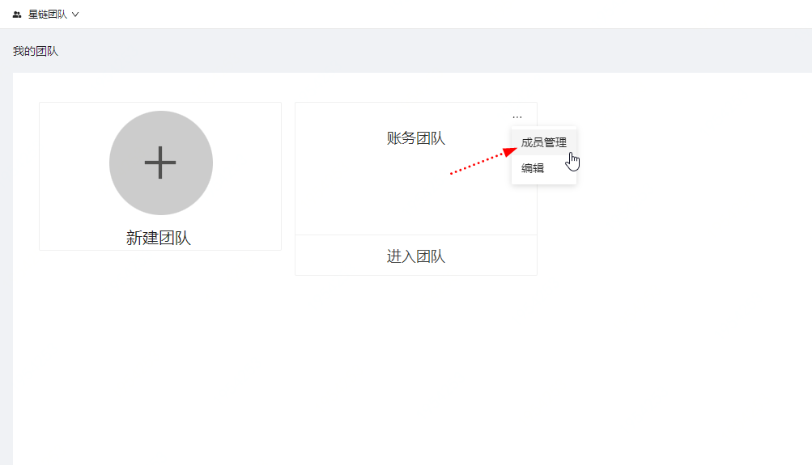
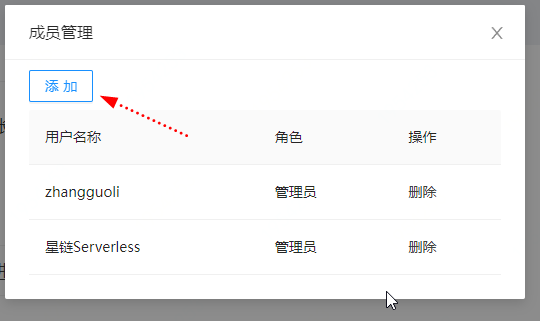
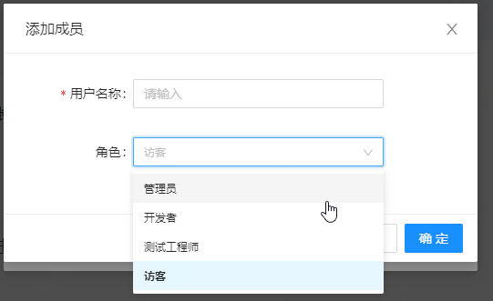
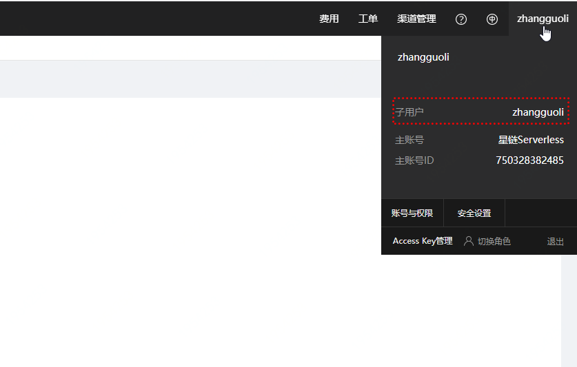

# 团队管理

新用户首次进入星链，默认会自动进入一个Demo团队，这个团队里有 多个VMS示例，可以通过这些示例了解如何开发vms。

## 添加团队

单击“新建团队”按钮，弹出如下对话框。

输入团队名称，单击确定。

## 成员管理
在团队右上角，单击"成员管理".

弹出成员管理对话框，在这里可以管理团队成员。

用户新建团队时，会自动将当前用户、当前用户的主账号，设置为团队管理员。

可以从下图位置获取"用户名称"

