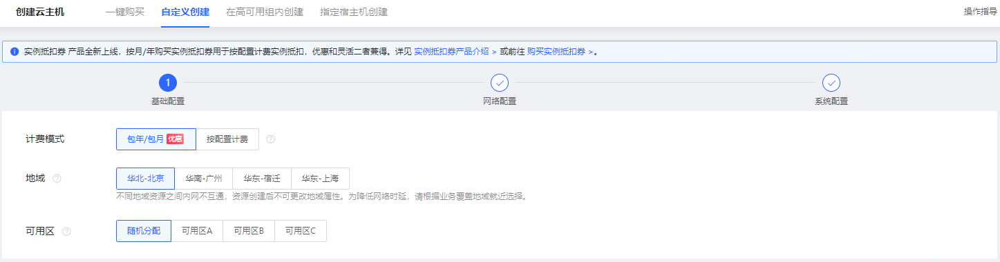
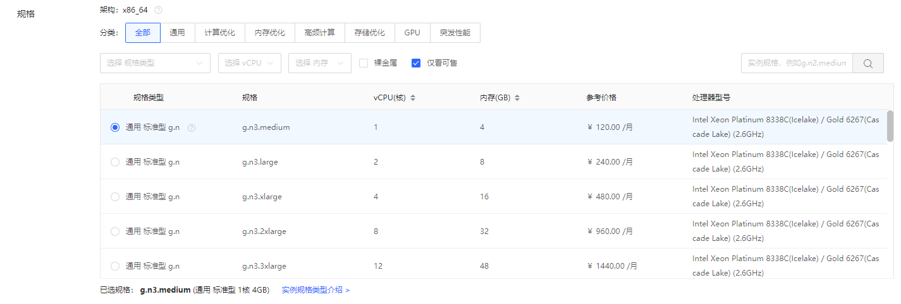
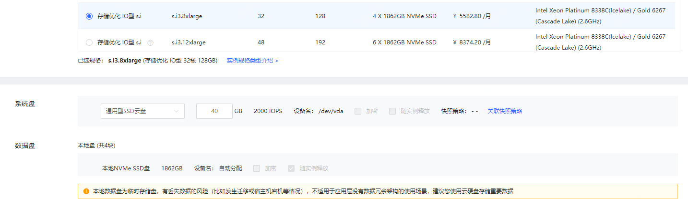
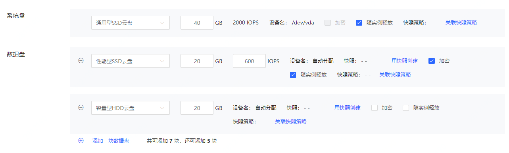
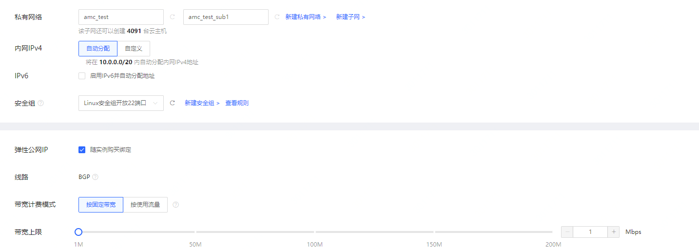
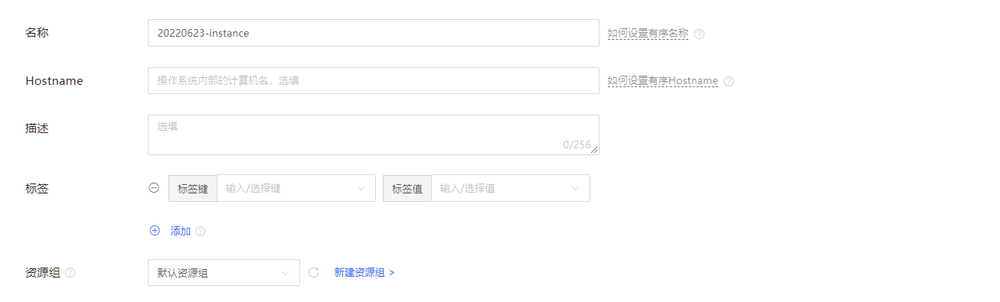
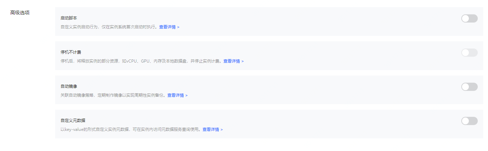
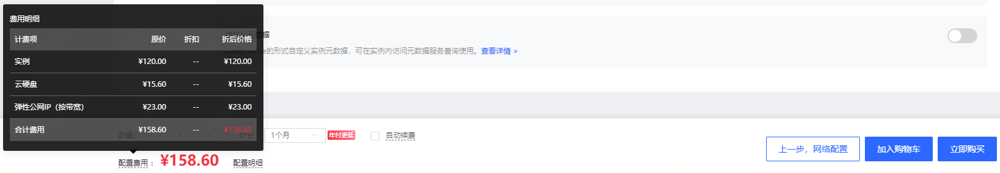

# 创建Linux实例
## 操作入口
- 1·登录京东云官网。选择产品-弹性计算-云主机CVM，点击立即购买进入云主机购买页面。
- 2.访问[实例控制台](https://cns-console.jdcloud.com/host/compute/list)，或访问[京东云控制台](https://console.jdcloud.com)点击左侧导航栏【弹性计算】-【云主机】-【实例】进入实例列表页。点击【创建】按钮，进入云主机购买页面。建议您根据业务情况选择实例所在地域，关于京东云地域详细信息，请参见[地域与可用区](../Introduction/Regions-and-AvailabilityZones.md)。
## 操作步骤
步骤1：基础配置
- 基础配置主要是购买实例的配置项，包括计费模式、地域和可用区、实例规格、镜像、存储。

步骤2：网络配置
- 网络配置包括云主机私有网络、子网、IP地址选择，以及根据是否需要访问公网为云主机绑定弹性公网IP。

步骤3：系统配置
- 系统配置包括登录信息、主机名称、标签、资源组等实例信息配置，以及停机不计费、启动脚本等高级配置。

### 步骤1：基础配置
1. 选择创建方式：
 * 提供三种创建方式 **自定义创建**、**在高可用组内创建**、**指定宿主机创建**，后两种需要您预先创建好高可用组和专有资源池或专有宿主机，如果是第一次使用保持默认选项“自定义创建”即可。
2. 选择计费模式：
 * 包年包月和按配置计费，包年包月为预付费模式，按一个整月进行购买付费；按配置计费为后付费模式，按照实际使用的时长（精确至秒）每小时进行扣费。关于两种计费方式的区别，请参见[计费规则](../Pricing/Billing-Rules.md)。
3. 选择地域与可用区：
 * 在此步骤可以选择实例对应的地域（华北-北京、华南-广州、华东-宿迁及华东-上海）及可用区，请注意“不同地域资源内网不互通，创建之后不可更改”，如果所选地域限额已满，可以通过[提交工单](https://ticket.jdcloud.com/myorder/submit)提升限额。

4. 选择实例模板：
- 开启实例模板选项需要指定实例模板。
- 实例模板是京东云提供的创建云主机的配置信息模板，包括镜像、云主机规格、系统盘及数据盘类型和容量、私有网络及子网配置、安全组及登录信息等。使用实例模板创建云主机无需重新指定实例模板已包含的参数，可快速多次创建相同配置的云主机，缩短业务部署时间。

5. 选择镜像：
- 提供以下镜像类型：**官方镜像**、**私有镜像**、**共享镜像**、**镜像市场镜像**四类镜像，详细区分请参见[镜像概述](../Operation-Guide/Image/Image-Overview.md)。
 * 对于初次使用京东云的用户可以选择京东云提供的“官方镜像”，您可以根据需要选择对应的系统，并选择合适的版本。
 * 如果您已经创建好自己的实例，并配置好相应的环境，可以将此实例进行制作私有镜像操作，同时基于此镜像批量创建有相同系统及环境配置的主机，还可以将此私有镜像共享给其他京东云用户。 

6. 选择实例规格：
 * 实例的规格支持用户自定义选择，从最小的1核1G（如g.s1.micro）到124C2108GB（如m.e3.31xlarge）。实例规格列表展示了实例规格对应的配置信息，包含CPU核数、内存以及价格和处理器信息。用户可以根据不同业务场景选择实例规格及相应配置，详情请参见[实例规格](../Introduction/Instance-Type-Family.md)。

7. 配置实例存储：
- 系统盘
  - 仅支持使用云硬盘系统盘，可选通用型SSD云盘、性能型SSD云盘及容量型HDD云盘，容量范围40GB~500GB。设备名默认/dev/vda。         
- 数据盘
  - 数据盘分为本地数据盘和云盘数据盘。
  - 仅存储优化型实例规格自带本地数据盘，数量和容量由具体实例规格决定。本地数据盘为临时存储盘，有丢失数据的风险（比如发生迁移或宿主机宕机等情况），不适用于应用层没有数据冗余架构的使用场景。 
  - 云盘数据盘默认不挂载，最多支持挂载7块云硬盘作数据盘。可选通用型SSD云盘、性能型SSD云盘及容量型HDD云盘，容量范围20GB-16000GB。数据盘挂载到云主机后，需要进入云主机操作系统挂载。 

  - 您可以随实例创建指定类型和容量的云硬盘，也可以基于已有云硬盘快照创建数据盘。关于数据盘设备名分配规则请查阅[设备名分配规则](../Operation-Guide/Storage/Assign-Device-Name.md)。
  * 支持为云主机挂载加密云硬盘（一代实例规格不支持），可在创盘时指定云硬盘加密属性，若使用快照创建则云硬盘加密属性从快照侧继承，云硬盘创建后加密属性不可修改。详情请参见[云硬盘加密](../Operation-Guide/Storage/Encryption-of-Cloud-Disk.md)。 
  * 支持按配置计费且非多点挂载云硬盘设置随实例删除属性，若勾选，会在实例删除时一并删除。
  * 支持单盘粒度指定云盘快照策略，您可根据备份需要为不同云盘指定不同或相同的快照策略，京东云会根据您指定的策略自动定期备份您的云硬盘。详情参见详情请参见[自定义快照策略](https://docs.jdcloud.com/cn/cloud-disk-service/snapshotpolicy)。 
  * 云硬盘费用与实例独立，具体价格信息请查阅[云硬盘价格](http://docs.jdcloud.com/cn/cloud-disk-service/billing-rules)。
### 步骤2：网络配置
1. 配置实例网络：  
  * 选择私有网络及子网：您须先行创建VPC及子网。选择子网后，系统会判断该子网下可以创建的云主机数量，如果暂时没有子网，可以通过快速入口新建子网。详细请参见[私有网络](http://docs.jdcloud.com/cn/virtual-private-cloud/product-overview)和[子网](http://docs.jdcloud.com/cn/virtual-private-cloud/subnet-features)。
  * 选择内网IP分配方式：如对内网IP地址没有特殊要求，可以选择“自动分配”，由系统自动在子网可用网段内分配；如需指定请选择“自定义”，并在提示范围内输入，系统会校验IP是否可用。须注意的是，若选择自定义内网IP地址，则无法批量创建实例。
  * IPv6地址配置：勾选“启用IPv6并自动分配地址”。
  * 选择安全组：实例在创建时必须绑定一个安全组，若当前地域下未创建自定义安全组，可以在系统创建的三个默认安全组中选择一个绑定（每个私有网络创建成功之后都会自动创建三个默认安全组），也可以通过快速入口前往安全组页面[创建安全组](http://docs.jdcloud.com/cn/virtual-private-cloud/security-group-configuration)。由于官方镜像系统内防火墙默认关闭，建议绑定仅开放22端口（Linux）或3389端口（Windows）的安全组，实例创建之后再根据访问需求创建新的安全组并绑定。    
2. 配置公网带宽：
- 若您的云主机需公网访问能力，则须为云主机分配公网IP。
  * 带宽计费方式：京东云提供按固定带宽和按使用流量两种带宽计费类型的弹性公网IP。按固定带宽计费指的是按照购买时设置的带宽上限值付费，而与实际访问公网所用带宽无关。按使用流量计费则根据您实时访问公网的实际流量计费。
  * 线路：基于BGP协议三线接入，动态路由，访问稳定。               
  * 带宽范围：1Mbps~200Mbps。
- 在创建主机过程中可以暂不购买公网IP，完成主机创建后，再进行绑定。弹性公网IP带宽费用与实例费用独立。具体价格信息请查阅[弹性公网IP价格](../../../Networking/Elastic-IP/Pricing/Price-Overview.md)。      

### 步骤3：系统配置
1. 设置登录信息：
 - Linux系统的云主机，可以选择密码登录，也可以通过绑定已经创建的SSH密钥进行更安全的实例登录认证。仅设置密钥时，将自动禁止SSH密码登录，主机创建后可通过重置密码功能开启密码登录，详细SSH密钥创建及登录帮助，请查阅 [SSH密钥](../Operation-Guide/Key-Pair/KeyPair-Overview.md)。若使用私有镜像创建云主机，将用镜像中原有登录凭证，不再额外指定。
 * 对于设置密码，可以选择“自定义”设置密码，也可以选择“自动生成”（系统将自动生成随机密码，并以短信和邮件发送给您），密码除了用于SSH登录实例时的密码，也是控制台通过VNC登录实例的密码。     

2. 设置实例名称、hostname、描述、为实例绑定标签、将实例加入资源组：
  * 实例名称：您需要设置创建的云主机名称，名称不可为空，只支持中文、数字、大小写字母、英文下划线“ _ ”、中划线“ - ”及点“.”，且不能超过128字符。批量创建多台云主机时，可在非首位位置添加[start_number]来设置有序名称。具体操作可查阅[设置有序名称或主机名称](https://docs.jdcloud.com/cn/virtual-machines/set-ordered-name)。
  * hostname：选填，您需要设置创建的云主机操作系统内部的计算机名，对于Linux系统，名称为2~64字符，支持多个点号"."，点号“.”之间为一段，每段允许大小写字母、数字和中划线"-"；点号"."和中划线"-"不能作为首尾，不能连续使用。批量创建多台云主机时支持设置有序名称，详见[设置有序名称或主机名称](https://docs.jdcloud.com/cn/virtual-machines/set-ordered-name)。
  * 实例描述：选填，256字符以内。
  * 为实例绑定标签：您可以选择为创建的云主机添加标签，每个标签由 1 个“键”和 1 个“值”组成，标签键值不能以 "jrn:" “jdc-”开头，仅支持中文，大小写英文、数字及如下符号“ _.,:/=+-@ ”。最多能够绑定10个标签至本次创建的云主机。如果为批量创建购买，标签将与批量创建出的每台主机相绑定。关于标签的编辑操作请查阅 [编辑标签](../Operation-Guide/Tag/Edit-Tag.md)。
  * 为实例加入资源组：您可以将您创建的云主机加入资源组，资源组是京东云资源分组管理的工具，支持对云资源进行逻辑分组。系统会为每个用户创建一个“默认资源组”，所有未指定资源组（包括创建时缺省此配置或在资源组功能上线前创建的）的云主机均会自动加入“默认资源组”。关于资源组操作请查阅[资源组概述](https://docs.jdcloud.com/cn/virtual-machines/resource-group-introduction)。  

3. 设置高级选项：
- 启动脚本：自定义实例启动行为，仅在实例系统首次启动时执行。详见[启动脚本介绍](https://docs.jdcloud.com/cn/virtual-machines/api/modifyinstanceattribute?content=API)。
- 停机不计费：开启此功能后，按配置计费的实例将释放的部分资源，如vCPU、GPU、内存及本地数据盘，并停止实例计费。详见[实例停机不计费](https://docs.jdcloud.com/cn/virtual-machines/uncharged_for_stopped_vm)。
- 自动镜像：关联自动镜像策略，定期制作镜像以实现周期性实例备份。详见[自动镜像策略](https://docs.jdcloud.com/cn/virtual-machines/autoImagePolicy)。
- 自定义元数据：以key-value的形式自定义实例元数据，可在实例内访问元数据服务查询使用。详见[自定义元数据](https://docs.jdcloud.com/cn/virtual-machines/custom-metadata)。
 
### 确认购买信息
1. 确认云主机数量及购买时长：
  * 购买数量受限该地域您云主机、云硬盘、公网IP限额以及所选子网剩余IP数量，若限额不够，可通过[提交工单](https://ticket.jdcloud.com/myorder/submit)提升限额。
  * 若购买包年包月实例，则需要设置购买时长，最短为1个月，最长为3年，购买时长超过1年有较大优惠。若需要更长服务时长请[提交工单](https://ticket.jdcloud.com/myorder/submit)。
  * 若您账户金额充足，可以在到期前按购买时长自动续费，资源创建后，自动续费属性和时长均可修改。
2. 确认配置费用和配置明细：

### 下单购买
- 可以选择立即购买或加入购物车后购买。
  - 点击立即购买跳转订单确认页，完成付款后即可创建云主机。
  - 加入购物车后，点击购物车图标进入购物车页面，点击立即购买跳转订单确认页，完成付款后即可创建云主机。仅支持包年包月计费模式云主机加入购物车。

## 相关参考

[地域与可用区](../Introduction/Regions-and-AvailabilityZones.md)

[计费规则](../Pricing/Billing-Rules.md)

[镜像概述](../Operation-Guide/Image/Image-Overview.md)

[实例规格](../Introduction/Instance-Type-Family.md)

[设备名分配规则](../Operation-Guide/Storage/Assign-Device-Name.md)

[云硬盘加密](../Operation-Guide/Storage/Encryption-of-Cloud-Disk.md)

[云硬盘价格](http://docs.jdcloud.com/cn/cloud-disk-service/billing-rules)

[私有网络](http://docs.jdcloud.com/cn/virtual-private-cloud/product-overview)

[子网](http://docs.jdcloud.com/cn/virtual-private-cloud/subnet-features)

[创建安全组](http://docs.jdcloud.com/cn/virtual-private-cloud/security-group-configuration)

[弹性公网IP价格](../../../Networking/Elastic-IP/Pricing/Price-Overview.md)

[编辑标签](../Operation-Guide/Tag/Edit-Tag.md)
 
[SSH密钥](../Operation-Guide/Key-Pair/KeyPair-Overview.md)

