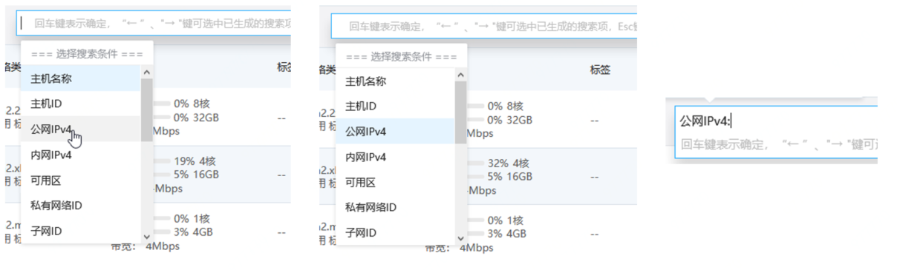

# 查找云主机

默认情况下，主机列表展示的是当前地域下全部主机。为了帮助您快速搜索出当前地域下的特定主机，京东智联云提供联合搜索功能，您可一次指定多个搜索条件进行检索。目前支持的搜索条件有：主机ID、主机名称、公网IPv4、内网IPv4、可用区、私有网络ID、子网ID、弹性网卡ID、镜像ID、实例规格、高可用组ID及故障域。相同搜索条件下不同搜索条件值在搜索时关系为“或”，即满足任一搜索条件值的资源可被搜索到。不同搜索条件在搜索时关系为“且”，即同时满足每个搜索条件的资源可被搜索到。
	
	请注意：
	* 特例情况：当搜索条件中同时存在“公网IPv4”与“弹性网卡ID”时，两者在搜索时关系为“或”。

## 操作步骤

### 指定搜索条件

1. 访问[云主机控制台](https://cns-console.jdcloud.com/host/compute/list)，即进入主机列表页面。或访问[京东智联云控制台](https://console.jdcloud.com)点击左侧导航栏【弹性计算】-【云主机】进入主机列表页。

2. 选择地域

3.单击联合搜索框。

4.指定搜索条件：您可通过鼠标选中、键盘“↑”“↓”键选中或手动输入指定搜索条件。

### 指定搜索条件值

1.不同的搜索条件下根据搜索条件值进行搜索的方式不同：
* 搜索条件为“主机名称”：支持模糊搜索，仅支持单个条件值搜索
