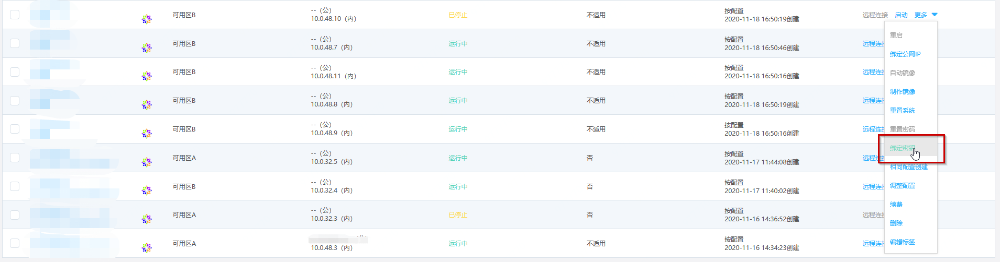
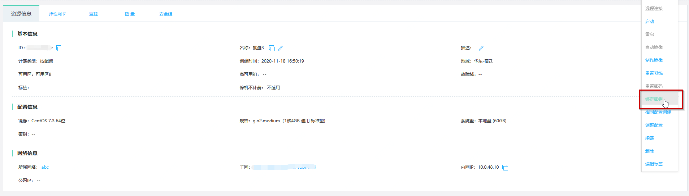
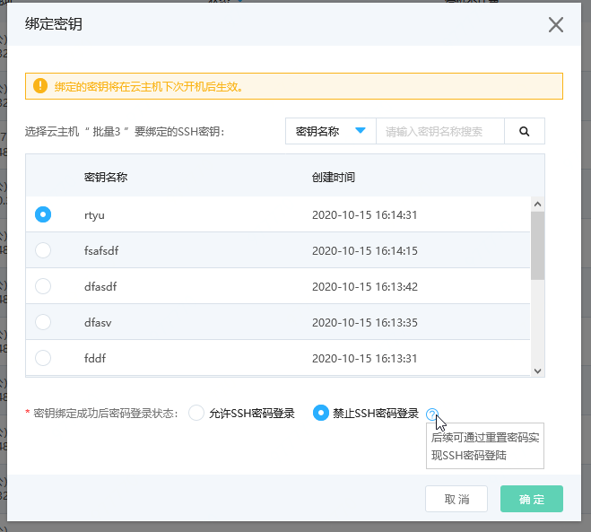
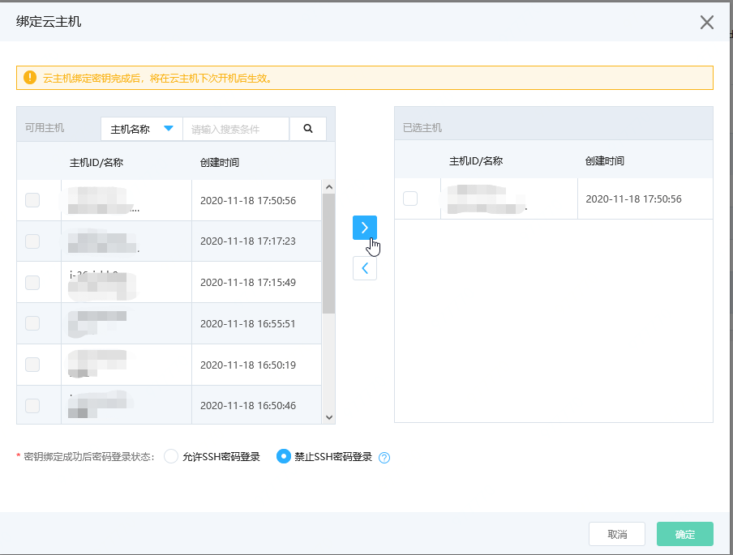

# 绑定密钥

绑定密钥指是指将SSH密钥对的公钥注入至相应实例中，其中包括您在控制台生成的公钥或上传至控制台的公钥两种。

您可在创建实例、对实例重置系统或实例处在停止或运行时绑定密钥，创建实例时绑定密钥请参考[创建实例](../Instance/Create-Instance.md)，对实例重置系统时请参考[重置系统](../Instance/Rebuild-Instance.md)。

## 已有实例绑定密钥（内测）

本功能目前为内测阶段，如果您想要开启此功能，请通过提交工单或联系客服进行申请。

### 前提条件

* 本功能的实现依赖于官方镜像中默认安装的系统组件JCS-Agent，由于历史原因，官方镜像系统组件经历了多个组件多个版本的衍变，只有安装了指定版本的JCS-Agent才能保证功能的正常使用。请根据[镜像支持情况](SupportImage.md)查看您的实例是否支持此功能。
* 实例必须为Linux系统、未绑定密钥且处于“运行中”或“已停止”状态。若实例处于其他非稳定状态，还请等待前序操作执行完成后再操作绑定密钥。

### 操作步骤

#### 从实例侧为实例绑定密钥

1. 访问[云主机控制台](https://cns-console.jdcloud.com/host/compute/list)，即进入实例列表页面。或访问[京东智联云控制台](https://console.jdcloud.com)点击左侧导航栏【弹性计算】-【云主机】进入实例列表页。
2. 选择地域。
3. 在实例列表中选择需要绑定密钥的实例，点击【操作】-【更多】-【绑定密钥】按钮，或点击实例名称进入详情页后点击【操作】-【绑定密钥】按钮


4. 为实例选择想要绑定的密钥，同时选择密钥绑定成功后主机的SSH密码登录功能是否需要关闭。

```   
      请注意：
      * 为了提高安全性，京东智联云建议您选择禁止SSH密码登陆方式，禁止后用户将无法通过密码以SSH方式登陆主机，但不会影响您使用密码从控制台远程登录主机。
      * 禁止SSH密码登陆后，您可通过重置密码操作将密码登录状态由禁止改为允许。  
```

  
5. 点击【确定】完成绑定，绑定的密钥将在实例下次开机后生效。

#### 从密钥侧为实例绑定密钥

1. 访问[SSH密钥控制台](https://cns-console.jdcloud.com/host/ssh/list)，即进入实例列表页面。或访问[京东智联云控制台](https://console.jdcloud.com)点击左侧导航栏【弹性计算】-【云主机】-【SSH密钥】进入SSH密钥列表页。

2.选择地域。

3.点击【操作】-【绑定云主机】按钮，或点击SSH密钥名称进入详情页后点击【操作】-【绑定云主机】按钮。

4.在“可用主机”列表勾选想要与密钥关联的云主机，选择完成后点击向右箭头将勾选数据移入“已选主机”列表。同时选择密钥绑定成功后主机的SSH密码登录功能是否需要关闭。


5.点击【确定】完成绑定，绑定的密钥将在实例下次开机后生效。

## 相关参考
[镜像支持情况](SupportImage.md)

[重置系统](../Instance/Rebuild-Instance.md)

[SSH登录配置](../../Linux-Troubleshooting/Configuration-Class/SSH-creation-and-login.md)

