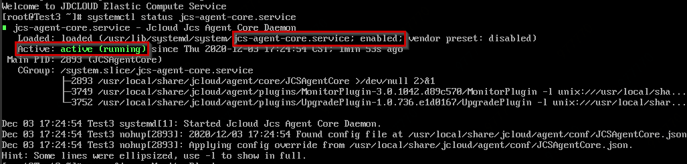
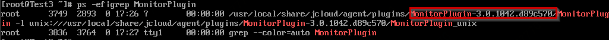
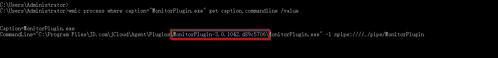

# 镜像支持情况

重置系统中使用镜像原有设置，已有实例绑定与解绑密钥功能的实现依赖于官方镜像中默认安装的系统组件JCS-Agent，由于历史原因，官方镜像系统组件经历了多个组件多个版本的衍变，只有安装了指定版本的JCS-Agent才能保证功能的正常使用。

* 官方镜像：2018年12月14日以后使用官方镜像创建实例，均可正常使用该功能；<br>
* 私有/共享镜像：如果制作私有镜像的实例是使用官方镜像创建且创建时间不早于2018年12月14日，则使用私有/共享镜像创建实例，可正常使用该功能；<br>
* 云市场镜像：云市场镜像更新频率取决于服务商，不同镜像支持自定义数据功能的情况各异，请提交工单或联系京东智联云技术支持咨询。

您可以通过下述方法查看实例内JCS-Agent的版本，确认基于当前实例制作的私有镜像是否支持此功能，若当前实例内安装的agent为早期其他组件或JCS-Agent版本过低，请参照 [官方镜像系统组件](http://docs.jdcloud.com/cn/virtual-machines/default-agent-in-public-image) 进行安装。<br>
### Linux系统<br>
1.确认当前实例内安装了JCS-Agent，并处于运行状态。
输入指令：
```
systemctl status jcs-agent-core.service
```
如下图显示服务为enabled，且状态为active，则说明当前实例已安装并使用JCS-Agent。


2.确认JCS-Agent版本是高于“3.0.1042.d89c570”的版本，即表明支持本功能。输入如下指令如图查看版本号：
```
 ps -ef|grep MonitorPlugin
```



### Windows系统： <br>
1.确认当前实例内安装了JCS-Agent，并处于运行状态。
    在“运行”中执行`services.msc`，查看windows运行服务，如下图显示JCSAgentCore正在运行，且启动类型为自动，则说明当前实例已安装并使用JCS-Agent。


2.确认JCS-Agent版本高于“3.0.1042.d89c5706 ”的版本，即表明支持自定义数据功能。
    在命令行工具中执行如下代码，如图可获知当前版本情况。
```
wmic process where caption="MonitorPlugin.exe" get caption,commandline /value
```



      请注意：
      * 如您当前实例内未安装JCS-Agent或当前版本不支持本功能，请提交工单由技服人员协助安装。

