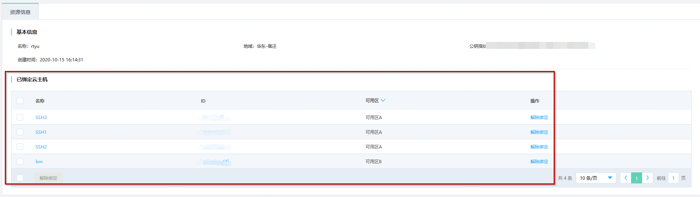
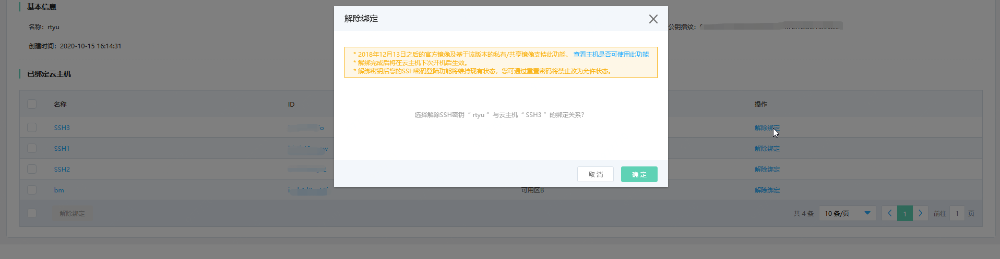
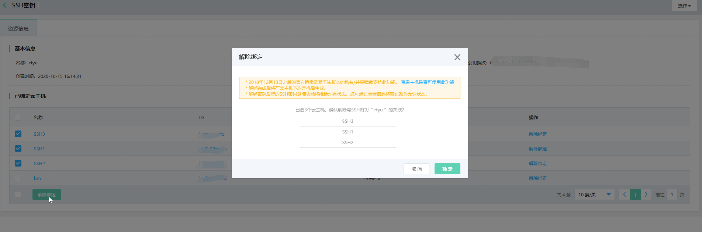

# 解绑密钥

您可在对实例重置系统或实例处在停止或运行时解绑实例上已绑定的密钥，对实例重置系统时解绑秘钥请参考[重置系统](../Instance/Rebuild-Instance.md)。

## 已有实例解绑密钥（内测）

本功能目前为内测阶段，如果您想要开启此功能，请通过提交工单或联系客服进行申请。

### 前提条件

* 本功能的实现依赖于官方镜像中默认安装的系统组件JCS-Agent，由于历史原因，官方镜像系统组件经历了多个组件多个版本的衍变，只有安装了指定版本的JCS-Agent才能保证功能的正常使用。请根据[镜像支持情况](SupportImage.md)查看您的实例是否支持此功能。
* 实例必须为Linux系统、已绑定密钥且处于“运行中”或“已停止”状态。若实例处于其他非稳定状态，还请等待前序操作执行完成后再操作绑定密钥。

### 操作步骤

#### 从实例侧为实例解绑密钥

1. 访问[云主机控制台](https://cns-console.jdcloud.com/host/compute/list)，即进入SSH密钥列表页面。或访问[京东智联云控制台](https://console.jdcloud.com)点击左侧导航栏【弹性计算】-【云主机】进入实例列表页。

2. 选择地域。

3. 在实例列表中选择需要绑定密钥的实例，点击【操作】-【更多】-【解绑密钥】按钮，或点击实例名称进入详情页后点击【操作】-【解绑密钥】按钮。

4. 点击【确定】完成解绑，解绑将在实例下次开机后生效。

#### 从密钥侧为实例解绑密钥

1. 访问[SSH密钥控制台](https://cns-console.jdcloud.com/host/ssh/list)，即进入SSH密钥列表页面。或访问[京东智联云控制台](https://console.jdcloud.com)点击左侧导航栏【弹性计算】-【云主机】-【SSH密钥】进入SSH密钥列表页。

2.选择地域。

3.点击SSH密钥名称进入详情页后可看到与当前密钥绑定的云主机列表。

4.单台操作：已绑定云主机列表中，点击【操作】-【解除绑定】按钮，在弹窗中点击【确定】按钮解除绑定。

批量操作：点击已绑定云主机列表下方【解除绑定】按钮，在弹窗中点击【确定】按钮解除绑定。

## 相关参考
[镜像支持情况](SupportImage.md)

[重置系统](../Instance/Rebuild-Instance.md)

[SSH登录配置](../../Linux-Troubleshooting/Configuration-Class/SSH-creation-and-login.md)

