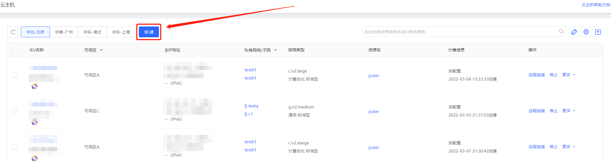
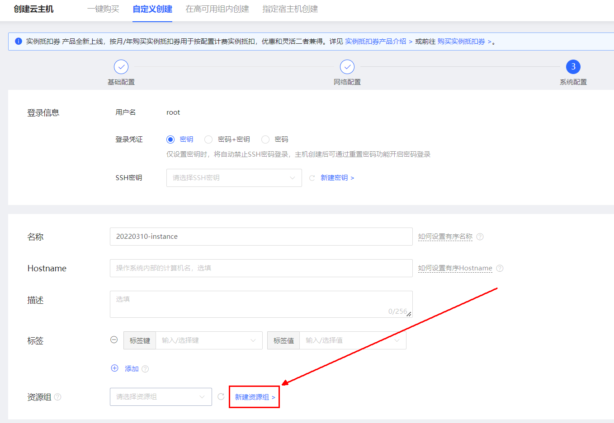

# 实例加入资源组

创建主机时，支持选择指定资源组添加，如不选择将加入“默认资源组”。

## 操作步骤

- 进入[京东云控制台](https://cns-console.jdcloud.com/host/compute/list)，访问实例列表页。
- 点击创建进入实例创建页。

- 在创建页面的 “系统配置” 页面中选择期望加入的资源组，如需新建请点击右侧的链接前往资源组页面创建。

