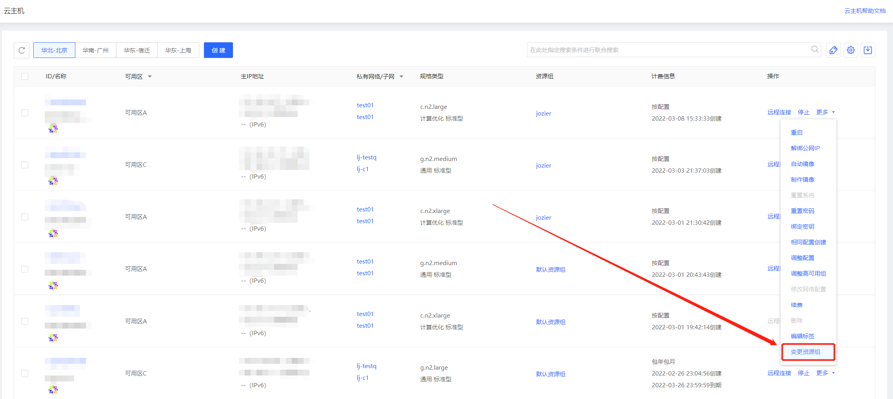
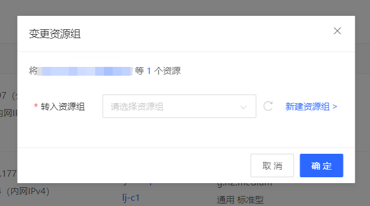
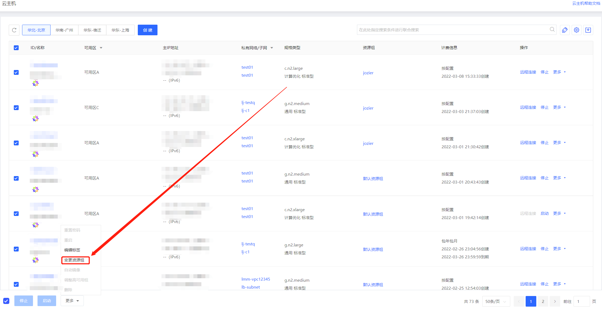
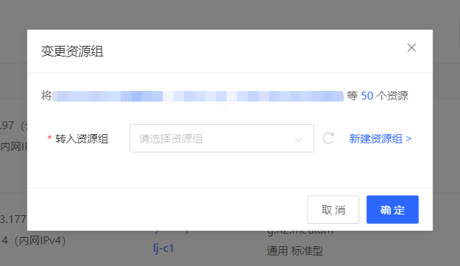

# 变更资源组

实例加入资源组后，您可参考下方操作变更实例所在资源组。

## 操作步骤

- 访问[云主机控制台](https://cns-console.jdcloud.com/host/compute/list)，进入实例列表页面。或访问 [京东云控制台](https://console.jdcloud.com/overview) ，点击顶部导航栏 **弹性计算-云主机**，进入实例列表页。

- 点击实例列表页【操作-更多-变更资源组】或进入实例详情页点击右上角的【操作-变更资源组】。

- 选择需要转入的资源组即可变更单一实例所在资源组。

- 也可选择多个实例后点击左下角更多-变更资源组。

- 选择需要转入的资源组，即可批量变更实例所在资源组。

