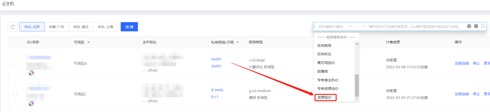

# 资源组筛选

可在实例控制台基于资源组ID对实例进行筛选。

## 操作步骤

- 访问 [云主机控制台](https://cns-console.jdcloud.com/host/compute/list) ，进入实例列表页。或访问 [京东云控制台](https://console.jdcloud.com/overview) ，点击顶部导航栏 **弹性计算-云主机**，进入实例列表页。

- 在列表页右上角联合搜索框中，下拉选择搜索条件-资源组ID，输入资源组ID后进行筛选。

