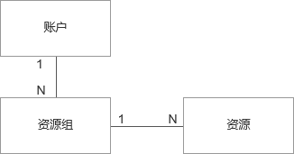

# 资源组概述

资源组（Resource group）是京东云资源分组管理的工具，支持对云资源进行逻辑分组。通过使用资源组，可实现多项目或多应用场景下的资源分组管理问题。

系统会为每个用户创建一个“默认资源组”，所有未指定资源组（包括创建时缺省此配置或在资源组功能上线前创建的）的实例均会自动加入“默认资源组”。

## 使用限制
* 一个云资源只能归属一个资源组，一个资源组内可以容纳多个云资源

## 实例支持的资源组操作：

- [添加资源组](https://github.com/wangbaohan/cn/blob/wangbaohan-patch-1/documentation/Elastic-Compute/Virtual-Machines/Operation-Guide/Resource-Groups/Add-Resource-Groups.md)

- [变更资源组](https://github.com/wangbaohan/cn/blob/wangbaohan-patch-1/documentation/Elastic-Compute/Virtual-Machines/Operation-Guide/Resource-Groups/Change-Resource-Groups.md)

- [筛选资源组](https://github.com/wangbaohan/cn/blob/wangbaohan-patch-1/documentation/Elastic-Compute/Virtual-Machines/Operation-Guide/Resource-Groups/Filter-Resource-Groups.md)
