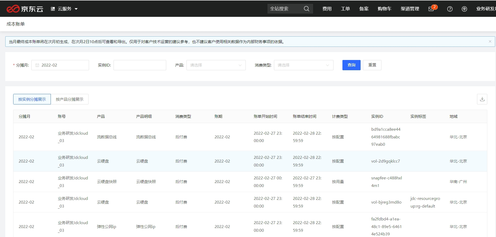
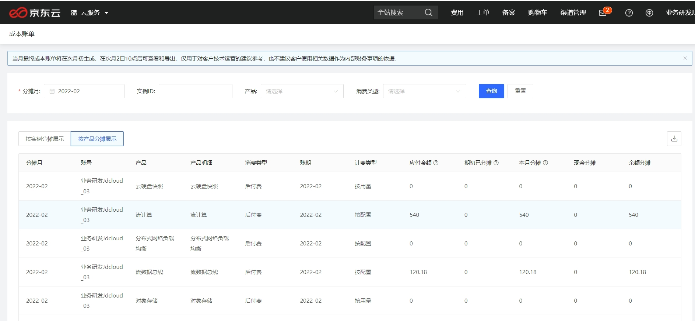
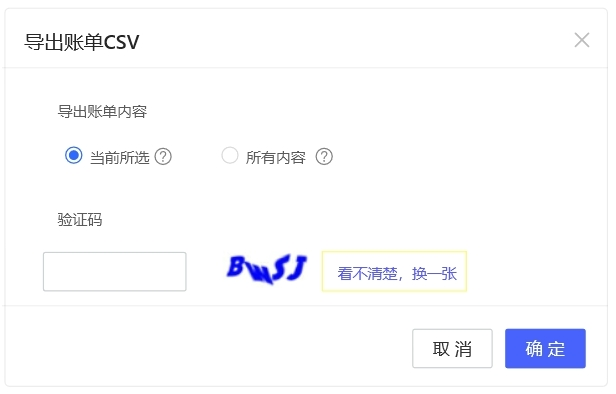
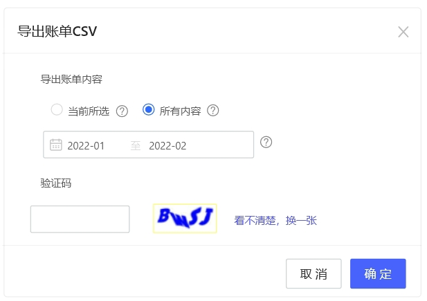

## **操作说明**

本文将向您介绍如何使用成本账单，并进行更改配置。

您可以登录[jdcloud.com](https://www.jdcloud.com/)，进入“[控制台-成本管理-成本账单](https://cost-allocation-console.jdcloud.com/list)”，查看费用分摊到每个月的金额等信息。

支持按分摊月、实例ID、产品、消费类型进行搜索；可以按实例分摊展示和按产品分摊展示切换，查询费用情况。

### 按实例分摊

点击“按实例分摊展示”，可以查看按资源实例维度汇总的费用，分摊到该自然月的金额等信息。

|  **名称**   | **说明**                                                     |
| :---------- | ----------------------------------------------------------- |
|   分摊月   | 资源实例产生的费用，分摊到的自然月，预付费是按服务周期分摊到的自然月，后付费是资源实际消耗的自然月 |
|账号|登录账号|
|产品|用户所采购的云产品|
|产品明细|用户所采购云产品下具体的商品|
|消费类型|包含预付费与后付费|
|账期|资源实例产生的分摊费用，所对应的账期|
|账单开始时间|消费的开始时间|
|账单结束时间|消费的结束时间|
|计费类型|包年包月、一次性、按配置、按用量|
|实例ID|资源实例对应的名称编号|
|实例标签|资源实例的标签管理功能，方便您通过标签对实例分类|
|地域|资源实例对应计费项的地域信息|
|应付金额|用户享受优惠后需支付的金额，应付金额=原价-优惠金额|
|期初已分摊|分期账期开始到本月之前已支付/分摊的金额|
|本月分摊|当月已支付/分摊的实际金额|
|期末未分摊|下个月开始还需要支付/分摊的实际金额，预付费期末未分摊是分摊的金额，后付费期末未分摊是0|

### 按产品分摊

点击“按产品分摊展示”，可以查看按产品汇总的费用，分摊到该月的资金等信息。

|  **名称**   | **说明**                                                     |
| :---------- | ----------------------------------------------------------- |
|分摊月|按产品汇总的费用，分摊到的自然月，预付费是按服务周期分摊到的自然月，后付费是资源实际消耗的自然月|
|账号|登录账号|
|产品|用户所采购的云产品|
|产品明细|用户所采购云产品下具体的商品|
|消费类型|包含预付费与后付费|
|账期|资源实例产生的分摊费用，所对应的账期|
|账单开始时间|消费的开始时间|
|账单结束时间|消费的结束时间|
|计费类型|包年包月、一次性、按配置、按用量|
|应付金额|用户享受优惠后需支付的金额，应付金额=原价-优惠金额|
|期初已分摊|分期账期开始到本月之前已支付/分摊的金额|
|本月分摊|当月已支付/分摊的实际金额|
|现金分摊|通过现金支付该产品产生的费用，并分摊到当前月的金额|
|代金券分摊|通过代金券支付该产品产生的费用，并分摊到当前月的金额|
|期末未分摊|下个月开始还需要支付/分摊的实际金额，预付费期末未分摊是分摊的金额，后付费期末未分摊是0|

### 导出数据

点击**下载**图表，可以下载图表。完成后输入验证码，点击**确认**，即可下载成本账单。

#### 1.导出当前所选

#### 2.导出所有内容

一次最多导出6个月账单，可以导出一年的数据。如果导出1年以上的数据，需要提交工单。

