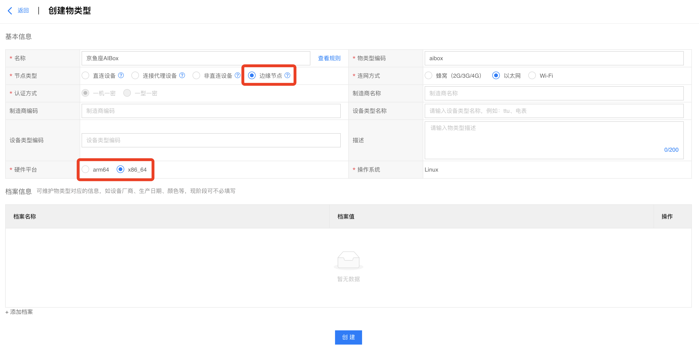
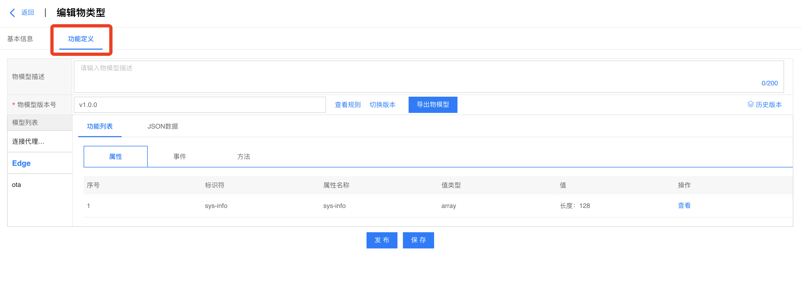
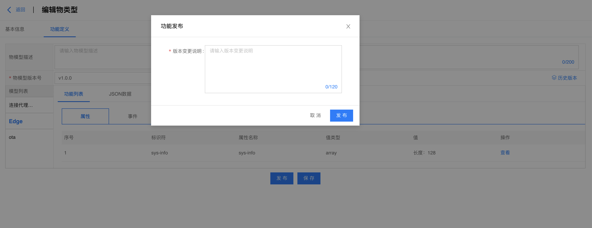
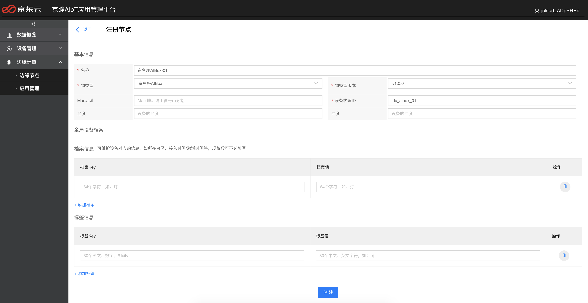
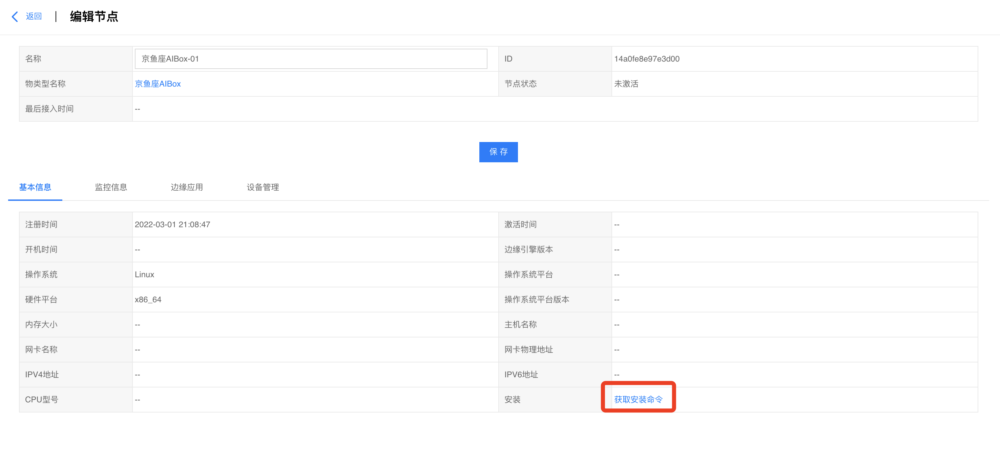
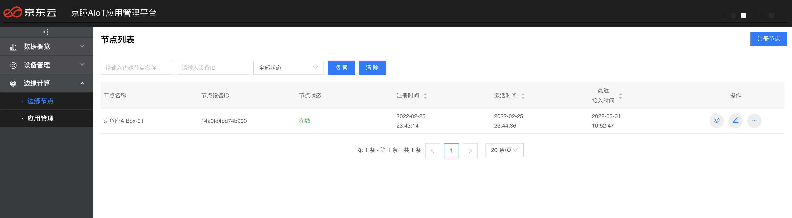
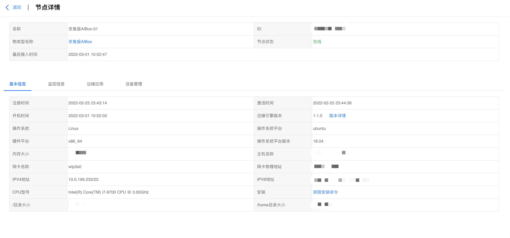
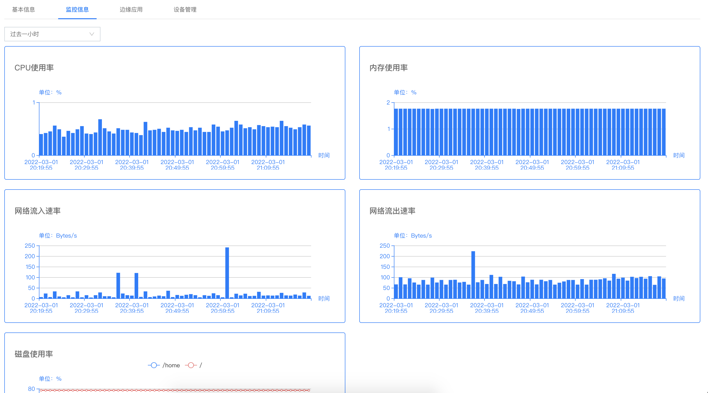

# 边缘节点接入

登录京瞳AIoT应用管理平台， 共4步即可完成边缘节点快速接入。

## 创建物类型

进入**设备管理中心**->**物类型列表**，点击**创建物类型**，并按如下步骤操作：

填入物类型的名称、连网方式和硬件平台等基本信息，确定基本信息无误后，点击**保存**

然后进入**功能定义**，会看到平台自动为边缘节点物类型添加了连接代理、Edge和ota模型，且不允许修改

物模型版本默认是v1.0.0，允许修改，然后点击**保存**，提示创建物类型成功

最后点击**发布**，填入版本变更说明，即可完成物类型的发布。

## 注册边缘节点

进入**边缘计算**->**边缘节点**，点击**注册设备**，并按如下步骤操作：

填入基本信息，其中物类型选择刚创建的物类型，确认基本信息无误后，点击**创建**，即可完成设备的创建

## 获取安装命令

注册成功后，会自动进入设备基本信息页，点击**获取安装命令**

点击**copy**按钮，复制安装命令，在边缘节点设备上执行命令，即完成边缘框架部署

## 节点详情

在京瞳AIoT应用管理平台查看当前设备状态，显示在线

点击操作栏**查看**按钮，进入节点编辑页面，能够看到节点当前的基本信息如下：

点击**监控信息**tab按钮，能够看到节点的监控信息如下：

