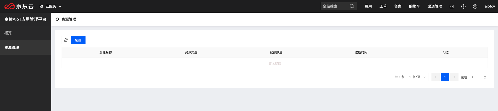
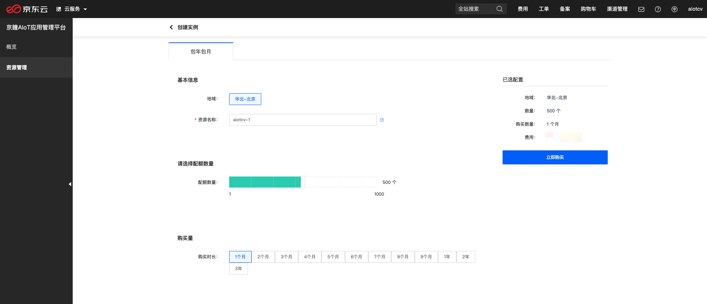
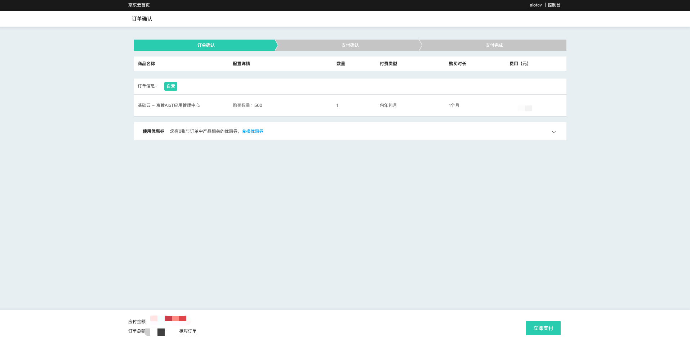
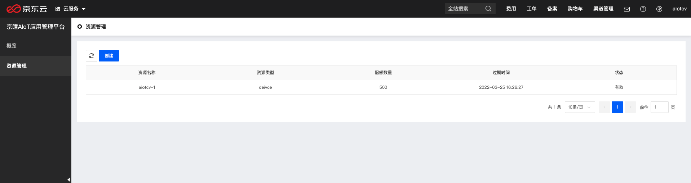
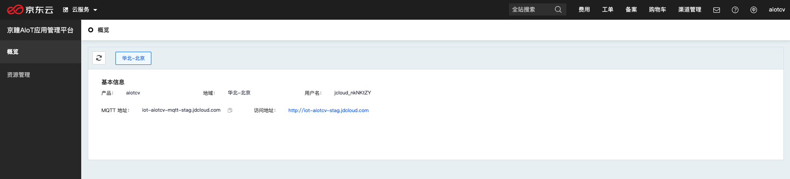

# 开通京瞳AIoT应用管理平台

本文介绍如何快速开通京瞳AIoT应用管理平台

1. 登录京东云控制台，进入"物联网->京瞳AIoT应用管理平台控制台"，进入资源管理页，点击“创建”。

2. 在资源创建页，填写您的资源名称、配额数量及购买时长等信息。

3. 点击“立即购买”，进入购买订单确认页，订单确认无误后点击“立即支付”。

   
4. 支付订单完成后，点击"管理控制台"会跳转至资源管理页，可点击"刷新"实时刷新资源列表。

5. 点击"概览"，进入概览页，可查看服务基本信息，包括地域、访问地址、MQTT地址等。

