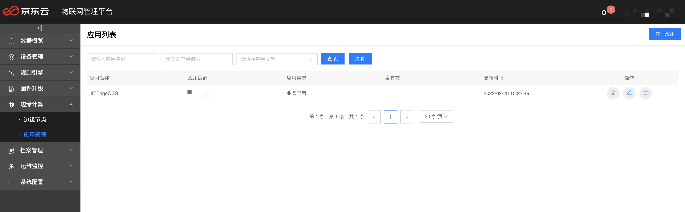
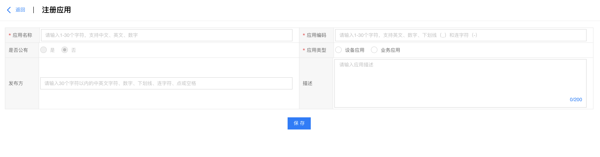
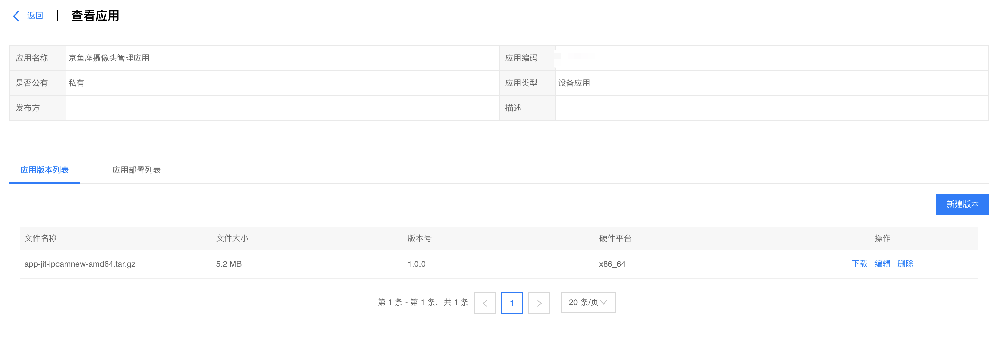
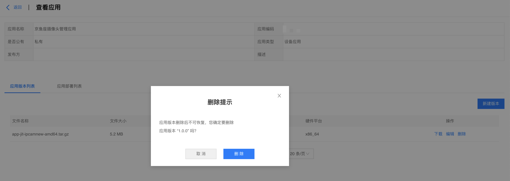

# 应用管理

在左侧导航栏选择 **边缘计算** -> **应用管理**，进入"应用列表"页，可对边缘应用进行注册、删除、查看和检索等操作。

##  注册应用

在"应用列表"页点击"注册应用"按钮，进入"注册应用"页面，需填写以下信息，填写完成后点击"保存"按钮，注册成功会自动跳转至"应用详情"页。

-   应用名称：边缘应用名称。仅支持30个以内的字符，包括中文、英文和数字。
    
-   应用编码：边缘应用唯一编码。仅支持30个以内的汉字、英文、数字、下划线(\_)、连字符(-)、点(.)、空格。
    
-   应用类型：可选择设备应用或业务应用。设备应用：用于接入和管理设备的边缘应用。业务应用：不涉及接入或管理设备的业务应用。
    
-   是否公有：公有的话对所有用户可见，私有的话仅对当前用户可见。
    
-   发布方：发布方名称，非必填。
    
-   描述：应用描述，非必填。

## 上传应用

在"应用列表"页点击目标应用操作栏的"查看"按钮，进入"编辑应用"页，页面顶部是应用基本信息，点击"编辑"按钮，可修改应用基本信息，包括应用名称、是否公有、发布方、描述等。

## 应用版本管理

"编辑应用"页底部包括应用版本列表和应用部署列表，默认打开的是应用版本列表。

### 新建版本

点击 "新建版本"按钮，进入"新建版本"页面，填入应用信息、缺省容器参数和缺省应用配置等信息，点击"确定"按钮即可完成应用新版本的创建。

应用信息
-   镜像包上传：支持上传tar.gz、tgz格式的压缩包。
    
-   应用版本：请遵循语义化版本规范，版本号格式：主版本号.次版本号.修订号，例如 V1.0.0、v1.0.0 或 1.0.0。
    
-   签名算法：应用镜像包签名算法，默认MD5。
    
-   签名值：应用镜像包签名值。
    
-   硬件平台：应用支持的硬件平台，平台支持arm64和x86_64两种硬件平台。
    
-   操作系统：应用支持的操作系统，平台目前仅支持Linux。

缺省容器参数

-   CPU优先级：支持Lower、Normal和Higher三种。
    
-   内存限制：单位为MB，若无限制，则填0。
    
-   特权模式：可选择是否支持。
    
-   重启策略：支持从不重启、总是重启、失败时重启三种选择。
    
-   使用宿主机host模式：可选择是否使用。
    
-   EntryPoint：镜像EntryPoint，非必填。
    
-   环境变量：点击"添加环境变量"按钮，输入变量名称和值，即可添加环境变量，最多支持10个。
    
-   端口映射：点击"添加端口映射"按钮，输入容器内端口和宿主机端口，即可添加端口映射，最多支持10个。
    
-   卷映射：点击"卷映射"按钮，输入源路径和目的路径，即可添加卷映射，最多支持10个。

缺省应用配置

-   应用配置：支持自定义输入应用配置，最多支持输入两千个字符。

### 删除版本

在"应用版本列表"页面，点击目标应用版本操作栏的"删除"按钮，并在弹出的删除确认提示框中点击删除按钮，即可删除该版本。

### 编辑版本

在"应用版本列表"页面，点击目标应用版本操作栏的"编辑"按钮，在弹出的"编辑版本"页面中可编辑版本的部分应用信息（硬件平台、操作系统）、容器参数和应用配置，编辑完成后点击"确定"按钮即可保存。

### 下载版本

在"应用版本列表"页，点击目标应用版本操作栏的"下载"按钮，可下载该版本的镜像包。

## 应用部署列表

在"编辑应用"页，点击"应用部署列表"按钮，出现"应用部署列表"页（若无应用部署信息，需跳转至 **边缘计算** -> **边缘节点** -> **边缘应用** 部署应用），可查看该应用部署在各节点的具体详情，包括节点名称、节点设备ID、节点状态、应用状态、部署版本、部署时间和应用操作等。若节点在线，应用操作可对应用进行停止、移除、强制重启、编辑容器参数、编辑应用配置、更新等操作；若节点离线，应用操作仅可查看容器参数和应用配置。

在**应用部署列表**页，应用操作栏支持移除、停止、强制重启、编辑容器参数和编辑应用配置等操作。
