边缘计算服务提供边缘节点和应用管理两部分核心功能，边缘节点支持节点创建、编辑、删除、OTA、边缘应用部署、边缘设备绑定解绑等操作，应用管理支持边缘应用版本创建、上传、编辑、删除等管理操作。

# 边缘节点

在左侧导航栏选择 边缘计算 -> 边缘节点，即可进入边缘节点列表页，节点列表页展示已注册的节点详细信息，包括节点名称、节点设备ID、节点状态、注册时间、激活时间、最近接入时间，支持对边缘节点进行注册、删除、查看、一键安装、节点检索等操作。

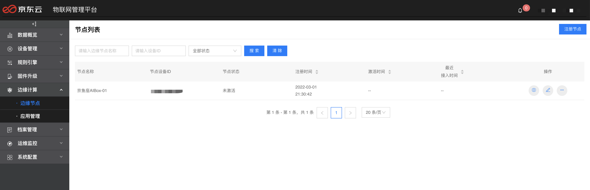

## 注册节点

在边缘节点列表页点击"注册节点"按钮，进入"注册节点"页面，填入相关信息，点击"创建"按钮，即可注册节点，注册成功后自动跳转 节点详情 页面。

基本信息
-   名称：边缘节点名称。仅支持30个以内的汉字、英文、数字、下划线(\_)、连字符(-)、点(.)、空格。
-   物类型：选择已创建的物类型，只有该物类型的"节点类型"是"边缘节点"才支持创建边缘节点，若需创建边缘节点物类型请前往 物类型列表 -\> 创建物类型（节点类型选择"边缘节点"）进行添加。
-   物模型版本：选择已发布的物模型版本。
-   设备物理ID:仅支持30个以内的汉字、英文、数字、下划线(\_)，连字符(-)。
-   Mac地址：Mac地址请用冒号(:)分割，非必填。
-   经度：描述设备的经度，非必填。
-   纬度：描述设备的纬度，非必填。

全局设备档案

对所有设备统一的信息维护，如所在台区、空间位置等。可在 档案管理 -\> 档案列表 中对全局设备档案进行管理，若档案列表中没有全局设备档案，则此处不显示。

档案信息

自定义的只对当前设备维护的信息，非必填项。

标签信息

可对设备添加标签。

## 查询节点

在"节点列表"页可根据节点名称、设备ID、设备状态等条件进行节点信息查询，输入查询条件点击"搜索"按钮即可完成检索，点击"清除"按钮可清空查询条件。

## 删除节点

在"节点列表"页点击目标节点操作栏的"删除节点"按钮，并在弹出的"删除确认框"点击"删除"按钮，即完成删除操作。

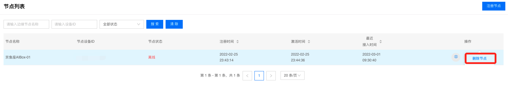

## 证书下载

在"节点列表"页点击目标节点操作栏的"证书下载"按钮，即可以下载平台为该节点颁发的证书文件。完整的证书压缩包含三个文件，分别是节点证书文件、节点秘钥文件和根证书文件。

## 操作节点

在"节点列表"页点击目标节点操作栏的"编辑"按钮，即进入"节点详情"页面。

### 基本信息

"节点详情"页默认打开的是节点的基本信息，包括节点的注册时间、激活时间、开机时间、边缘引擎版本、操作系统、操作系统平台、操作系统平台版本、硬件平台、主机名称、内存大小、网卡名称、网卡物理地址、IPV4地址、IPV6地址、CPU型号、安装指令、/目录大小、/home目录大小等信息。

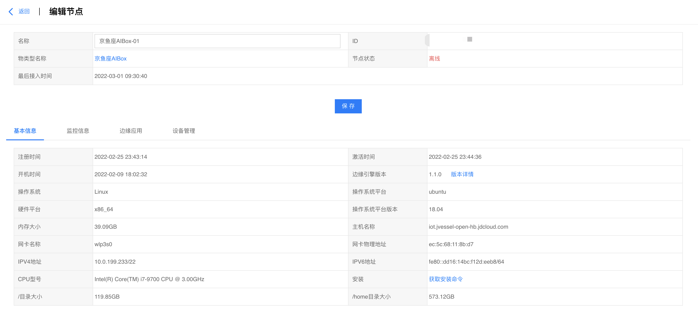

#### 获取安装命令

边缘节点支持一键安装。"节点详情"页点击"获取安装命令"按钮，弹出"安装命令"页面，可复制安装命令，在边缘节点设备上执行命令，完成边缘框架部署。

#### 版本详情

边缘节点支持OTA升级。"节点详情"页点击"版本详情"按钮，弹出"边缘引擎版本详情"页面，展示了当前版本的详细信息，包括操作系统、硬件平台、版本号、版本说明、可更新版本、版本说明和更新记录，点击"可更新版本"下拉列表可选择目标版本，选择后点击"更新"按钮，即下发OTA命令至边缘节点。

### 监控信息

在"节点详情"页点击"监控信息"按钮，即进入"监控信息"页，可查看节点的监控信息，包括节点的CPU使用率、内存使用率、网络流入速率、网络流出速率和磁盘使用率等。

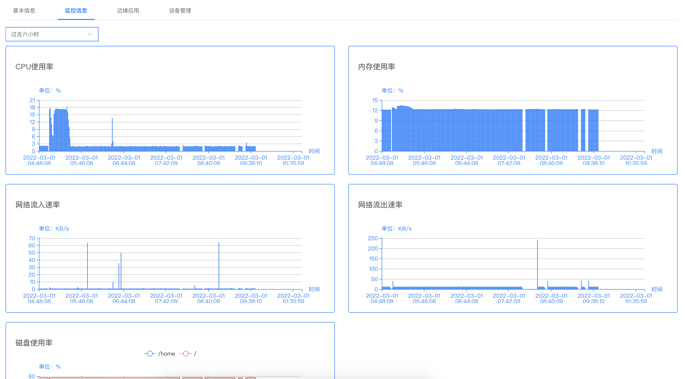

## 边缘应用

在"节点详情"页点击"边缘应用"按钮，即进入"边缘应用"详情页，可查看已部署应用列表，包括应用名称、应用编码、版本、应用状态、部署时间基本信息，以及可执行移除、停止、强制重启、编辑容器参数、编辑应用配置等操作。

### 部署应用

在"边缘应用"详情页点击"部署应用"按钮，弹出"部署应用"页面，可通过应用下拉菜单选择应用（若无可选择应用，则需跳转至 应用管理 上传应用），选择应用后镜像包列表中会出现该应用所有镜像包列表（若无可选择镜像包，则需跳转至 应用管理 -\> 应用版本 新建版本），包括镜像包名称、镜像包大小、应用版本、硬件平台、容器参数和应用配置等信息。

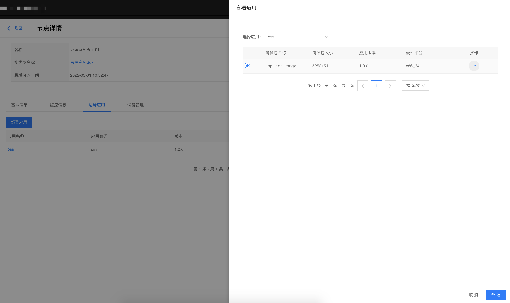

选择具体某个版本的镜像包后，若需要修改镜像包的容器参数，需点击操作栏的"容器参数"按钮，在弹出的"容器参数"页可编辑CPU优先级、内存限制、特权模式、重启策略、使用宿主机host模式、EntryPoint、环境变量、端口映射、卷映射等参数，编辑完成后点击"保存"按钮即可。

若需要修改应用的应用配置，需点击操作栏的"应用配置"按钮，在弹出的"容器参数"页可编辑应用配置具体内容，编辑完成后点击"保存"按钮即可。

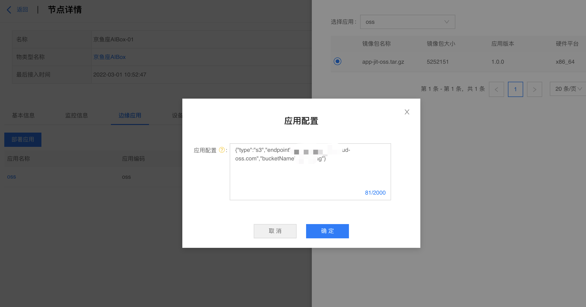

最后，点击右下角"部署"按钮，即下发部署应用命令至边缘节点，"部署应用"列表页就会展示该应用的具体信息。

### 移除应用

在"边缘应用"页点击目标应用操作栏的"移除"按钮，并在弹出的"移除确认"窗点击"删除"按钮，即下发移除应用命令至边缘节点。

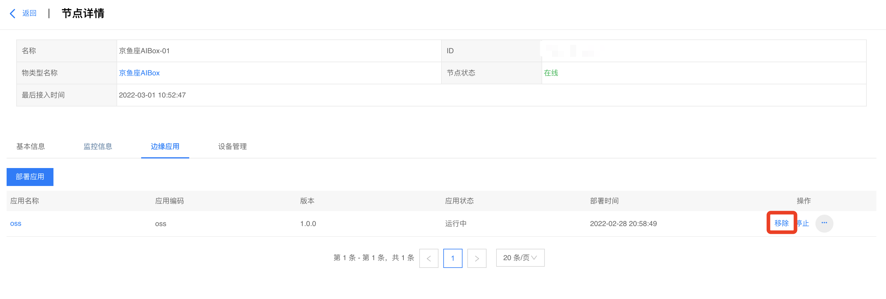

### 停止应用

在"边缘应用"页，若目标应用的应用状态为运行中，可点击操作栏的"停止"按钮，即下发停止应用命令至边缘节点。

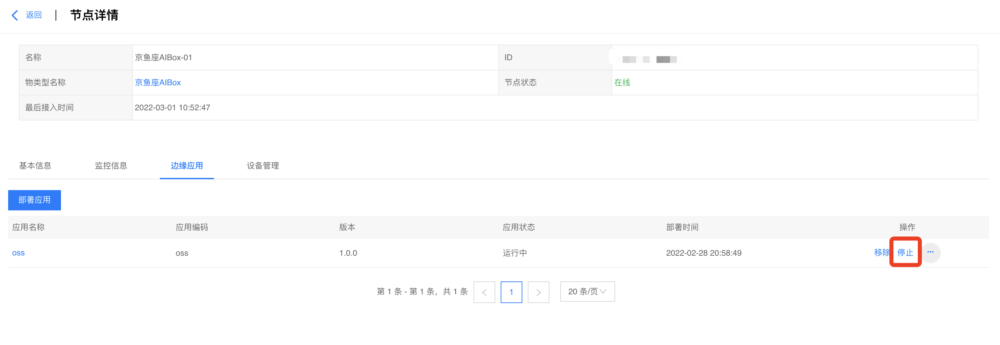

### 重启应用

在"边缘应用"页，若目标应用的应用状态为运行中，点击目标应用的"强制重启"按钮，即下发重启应用命令至边缘节点。

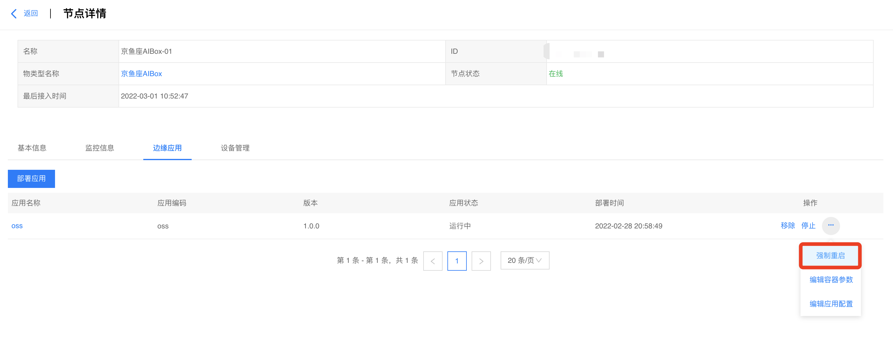

### 编辑应用容器参数

在"边缘应用"页，点击目标应用操作栏的"编辑容器参数"按钮，弹出的"编辑容器参数"页面中可修改容器参数，修改完成点击"确定"按钮，即下发编辑容器参数命令至边缘节点。

### 编辑应用配置

在"边缘应用"页，点击目标应用操作栏的"编辑应用配置"按钮，弹出的"编辑应用配置"页面可修改应用配置，修改完成后点击"确定"按钮，即下发编辑应用配置命令至边缘节点。

## 设备管理

在"节点详情"页点击"设备管理"按钮，进入"拓扑关系列表"页，可查看已建立拓扑关系设备列表，包括设备名称、设备ID、设备物理ID、状态等基本信息，以及执行解除代理管理等操作。

### 添加代理关系

点击"添加代理关系"按钮，弹出添加代理关系页面，可通过物类型和设备名称（若无可选择物类型，需跳转至 设备管理 -> 物类型列表 创建物类型）筛选设备列表（若无可选择设备，需跳转至 设备管理 -\> 设备列表 注册设备），包括镜像包名称、镜像包大小、应用版本、硬件平台、容器参数和应用配置等信息。然后勾选目标设备，并选择绑定目标设备应用（若无可选择设备应用，需跳转至 边缘计算 -\> 应用管理 上传应用），最后点击"保存代理关系"按钮即下发保存代理关系至边缘节点，操作记录会显示在拓扑关系列表中。

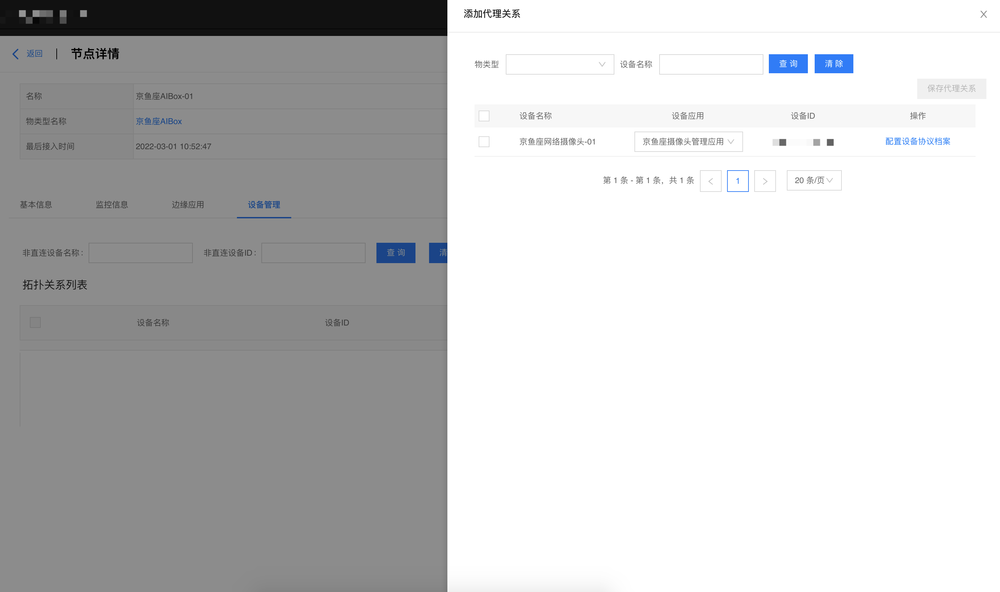

### 解除代理关系

在"拓扑关系列表"中选择目标设备（若无可选择设备，需先 添加代理关系），弹出的"确认解绑"页面点击"解除"按钮即下发解除代理关系至边缘节点。

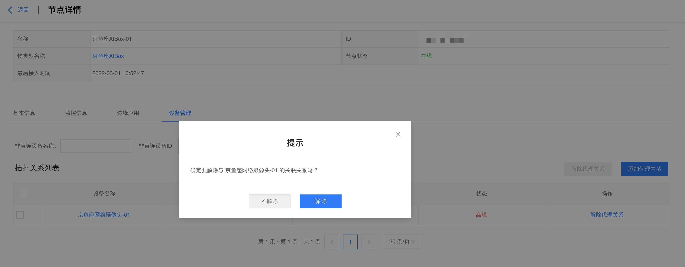