# 任务管理

在任务管理页面，可对升级任务进行创建，启动，查看进度详情，删除，查询等操作。

## 新增任务

登录物联网管理平台，在左侧导航栏选择 固件升级 -> 任务管理，即可进入任务管理页。点击新增任务按钮，进入新增升级任务页面。

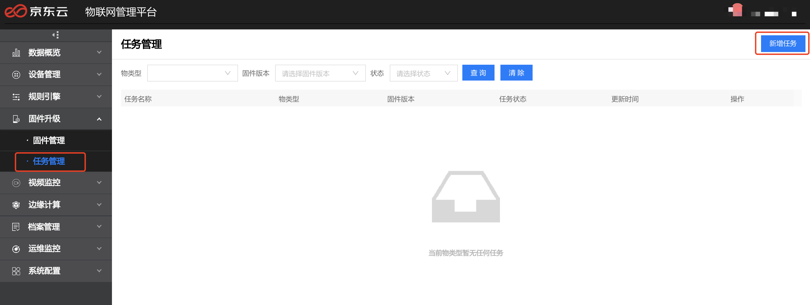

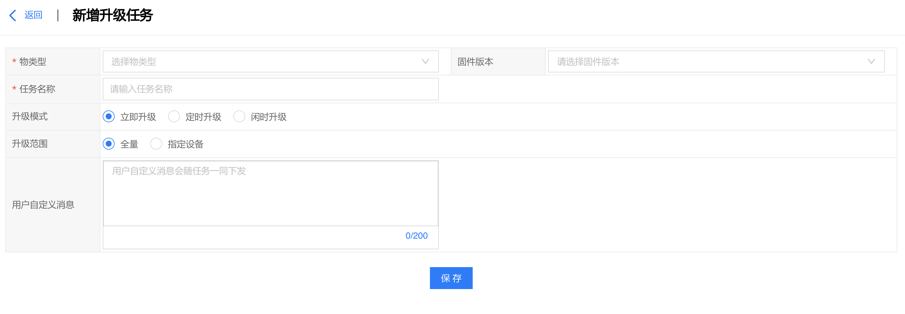

- 物类型：选择升级设备所属物类型。
- 固件版本：选择要升级的固件版本。
- 任务名称：描述任务名称。
- 升级模式：支持立即安装、定时升级、闲时升级三种模式。定时升级模式需指定升级时间。

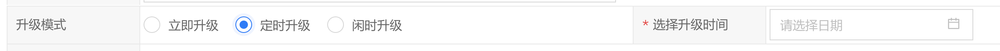

- 升级范围：支持全量升级和指定设备两种模式:
    - 全量：对该物类型下的所有设备进行升级。
    - 指定设备：支持设备分组和批量上传设备ID两种模式:
**设备分组**
选择设备分组，对该分组下的所有设备进行升级。

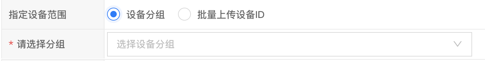

**批量上传设备ID**
点击设备ID模板下载，根据表格进行填写，再进行上传，将对表格中指定的设备进行升级。

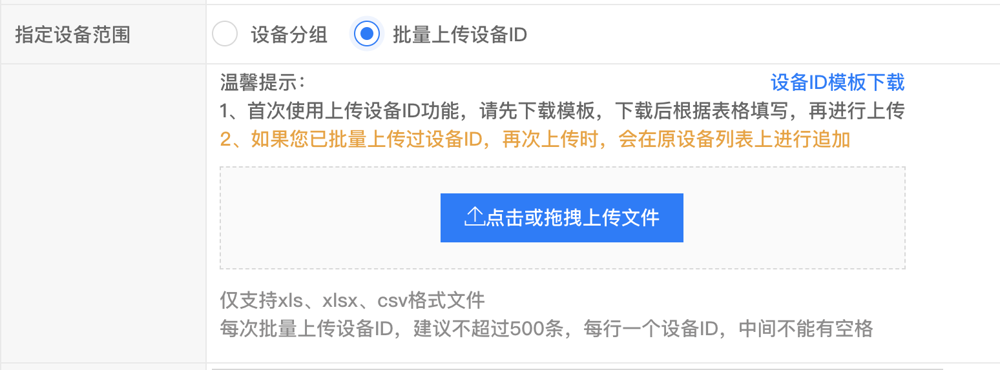

- 用户自定义消息：用户自定义消息会随任务一同下发。

## 编辑任务

新增任务后可点击编辑按钮对该任务进行修改，当任务状态为运行中或已完成时，不可进行编辑。

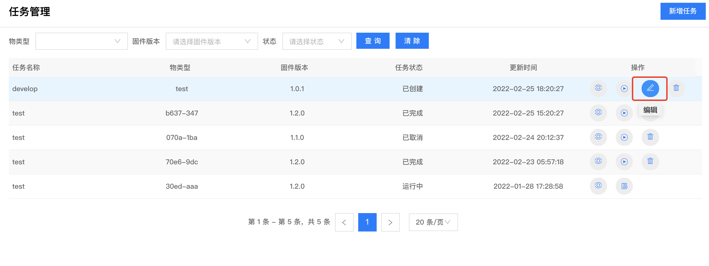

## 启动任务

创建任务后，可点击启动按钮启动升级任务。

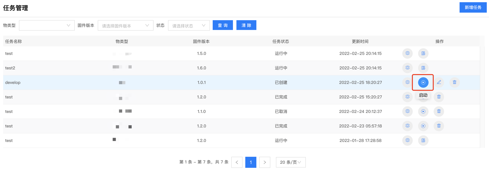

启动任务后，可点击取消按钮取消。

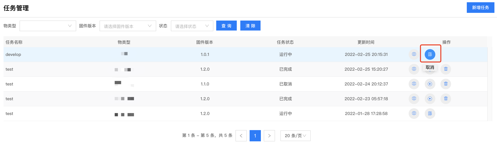

## 查看任务进度

点击查看进度按钮，可进入任务详情页面，展示设备固件升级状态。

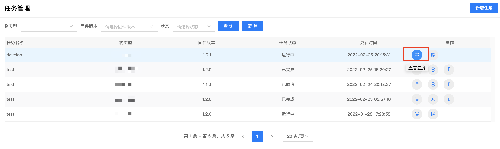

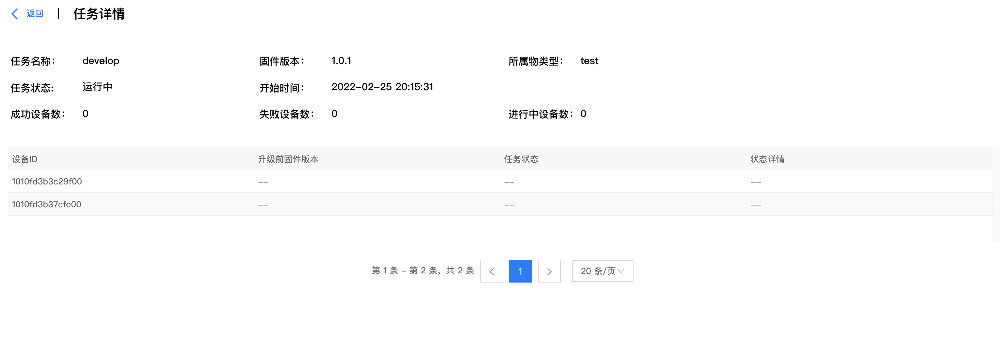

## 删除任务

点击要删除的任务的删除按钮，弹出删除任务弹窗，点击确定可进行任务删除。

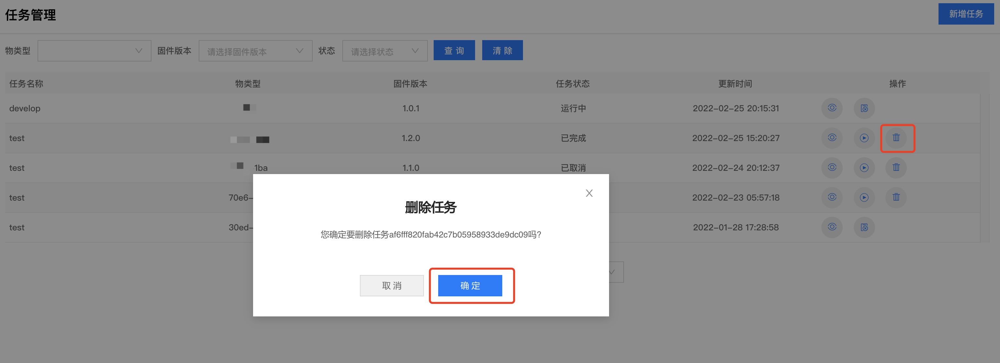

## 查询任务

在任务管理页面，可根据物类型，固件版本，任务状态（已创建、已取消、已完成、运行中）进行任务查询。

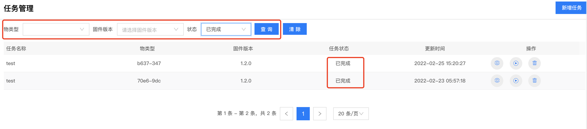