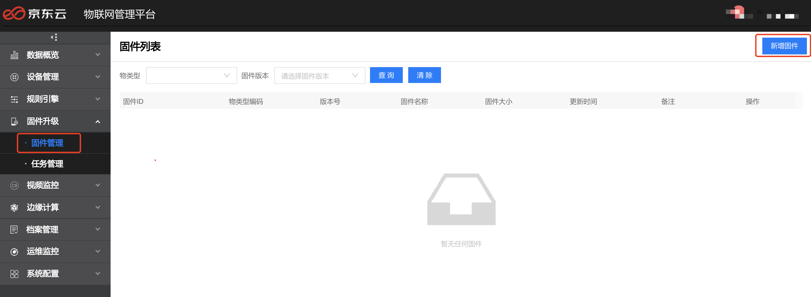
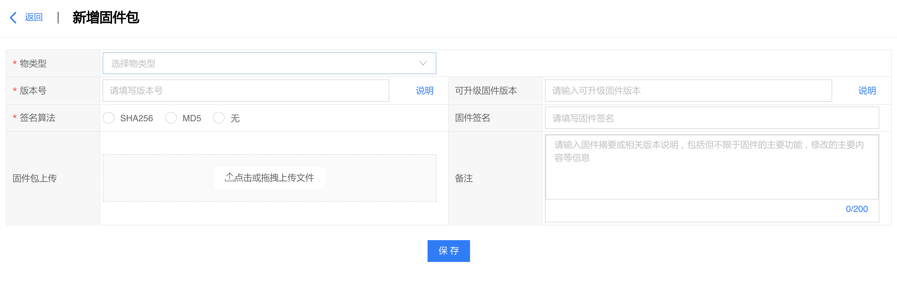
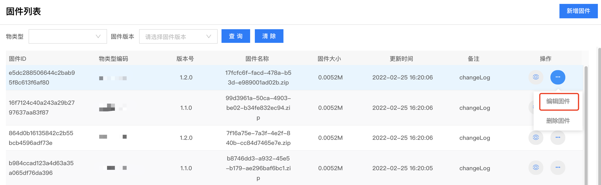
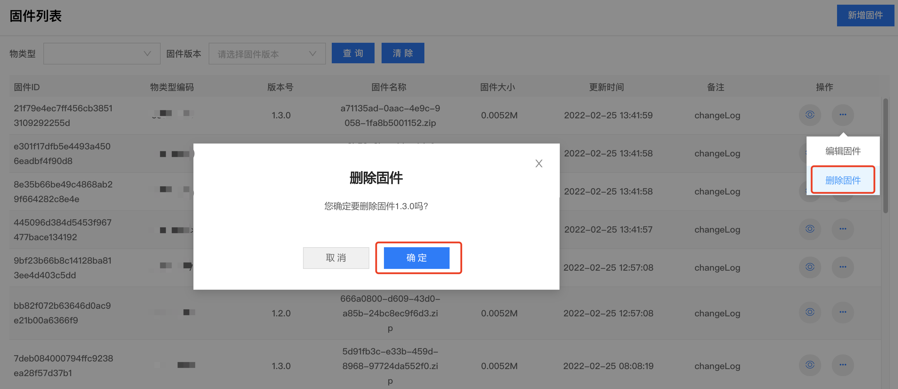
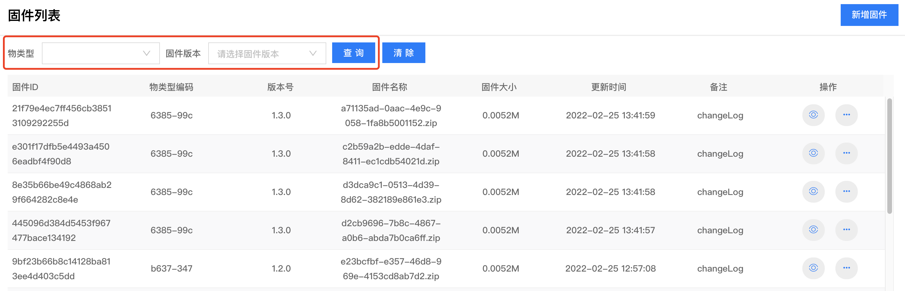

# 固件管理

在固件管理页面，可对固件进行新增，删除，编辑以及新增升级任务等操作。

## 新增固件

在左侧导航栏选择 固件升级 -> 固件管理，即可进入固件列表页。点击新增固件按钮，进入新增固件包页面。

-   物类型：选择已创建的物类型，只有该物类型含有OTA服务模型才支持固件升级，若需添加OTA服务模型请前往 物类型列表 -> 编辑物类型 -> 添加模型 -> 服务模型 进行添加。
-   版本号：添加可升级固件版本号，必须小于将要新增的固件的版本号。可以为空，即支持所有旧固件版本。
-   可升级固件版本：添加可升级固件版本号，必须小于将要新增的固件的版本号。可以为空，即支持所有旧固件版本。
-   签名算法：支持SHA256，MD5签名算法，也可选择无。
-   固件签名：非必填。
-   固件包上传：上传固件包。
-   备注：输入固件摘要或相关版本说明，包括但不限于固件的主要功能，修改的主要内容等信息，非必填。

## 编辑固件

进入固件升级-固件管理页面，选择固件点击编辑固件按钮，进入编辑固件页面。

## 删除固件

进入固件升级-固件管理页面，点击要删除的固件的删除按钮，弹出确认删除框，点击确定。

## 查询固件

进入固件升级-固件管理页面，选择物类型，固件版本，点击查询按钮，可查询相应条件下的固件信息。

