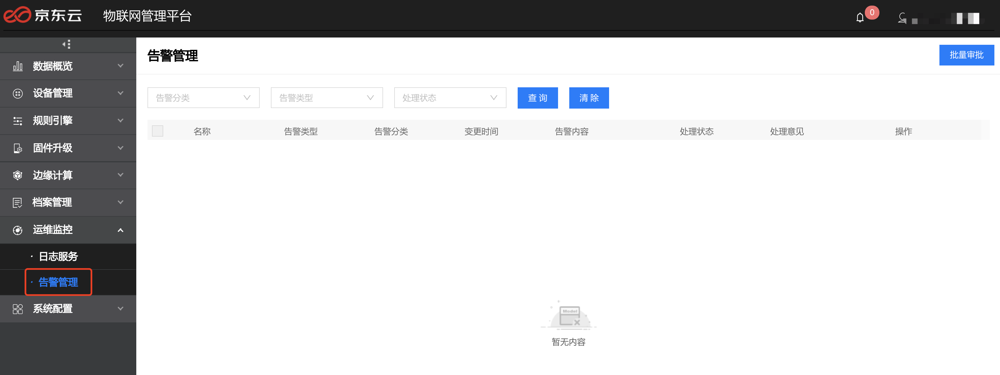
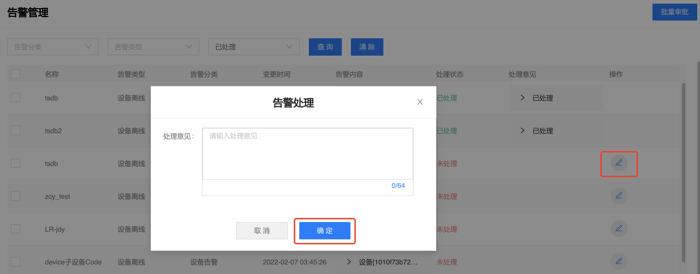
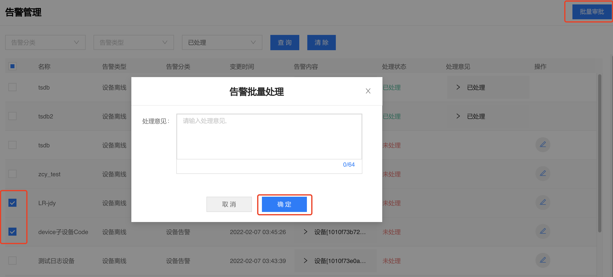
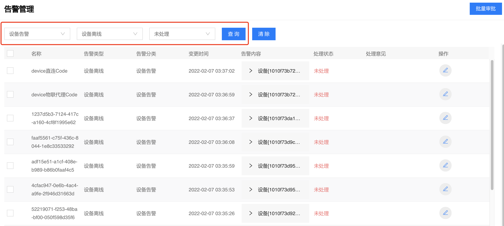

# 告警管理

物联管理平台支持在**运维监控**->**告警管理**页进行管理。设备告警目前只支持设备离线告警。

## 告警审批

告警审批包括单条告警审批及批量审批，审批完成后处理状态由未处理->已处理。

> 1．单条告警审批：

点击编辑按钮，填写处理意见，点击确定。

2.  批量审批

> 支持选中多条告警记录批量审批。

## 告警查询

支持根据告警类型，审批状态进行查询。

