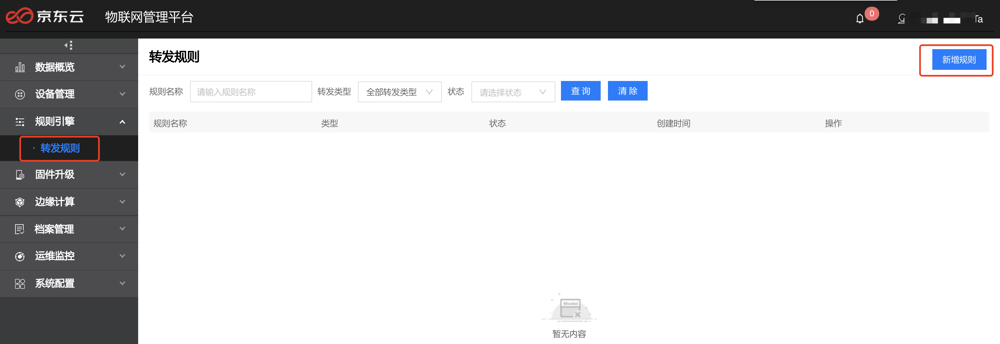
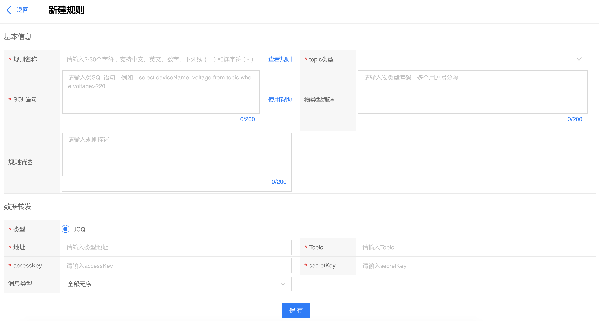
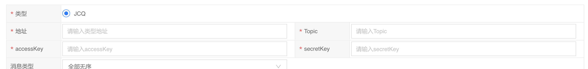
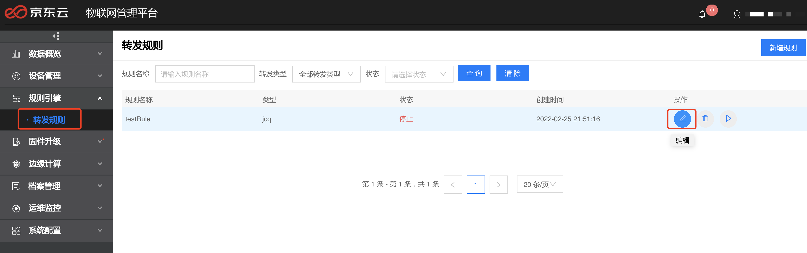
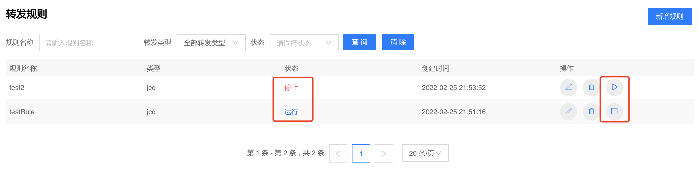
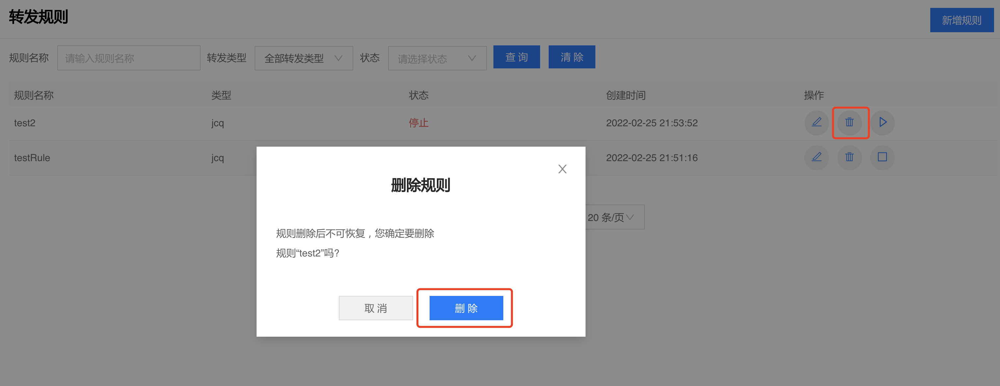

# 创建规则引擎

1. 登录物联管理平台
2. 左侧导航栏选择**规则引擎** -> **转发规则**
3. 点击页面右上方**新建规则**




**基本信息** 

-   规则名称：规则引擎唯一标识，支持2-30个字符内的中文、英文、数字、下划线（\_）和中划线（-）。
-   Topic类型 ：设备上报的MQTT Topic，表明对该Topic上报的数据进行处理。现支持设备事件上报，设备属性上报，设备方法调用，设备上下线四种Topic数据的处理。
-   物类型ID：支持根据物类型ID对上报数据进行过滤，多个物类型ID以逗号分隔，非必填。
-   SQL语句：定义数据过滤时执行的SQL语句，所有上报的数据都会经过SQL语句进行处理，然后进行数据转发。表名可以随意写，没有实际意义。
-   目前仅支持以下几种格式：
```
1. select * from temp
2. //包含 SQL 关键字
   select * from temp where "timestamp" > 1604581585
3. select deviceId as did from temp
4. //目前支持将 deviceId，thingTypeCode，deviceName，sn，uniqueId 五种信息添加到设备消息里对外发送，扩展字段须以$开头
   select $deviceName ,$thingTypeCode from temp
5. select * from temp where deviceId <> 1010631002e0500
6. select * from temp where deviceId like '%101063100%'
7. //字段名包含小数点
   select * from temp where "properties['battery.voltage']" = 10//数组8. select * from temp where events[0].key = 'connection_agent.online'
```
- 规则描述：对该规则的说明，无输入字符类型限制，长度限制为 0-200 个字符，非必填。

**数据转发**

通过规则过滤后的数据可以转发至JCQ。
转发到JCQ需填写地址、Topic、AccessKey/SecretKey、消息类型等信息。



获取消息队列JCQ的参数信息：
- 进入**消息队列JCQ** -> **Topic管理**
- 点击目标Topic名称进入该Topic详情页。若Topic管理页没有创建好的Topic,则点击新建按钮，创建Topic。
- AK/SK信息在Access Key管理页可以创建/获取。

## 编辑规则
1. 进入**规则引擎**-**转发规则**页面，选择一条规则点击编辑按钮，进入编辑规则页面。

2. 如果规则处于停止状态，进入编辑规则页面，可以修改规则的各项属性，点击保存后生效。
3. 如果规则处于运行状态，进入编辑规则页面，不可以修改规则的各项属性。

## 启停规则
1. 进入规则引擎-规则列表页面，点击运行/停止按钮。
2. 运行成功后，状态变为运行，在规则列表中操作中运行按钮变成停止按钮。停止成功后状态变为运行，在规则列表中操作中运行按钮变成停止按钮。



## 删除规则

进入**规则引擎**-**转发规则**页面，点击删除按钮。如果规则处于运行状态，则不可以删除；如果规则处于停止状态，则可以删除；删除成功后，在规则列表中查询不到。


