# 创建小程序

## 前提条件
[账号实名认证](./Precondition.md)

## 创建小程序

1. [登录控制台](./ControllPage.md)

2. 点击“小程序服务”菜单

   点击控制台左侧的“小程序服务“菜单后，点击”点击使用小程序“或者图片您都可以进入到“小程序管理云平台
   

3. 使用小程序服务

   进入“小程序管理平台”后，您可以管理小程序、下载小程序开发IDE工具、公版小程序运行App，小程序相关技术文档您也可在“小程序管理平台”上下载
   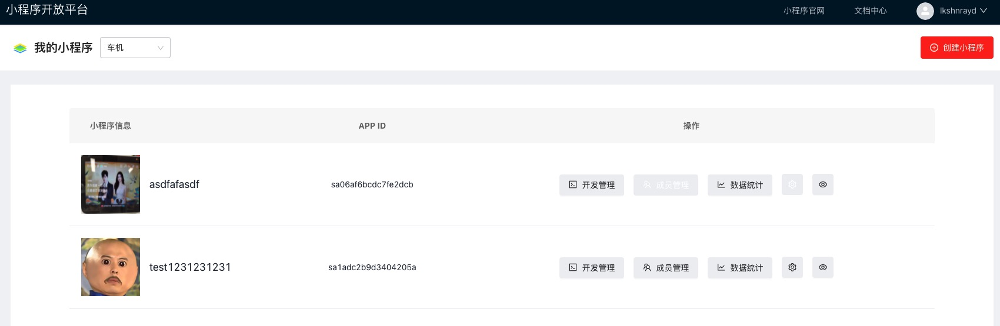
4. 创建小程序

   进入“小程序管理平台”后，页面的右上角或用户名下方，可见创建小程序按钮，您可以点击创建小程序，来新建属于自己的小程序
   
   然后根据提示信息填写，提交即可：
   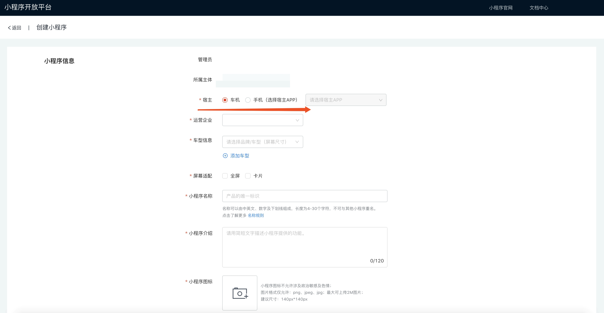

## 管理小程序
1. 开发管理

   您在已创建的小程序列表中可见 开发管理按钮
   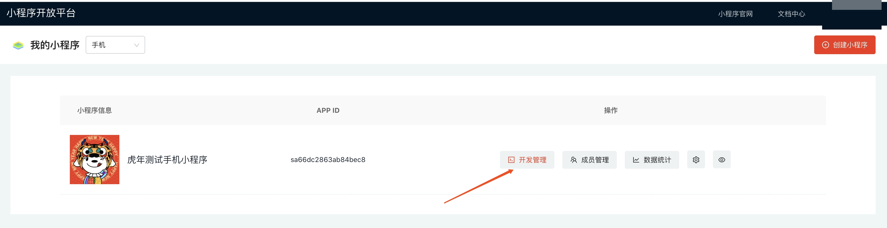
   开发管理可分为四部分：
   1. 下载 sdk、IDE工具以及京东小程序开发文档
   进入开发管理页面后可见底部有运行 sdk下载、IDE工具下载 以及京东小程序开发文档，目前运行SDK仅支持在1728*1440的Android屏端运行
   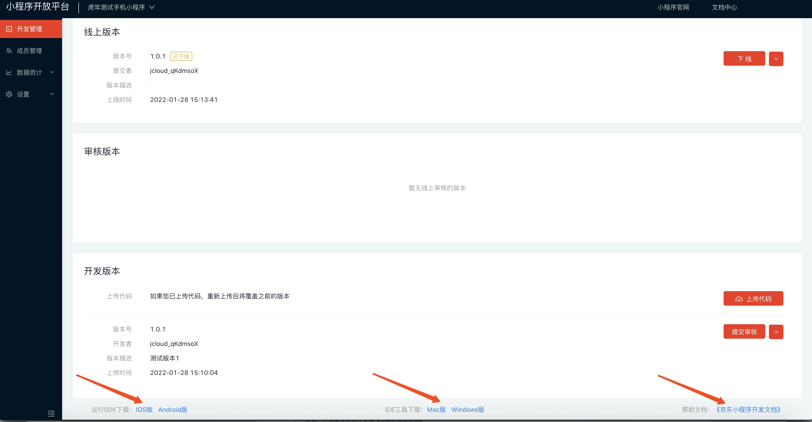
   2. 根据要求生成代码包，上传代码包，并提交审核，然后联系对应的管理人员
   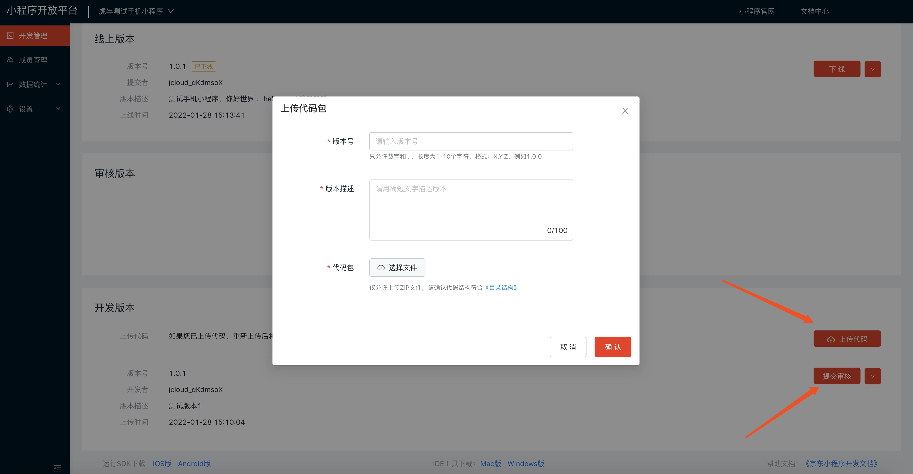
   3. 待管理人员审核通过后，即可提交发布，小程序发布及上线
   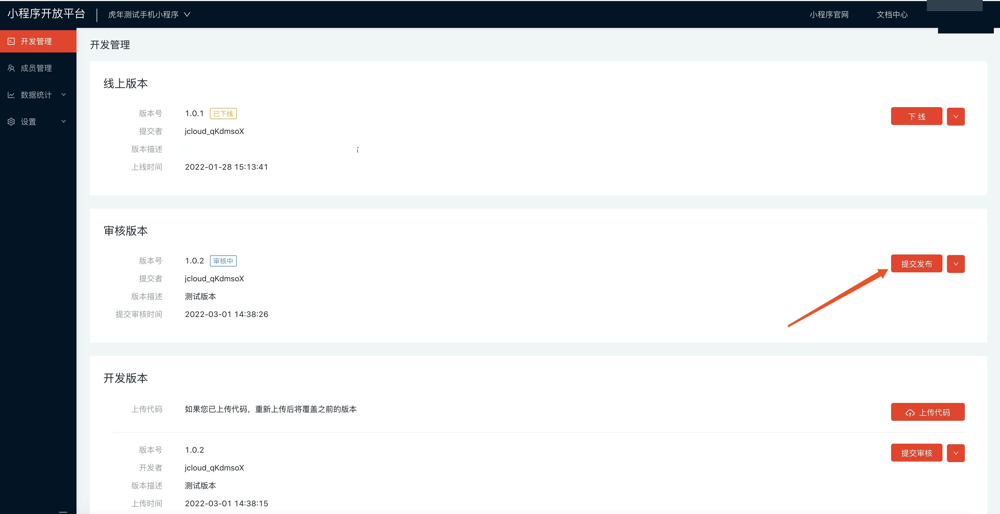
   4. 最后如果您已上线小程序的需要下线，点击下线即可，下线需要通过管理人员的审核，审核通过便下线成功
   

2. 数据统计

   在您的小程序上线后，您可以在数据统计页面查看您的小程序的相关统计数据，为您提供分析
   1. 基础数据
      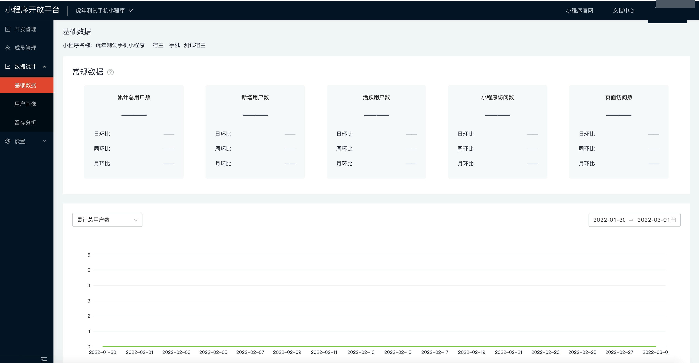
   2. 用户画像
      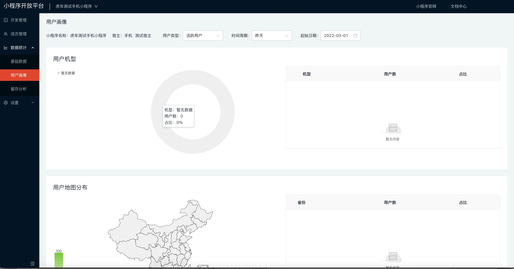
   3. 留存分析
      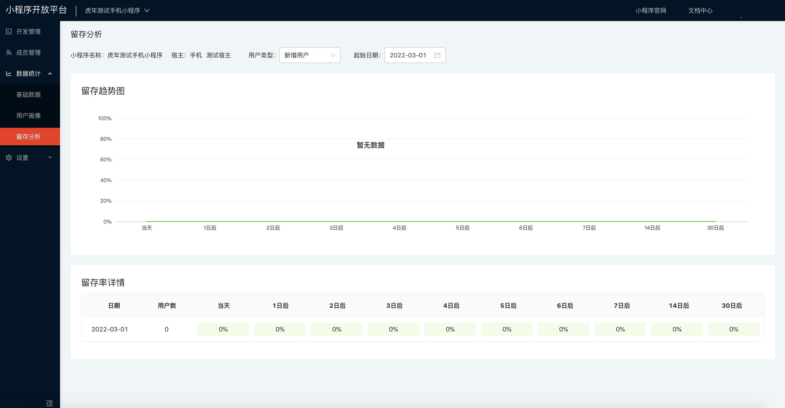
3. 设置

   小程序创建之后，您还可以其进行设置修改
   1. 基础设置
      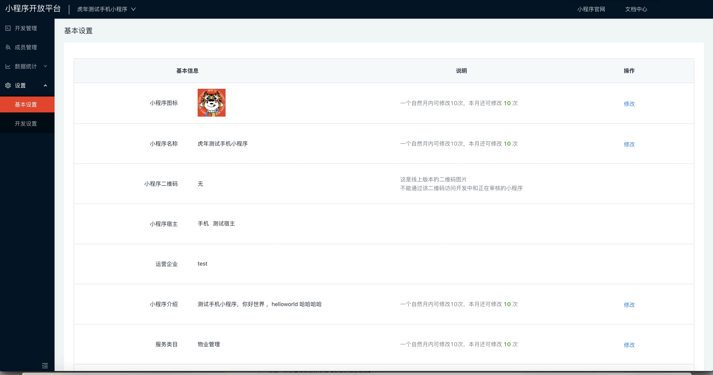
   2. 开发设置
      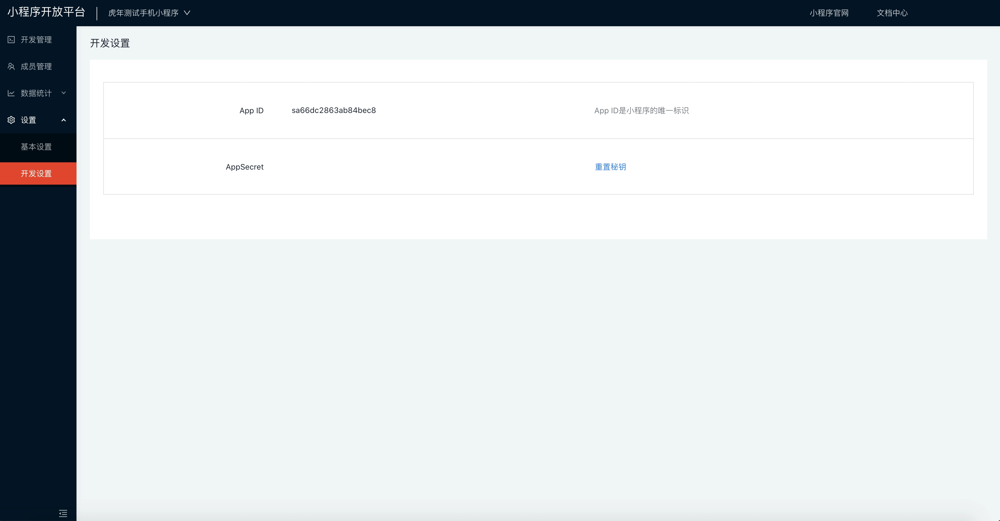