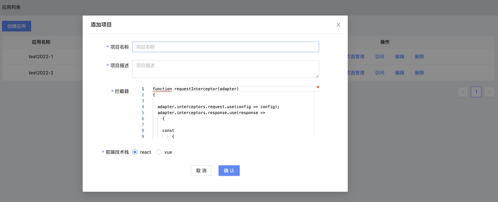
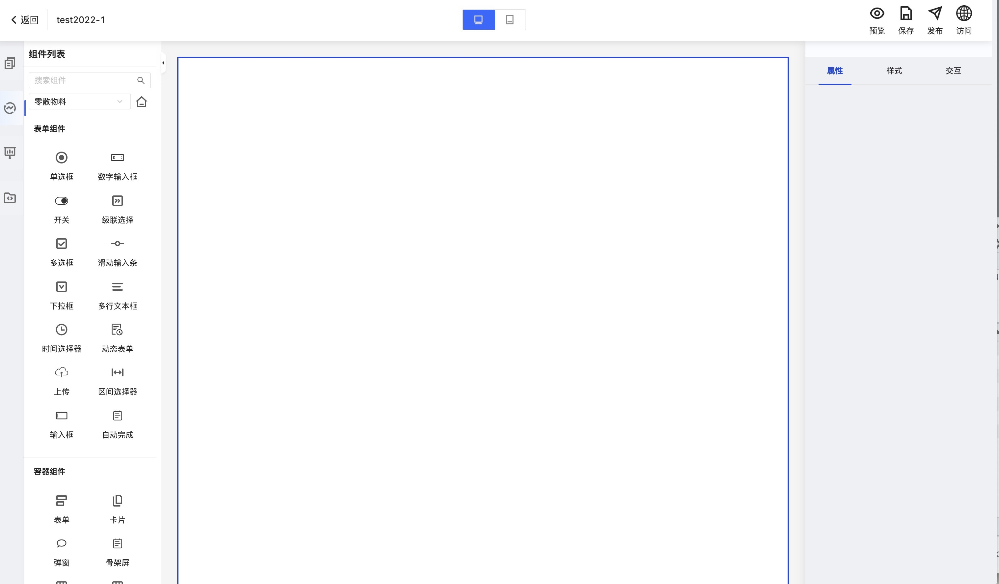

# 创建拖拽应用

## 前提条件
[账号实名认证](Precondition.md)

## 创建应用

1. [登录控制台](ControllPage.md)

2. 点击"低代码平台"菜单
   

3. 点击"创建应用"创建自己的应用程序
   

4. 点击"页面管理"进入拖拽控制台进行编辑
   
   
5. 点击右上角"发布"发布自己的应用

6. 返回应用列表点击"访问"查看自己所创建的应用