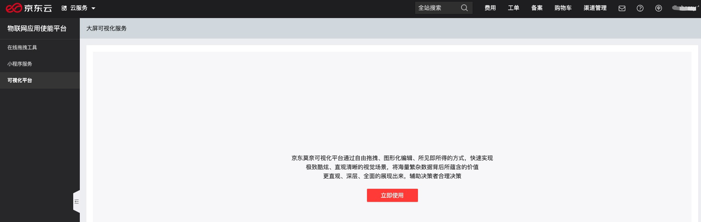

# 创建小程序

## 前提条件
[账号实名认证](./Precondition.md)

## 创建应用

1. [登录控制台](./ControllPage.md)

2. 点击“可视化平台”菜单

   点击控制台左侧的“可视化“菜单后，点击”立即使用“您可以进入到“京东莫奈可视化平台"
   

3. 使用小程序服务

   进入“京东莫奈可视化平台”后，您可以根据《操作手册》使用平台，操作手册入口见下图所示
   
