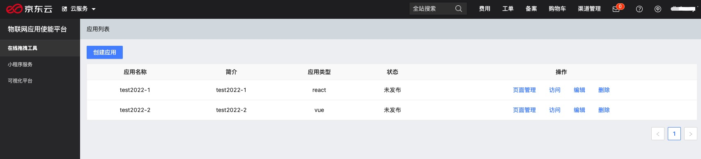
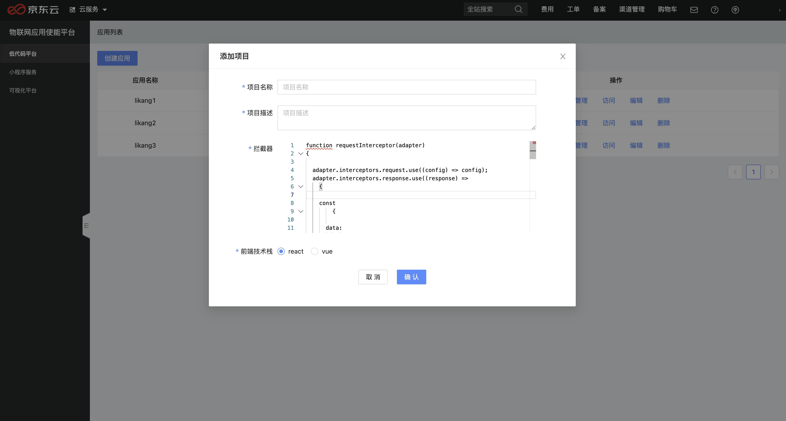

# 创建应用

## 前提条件
[账号实名认证](../Precondition.md)

## 创建应用

1. [登录控制台](../ControllPage.md)

2. 进入"低代码平台"

   点击控制台左侧的“低代码平台“菜单后，您就可以看到您自己已经创建的应用列表
   

3. 创建应用

   点击左上角"创建应用"。输入项目名称，项目描述，拦截器，前端技术栈创建自己的第一个低代码应用
   
   拦截器的作用是拦截请求，对请求数据做统一拦截处理，如果没有特殊需求可以使用页面默认值。

创建好的应用您可以通过最后一列"操作"进行页面管理，访问使用，编辑以及删除