# 页面创建
   在您自己的应用列表中，选择一个应用，点击"页面管理"您就可以编辑相应的应用。

   首先，来看一下页面编辑器的整体布局：页面管理、组件中心、数据共享、dsl。

1. 页面管理

   在左侧可以看到页面的个数。在页面的顶部搜索框，用户可以对之前做好的页面进行搜索、查找。右侧"加号"可以点击创建新的页面。页面列表右侧可以点击进行页面复制，重命名，删除等操作。
   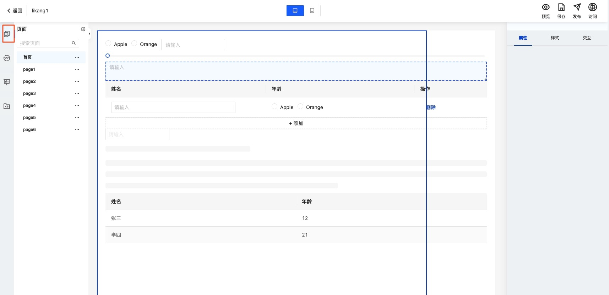

2. 组件中心

   该项包含组件列表：表单组件、容器组件、展示组件。组件列表上方有搜索框，用户可以对需要组件进行搜索。
   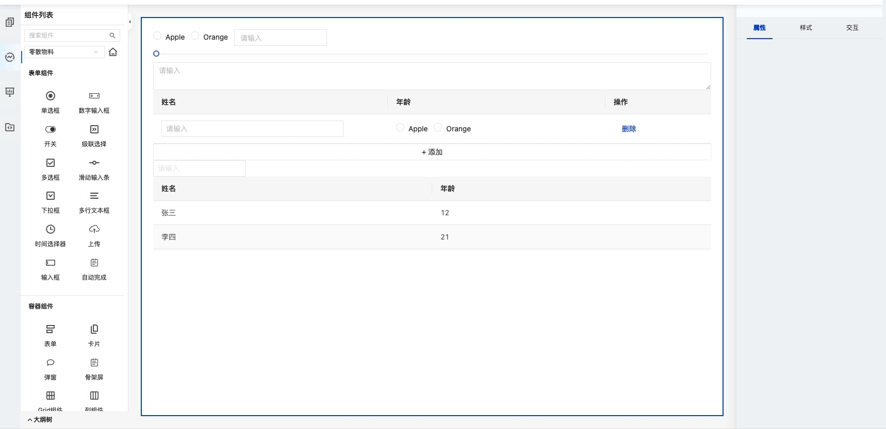

3. 数据共享

   该项包含数据源，所有的组件对应的数据源是通过API接口调用，还是JS脚本的格式。每个数据源右边的三个点，点击后，可以对每个数据源进行查看、编辑、删除。
   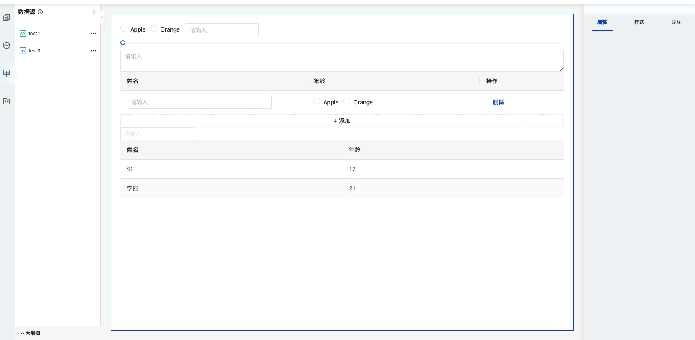

4. dsl
   该项为页面所有组件的dsl渲染代码，左侧为代码展示区。也可以通过代码区上方的编辑项进行编辑：代码演示、代码删除、代码复制、全屏编辑。
   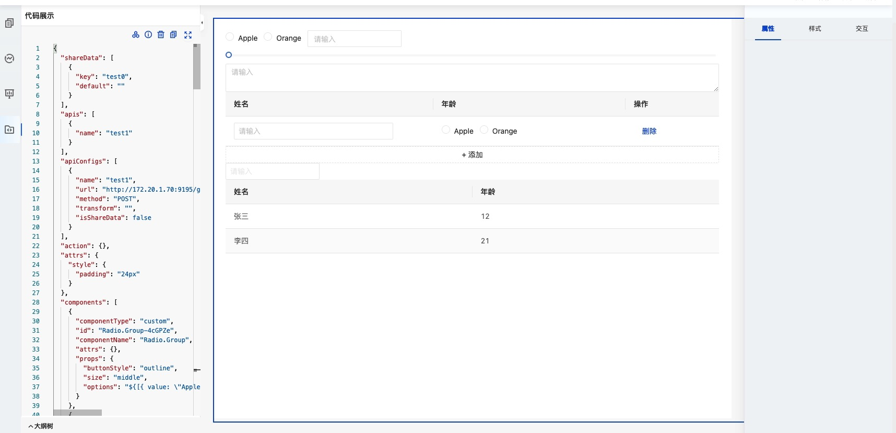

a. 界面的上方中央的位置，为PC端与移动端进行切换，用户可根据需求进行选择。
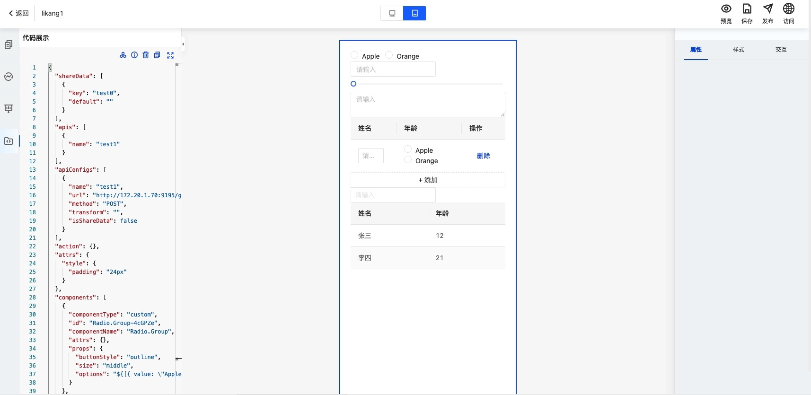

b. 页面的右侧为组件的属性、样式、交互的编辑区。对编辑的当前组件进行属性配置、样式编辑、以及交互方式的设计。
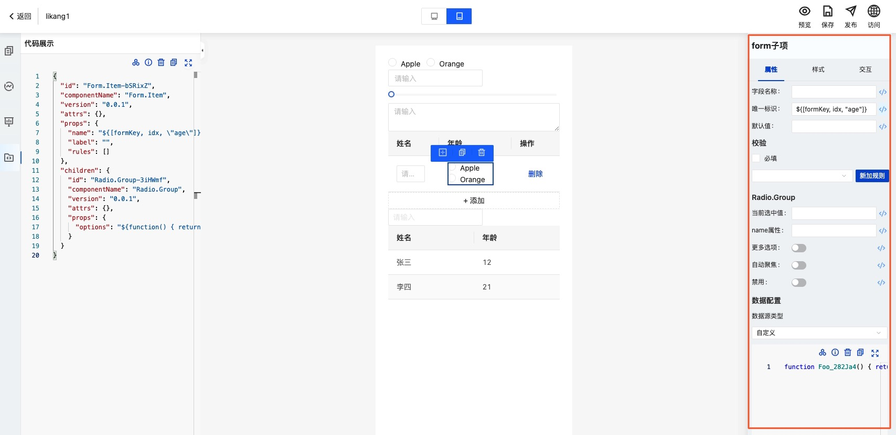

c. 页面编辑显示区：用户页面的编辑都在此页面进行操作，通过左侧拖拉拽组件，对页面进行布局，鼠标点击组件，会有蓝色的删除和复制图标，用户可选择点击，并且用户可在右侧属性编辑区对当前组件进行属性编辑。
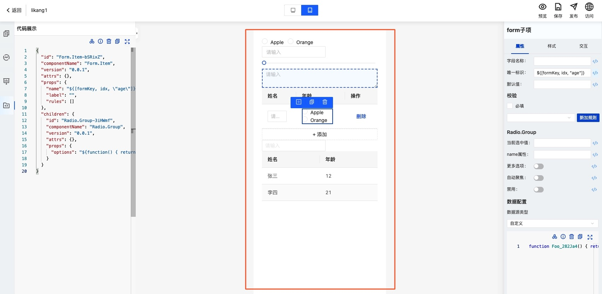

# 最佳实践
1、首先在页面编辑器中拖拽两个组件，按钮组件和表格组件。
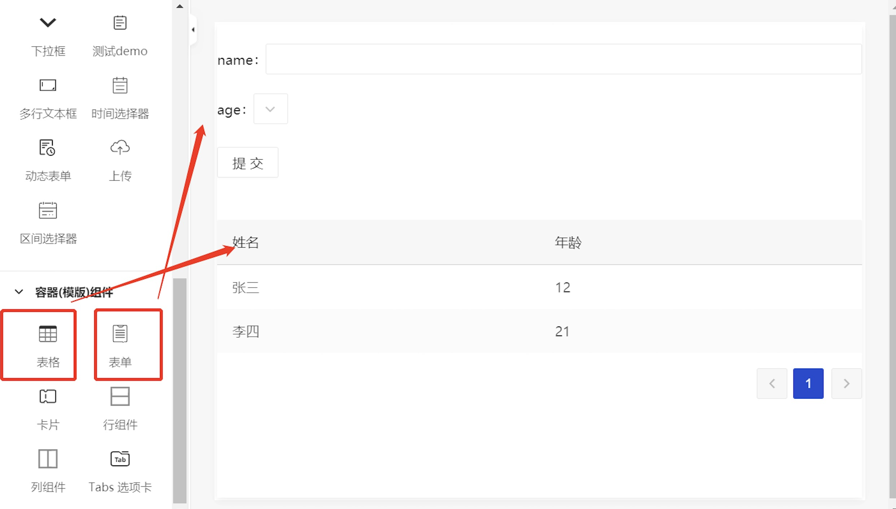

2、接下来，将组件的名称通过页面编辑器右侧的组件属性修改为自己需要的名称。
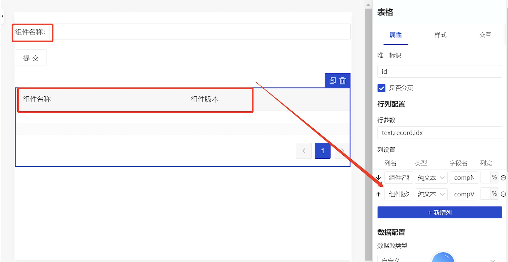

3、动作配置中的处理方式代码配置，您可以在页面编辑器左侧选择数据源，然后选择加号，快速新建远程API。
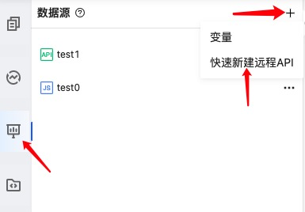

在新建远程API页面，可以看到以下选项，分别是：API名称、描述、自动保存、请求地址、请求方法、请求参数等。

- 在API名称处输入您要新建的API名称，这是必填项。
- 然后对API进行描述，该项为选填项。
- 输入您自己的**请求地址**（请求地址平台不提供，使用该平台的用户提供）用于页面加载数据，并且输入您的**请求方法**。
- 您在输入完毕之后，可以点击测试按钮，检查是否成功，如成功，在下方将会显示访问的数据，如不成功，将显示错误信息，重新输入。
- 这时候您还需要开启**自动保存按钮**，该按钮为您新建的API在后续做同步。

**新建远程API注意事项**

| 问题     | 解决方案                                                                                                                 |
|:-------|:---------------------------------------------------------------------------------------------------------------------|
| 接口跨域问题 | 添加接口时点击测试控制台出现CROS error，表示接口端服务不允许跨域访问，接口负责人需要处理允许跨域。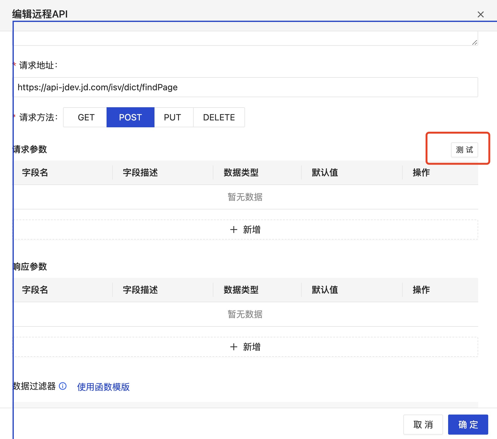 |
| 接口认证问题 | 添加的接口需要鉴权控制保证接口安全，用户可以通过在请求地址中、header中或者body中添加鉴权校验，后端接口服务认证                                                         |
| 接口结果映射 | 接口返回数据格式如果与页面展示需求不符，用户可以通过数据过滤器自定义代码转换成页面可接受的数据格式。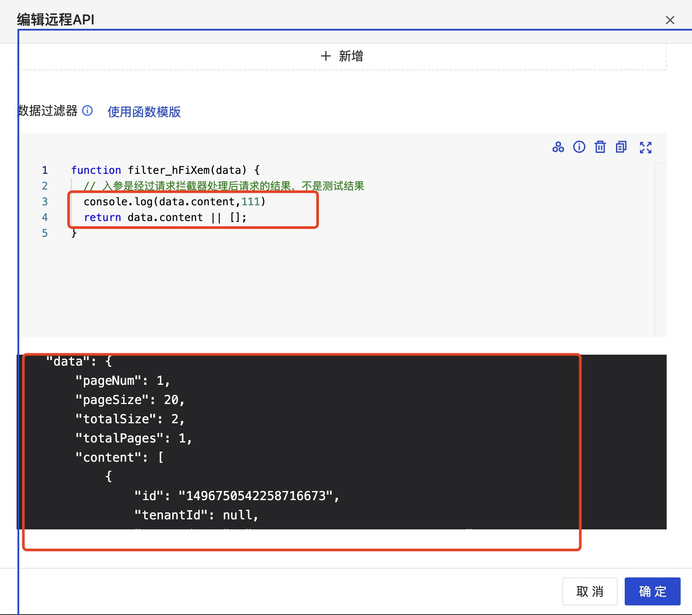     |

4、接下来，用户对表格组件的数据进行配置，在这里我们要实现表格组件的数据显示，这里需要选择之前配置好的数据源进行同步，我们选择test1数据源。
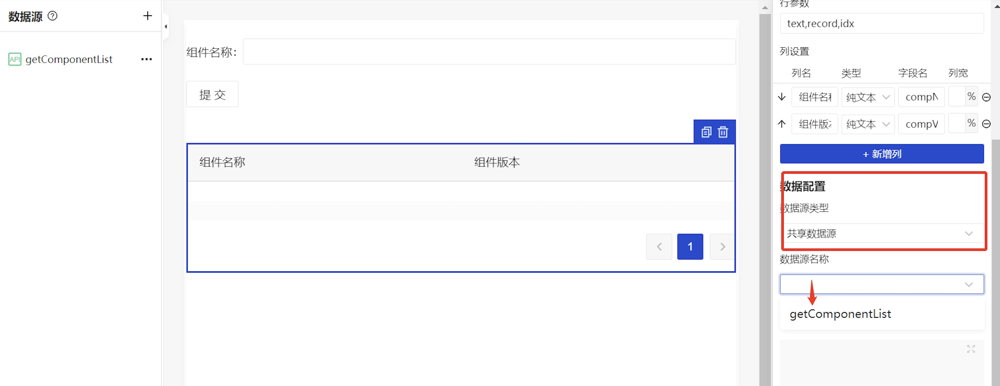

5、设置表格组件的交互动作。事件选择我们选择生命周期-加载，动作类型选择dispatch，处理方式选择数据源开头的Action，参数填写API所需要的参数。
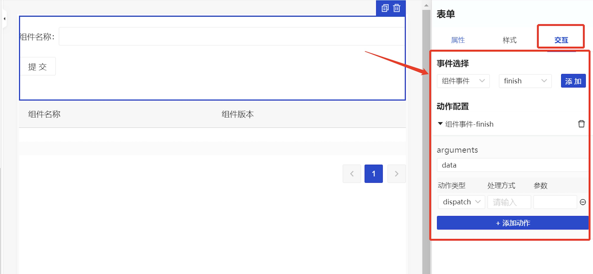

参数
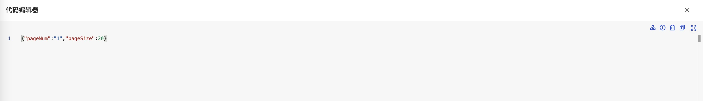

6、设置表格组件的交互动作。事件选择我们选择组件事件-click，动作类型选择dispatch，处理方式选择数据源开头的Action，参数填写API所需要的参数（参考第5步）。
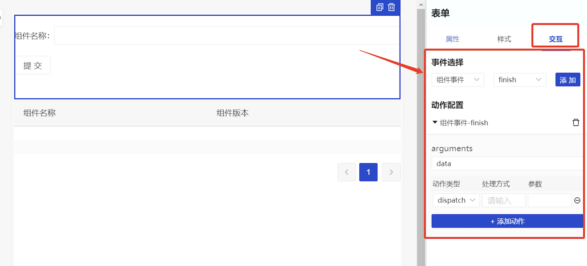

7、完成页面搭建，点击保存按钮，您也可以通过预览或者访问来查看页面搭建的整体效果。下图为搭建成功的效果。
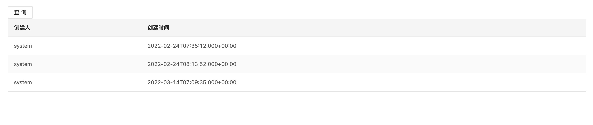

