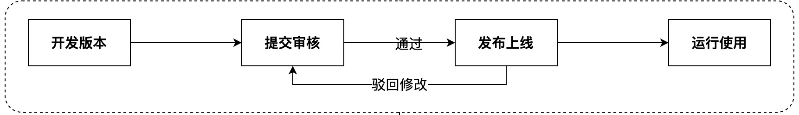
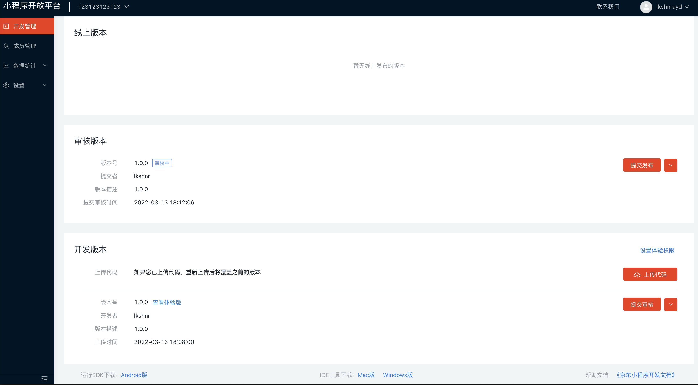

# 审核发布
   开发者登录小程序开放平台上传代码包并提交审核，后台会生成对应的开发版本，需要在开放平台对小程序提交审核，需要经过审核才能正式发布上线。
   

## 提交审核

   代码包上传成功后，并且小程序功能研发和测试完毕，通过点击“提交审核”，将当前的开发版本提交审核到JD侧管理员。可以在审核版本中看到，当状态为“审核中”时，可以点击“提交发布”右侧的按钮撤回审核。
   
   当审核不通过时，可以撤回审核，根据不通过原因修改后再次提交审核。

## 运营发布

   代码审核通过后，需要手动点击“提交发布”，小程序才会发布到线上提供服务。提交发布成功之后，就可以在"线上版本"查看该小程序的发布信息。
