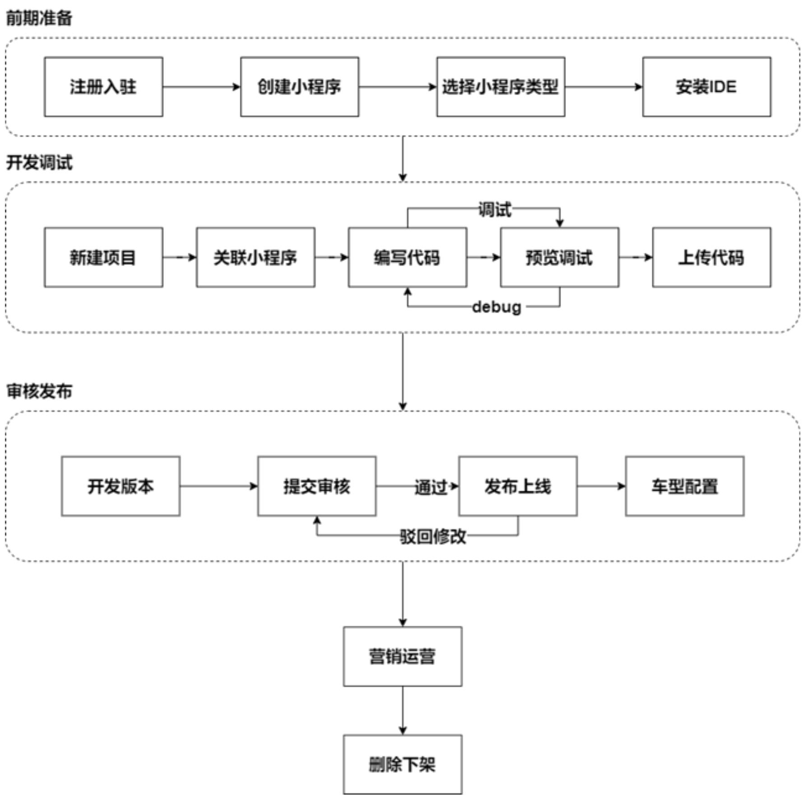
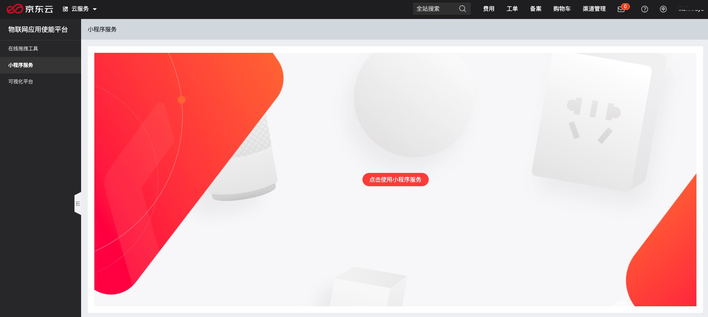
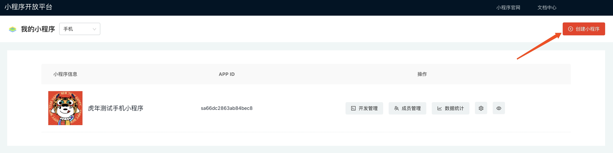
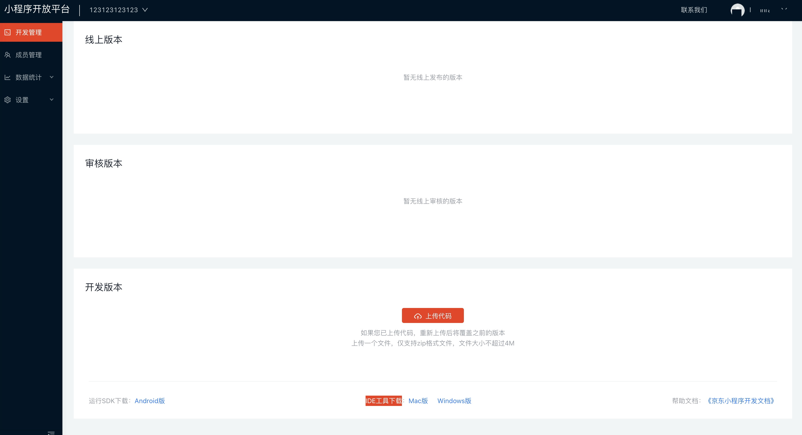

# 创建小程序
   开发操作流程
   

## 前提条件
[账号实名认证](../Precondition.md)

## 创建小程序

1. [登录控制台](../ControllPage.md)

2. 进入"小程序服务"

   点击控制台左侧的“小程序服务“菜单后，点击”点击使用小程序服务“或者图片您都可以进入到“小程序开放平台
   

3. 创建小程序

   进入“小程序开放平台”后，您可以点击右上角"创建小程序"，选择小程序类型，创建自己的第一个小程序
   

4. 安装IDE

   创建成功后您可以在列表页面看到自己已经创建成功的小程序。点进"开发管理"，您可以进入到"小程序开放平台"-"开发管理"。
   点击最下方"IDE工具下载"，安装IDE  
   