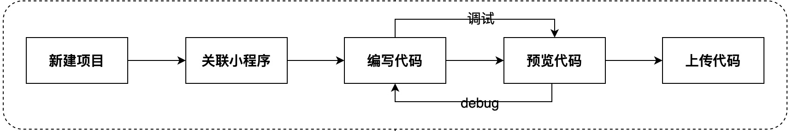
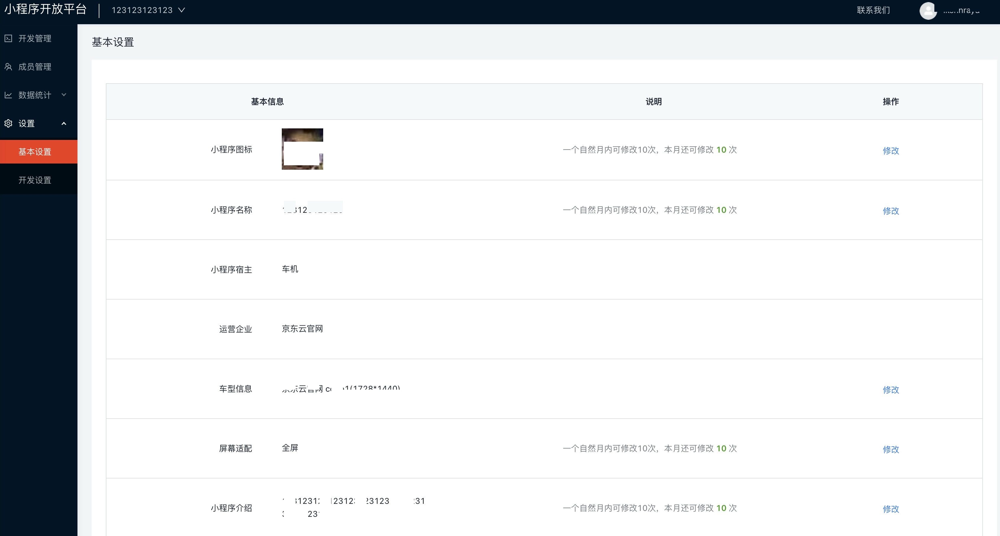
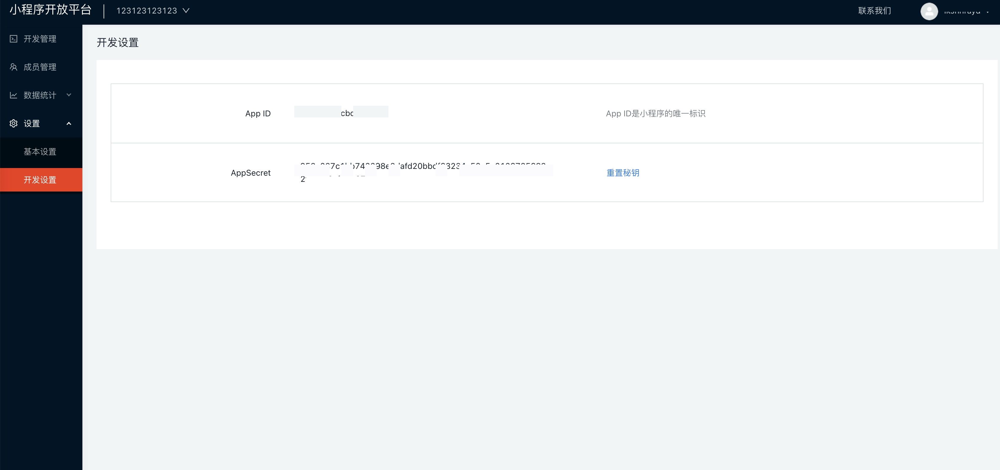
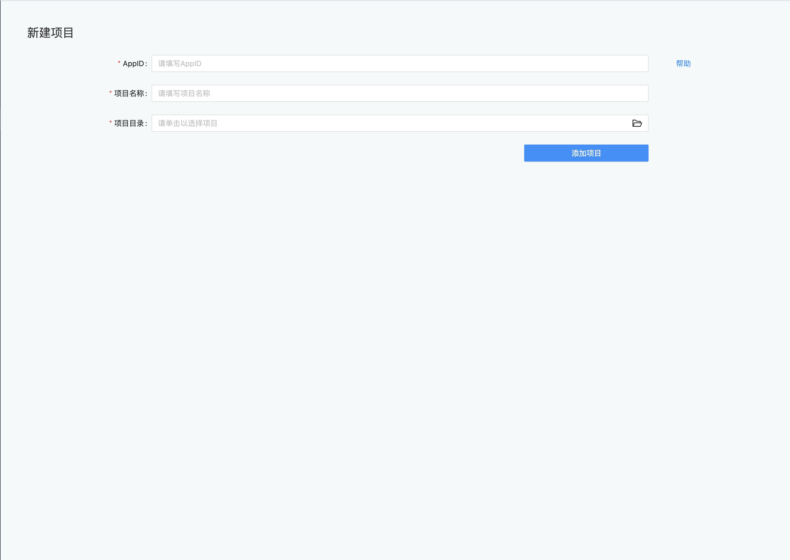
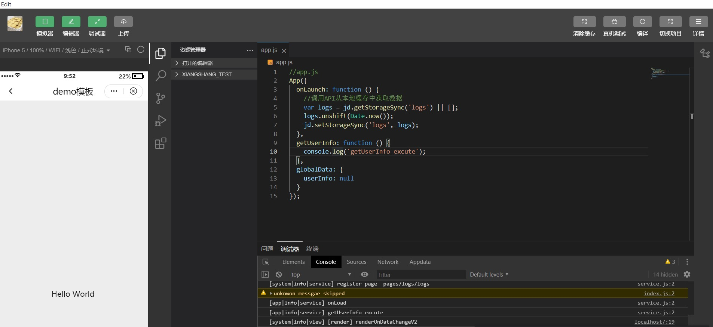
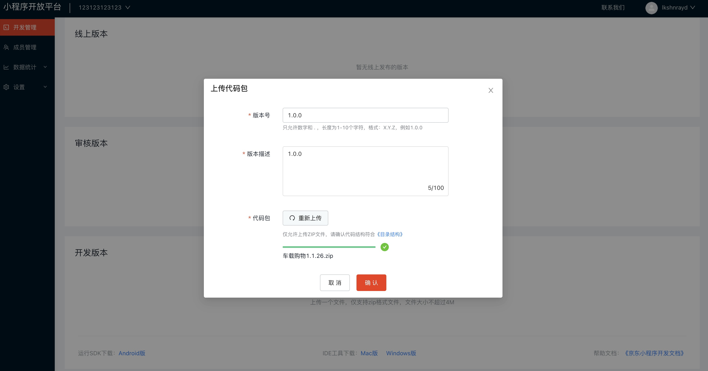
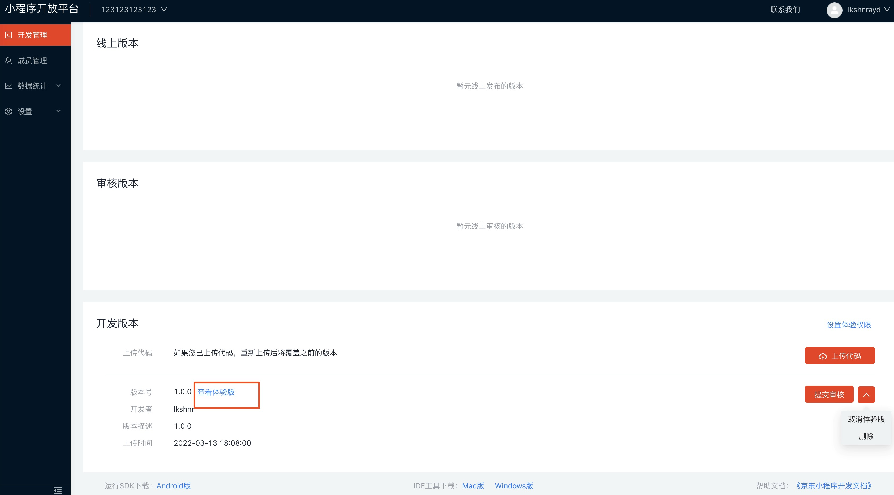

# 开发小程序
   小程序的开发工作在 IDE 中展开。以下是开发环节的基本流程
   

## 小程序设置
   小程序为开发者提供了小程序设置的功能，可以进行小程序信息的展示和修改，包括基本设置和开发设置

1. 基本设置

   创建小程序后，进入“设置”中进行基本设置可以为下一步开发做准备。
   

2. 开发设置

   创建小程序后，可以进入“设置”中进行开发设置。其中小程序的AppID是小程序的唯一标识，小程序秘钥可以重置。
   

3. 数据统计

   包括累计总用户数，新增用户数，活跃用户数，小程序访问数的昨日数据、环比数据和指标曲线等。

## 关联小程序

   进入IDE主界面之后，IDE会通过弹窗提示登录账号。由于每个账号可以拥有多个小程序的开发权限，因此需要关联后台具体的小程序AppID。
   

## 开发小程序

   开发者可以在 [小程序开发文档](https://iot-aep-mp.s3.cn-north-1.jdcloud-oss.com/mp-develop_reference-1.0.2.pdf) 上了解小程序的框架、组件与API。 小程序开放平台为开发者提供快捷API、及组件预览工具，可在项目开始前对小程序开发进行了解。

## 调试预览

   在开发过程中，小程序的运行效果会在主界面右侧的模拟器中显示。由于模拟器尚未支持全部API，因此还需要使用真机来预览与调试小程序的实际运行情况。
   
   

## 上传代码

   在完成开发之后，可以通过两种方式上传

   1、点击IDE工具栏左侧的上传工具，在弹出菜单中再点击上传按钮，本地代码将会上传至后台。
   

   2、点击"小程序开放平台"-"开发管理"最下侧开发版本，上传代码压缩包。
   

   在提交审核之前可以将您的小程序设置为体验版本，让部分用户先体验小程序。
   