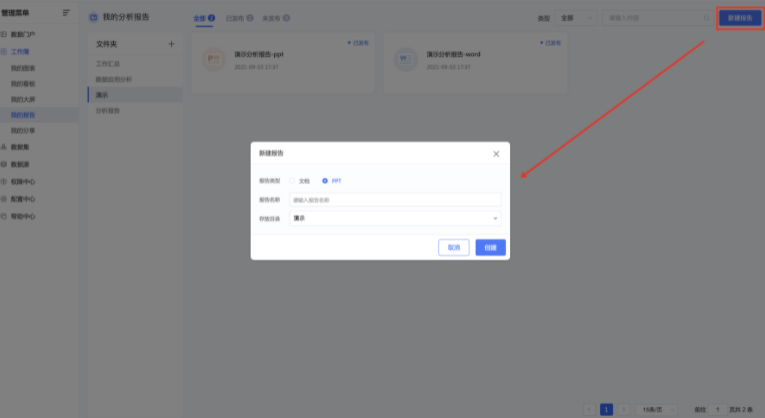
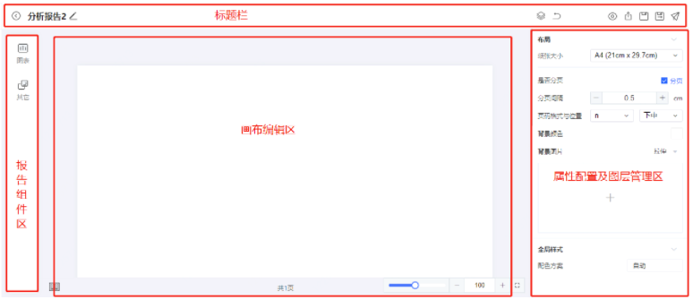
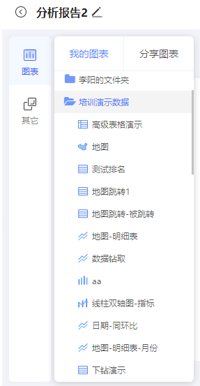
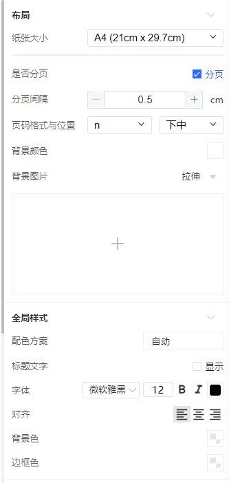
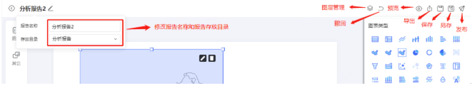
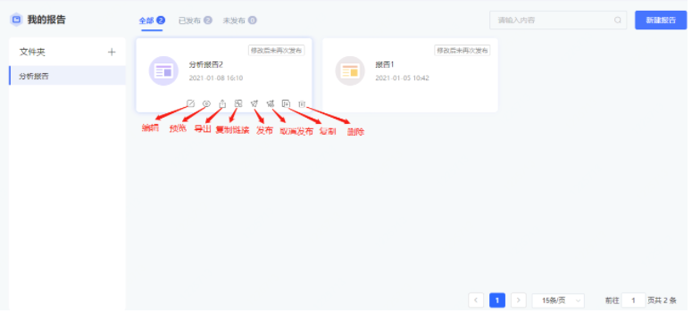

## 分析报告

### 1、新建分析报告

菜单中打开【工作簿】-【我的报告】

点击页面右上角的 **新建报告** 可选择文档或者ppt 两种类型，根据用户需要创建对应类型文档；

弹出录入报告名称，选择报告所在文件夹

 **提示**

与 **数据图表**、**看板**、**数据大屏** 、**分析报告** 模块同样不支持多级文件夹功能，只能设置一级文件夹。

 

### 2、报告工作区

进入分析报告的编辑页面，页面分为4个区域

- **标题栏**：左侧为分析报告文件名称和文件所属文件夹编辑；右侧为分析报告的图层管理、撤回、预览、导出、保存、另存为、发布等常规操作；

- **分析报告组件区**：页面组件区，包括 **图表组件**、**其他组件** 两个部分；

  - **图表组件**：包括 **当前用户** 创建并 **已经发布** 的所有图表和其他用户共享过来的图表；

  - **其他组件**：包括 **文本** 、**web**、**图片**附加组件；

- **属性配置及图层管理区**：包括报告基础属性配置区（包括布局配置、全局样式、数据更新等操作）和图层管理区（包括图层上移、下移、置顶、置底、删除等操作）；

- **报告画布编辑区**：是编辑报告内容的主要区域。主要操作是将 **组件区** 中的组件，拖拽到 **画布编辑区** 进行展示。并支持在 **属性配置区** 调整 **组件的布局**、 **基础样式** 、**图表类型与图表属性**等等；

- **组件设置**：画布编辑区支持组件托拉拽操作、调整缩放比例、组件快捷删除、图表组件编辑、组件大小调整等功能；

 

### 3、添加图表和组件

从 **报告组件区** 中，选择要加入画布内的图表或组件，并 **拖拽**到 **编辑区**即可

 

### 4、配置报告属性

在**属性配置及图层管理区**配置分析报告属性，包括**布局** 、**全局样式**配置。

当点击报告中图表或组件时，页面右侧**属性配置区**将展示当前选中图表或组件的可配置属性，如图表组件的配置区如下图所示，包括**图表标题**、**基本设置**、**图表属性**、**组件样式**。

### 5、预览、保存、另存和发布

在分析报告页面的**标题栏**右侧，可预览、保存、另存和发布报告。

 

### 6、分析报告文件夹管理

在分析报告文件列表页，鼠标移动到报告文件上，显示基本操作按钮；主要包括以下操作：

**编辑**：点击进入报告编辑页面；

**预览**：点击进入报告预览页面；

**导出**：点击导出PDF版本的分析报告；

**取消发布**：对于已发布的分析报告，点击该按钮可取消发布；对于保存未发布的大屏，此处为 **发布** 按钮，点击可发布；

**复制**：在列表中复制此报告，跳转到编辑页面，再次编辑后可直接保存，默认复制后的报告文件名为“XXX_副本”；

**复制链接**：在列表中复制报告链接，可将此链接共享给其他用户，其他用户访问该链接；或者将链接添加到门户中，用户通过门户访问此分析报告；

**删除**：点击删除并确认后，将删除分析报告。

