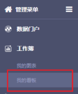
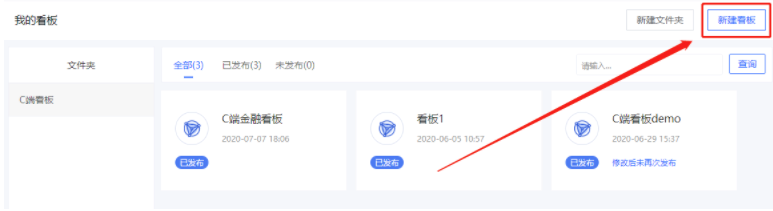
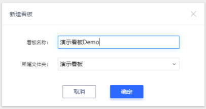
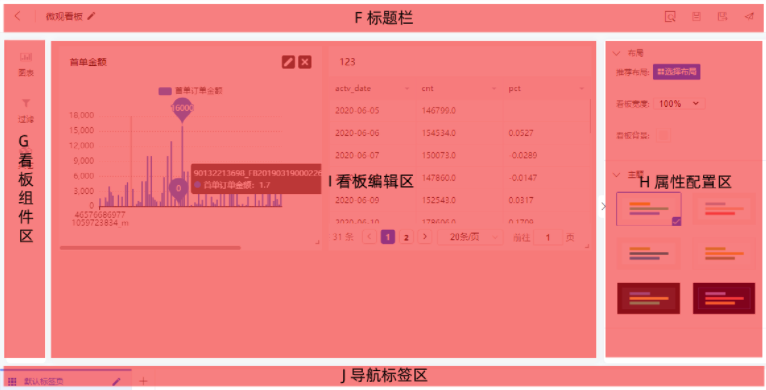
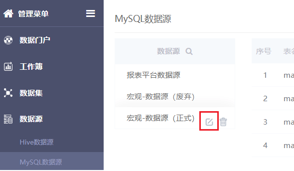
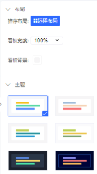
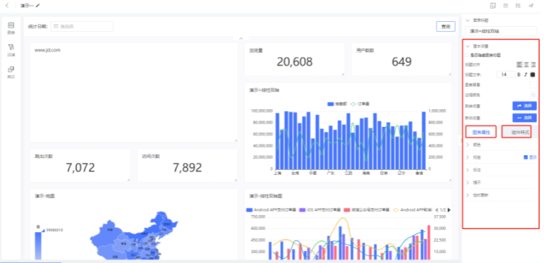
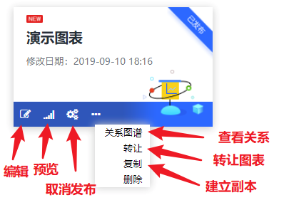
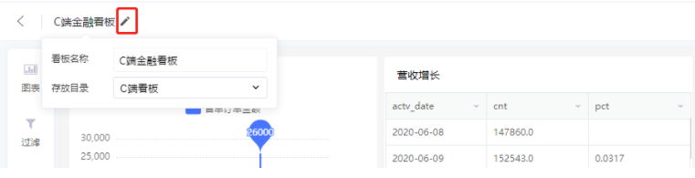

## 数据看板

### 1、新建看板

要使用数据看板，依次打开【工作簿】-【我的看板】

点击页面右上角的 **新建看板**

在弹框中数据新看板的名称，并选择新看板保存的文件夹位置，点击 **确定**。

 **提示**

与 **数据图表** 类似，**数据看板** 模块同样不支持多级文件夹功能，只能设置一级文件夹。

 

### 2、看板工作区

然后进入看板编辑的页面，页面分为5个区域：

- **F区**：右侧有对看板的常见操作；

- **G区**：页面组件区，包括 **图表**、**过滤组件** 和 **其他组件** 三个部分；

  - **图表**：包括 **当前用户** 创建并 **已经发布** 的所有图表；

  - **过滤组件**：包括 **时间**、**文本** 、**数值**等过滤组件，如下 **下拉框**、**模糊搜索输入框**等；
  - **其他组件**：包括 **文本框**、**图片框** 、**Web框** 和 **填充占位**；

- **H区**：包括多种看板可视化设置工具，如 **快速布局**、**看板主题**等；

- **I区**：是编辑看板内容的主要区域。主要操作是将 **G区** 中的组件，拖拽到 **I区** 进行展示。并支持在 **I区** 调整 **组件的大小**、 **多个元素之间的位置** 、**多个组件之间连接箭头**等等；

- **J区**：当图表加入到看板后，如对图表进行修改，此处会出现看板和图表两个标签页。通过点击，可以快速回到看板编辑页面中，而不需要做多次页面跳转。

 

### 3、添加图表和组件

从 **G** **看板组件区** 中，选择要加入看板的图表或组件，并 **拖拽**. 到 **I** **看板编辑区** 即可。

 

### 4、配置看板属性

在**H 属性配置区**配置看板属性，包括**布局**和**主题**配置。

为了更简便的调整看板中的内容布局，数据看板模块提供了辅助数据看板布局的功能，包括使用推荐布局、设置看板宽度、看板背景。同时，可以通过选择看板主题，快速统一看板中所有内容的配色方案。

当点击看板中某一图表或组件时，页面右侧**H 属性配置区**将展示当前选中图表或组件的可配置属性，如图表组件的配置区如下图所示，包括**图表标题**、**基本设置**、**图表属性**、**组件样式**。

 

### 5、预览、保存、另存和发布

在数据看板页面的**F区标题栏**右侧，可预览、保存、另存和发布看板。

 

### 6、再次编辑看板

在看板列表页，点击看板卡下方编辑按钮，即可再次编辑看板，编辑完成后点击保存暂存，点击发布更新已发布的看板。

### 7、修改看板名称和存放目录

在看板编辑页面左上角，点击铅笔按钮，即可修改看板名称和存放目录。

