## 数据图表

### 1、新建图表

在数据集列表页可以直接创建图表，还可以在图表列表页创建图标。

点击进入【工作簿】-【我的图表】

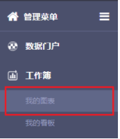

打开 **我的图表** 页面后，页面的主要部分展示的是按照 **文件夹** 管理的现有图表。

**提示：**

**数据图表** 模块不支持多级文件夹功能，只能设置一级文件夹。

在左侧点击选择所在文件夹，然后点击页面右上角的 **新建图表** 按钮，即开始在该文件夹下创建新的图表。

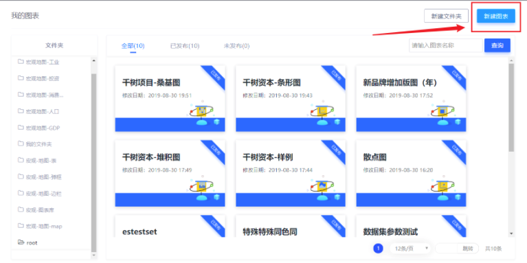

点击后，页面即跳转到图表配置页面。对于新建图表的操作，系统会自动弹出 **选择数据集** 弹窗。在弹窗中选择配置图表所用的数据集。

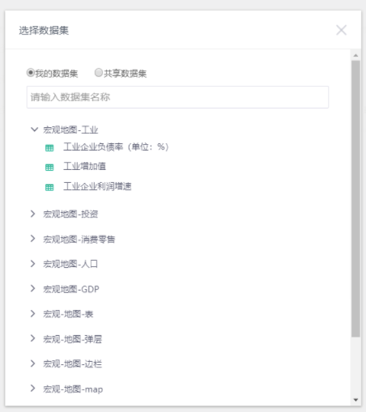

 **提示**

如果在列表中，找不到想要使用的数据集，请返回数据集模块，检查对应的数据集是否已经发布。仅保存而未发布的数据集，不会出现在这个列表中。

 

### 2、图表工作区

选择了数据集之后，就正式进入图表编辑页面了。整体的页面布局如下：

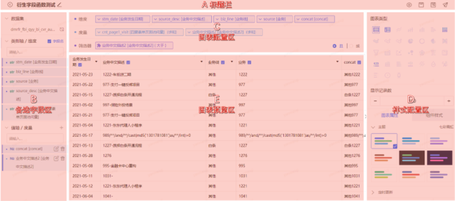

其中：

- **A区**：包含对图表的常见操作；
- **B区**：从数据集中取出了所有字段，并 **根据名称和字段的数据类型** 自动归类为 **类别轴 / 维度** 和 **值轴 / 度量** 两个类别；
- **C区**：可将A区中的备选字段拖拽到B区中的维度、度量或筛选器位置，用来配置图表中的数据和数据本身的展示样式；
- **D区**：主要是图表的基本信息，以及与可视化相关的配置项。例如字符大小、边距大小等等；
- **E区**：主要是图表预览区域。在B区和C区的配置修改，将会实时展示到这个区域；

**提示**

B区中的字段虽然自动分成了 **维度** 和 **度量** 两类，但是并不会限制用户将字段拖拽到C区的位置。也就是说，B区中被认为是度量的字段，在C区中也可以作为维度使用；对于维度字段也是同样。

 

### 3、配置字段

图表字段的基本操作如下图演示：

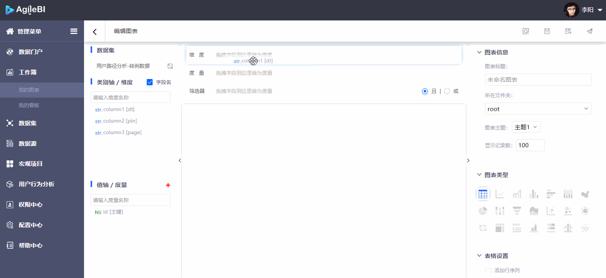

针对 **度量** 和 **维度** 两类字段，[**Agile BI**](http://bi.jd.com/main?a=2) 平台分别提供了快速配置菜单。

点击字段区域左侧的 **下箭头** 图标，可以展开菜单。

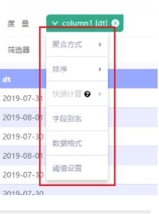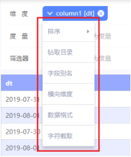

 

当字段被拖拽到 **筛选器** 位置时，将会自动弹出 **筛选配置窗口**。可选择筛选字段的数据类型，以及筛选条件的具体逻辑。

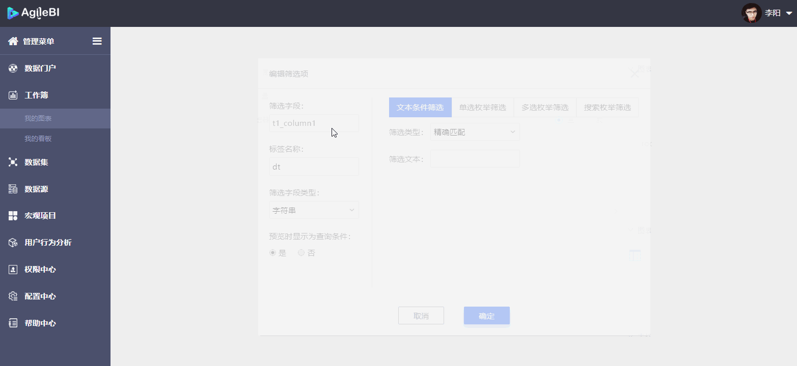

 

### 4、选择图表类型

图表编辑页面右侧 **D** **样式配置区** 可以选择图表类型。

- 图表类型如果是 **彩色** 的，意味着当前的度量和维度的数量，能够支持这种图表类型；
- 图表类型如果是 **灰色** 的，则意味着当前的度量和维度的数量，不能支持这种图表类型；

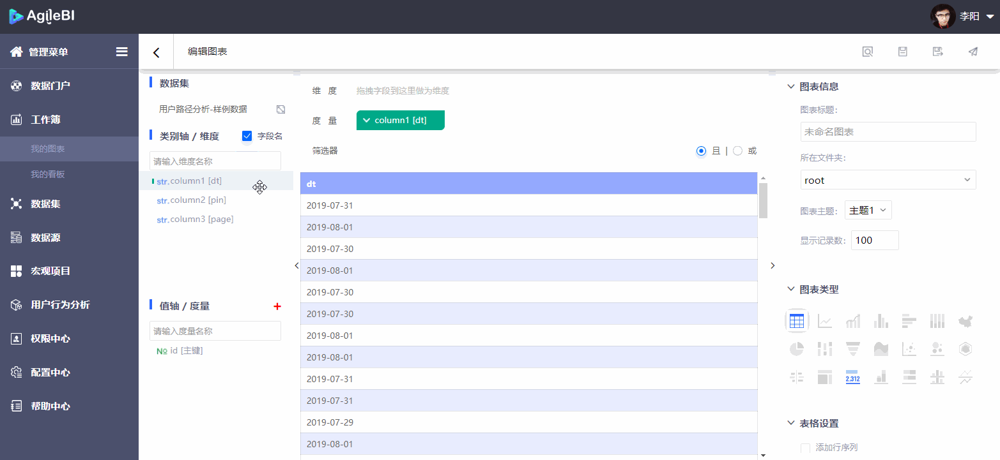

当鼠标指向特定的图表类型时，会展示这种图表类型需要的度量和维度的数量。

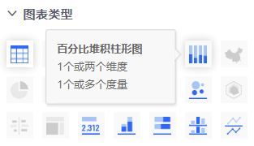

这里特别说明一下**桑基图**的配置方法：

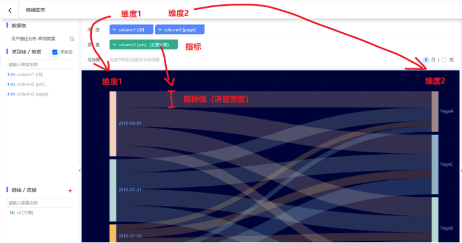

 

### 5、设置图表属性

**D 样式配置区**给出了图表的可视化配置选项。

图表默认显示100条数据记录，您可自行修改显示记录数。

通过点击 **图表属性**、**组件样式** 标签，可以切换配置项目。在 **D区** 上方选择不同的图表类型，将对应下方不同的属性、样式配置项，一些常见的配置项如下：

**图表属性**：主题、颜色、标签、标注、提示、定时更新、图标备注等

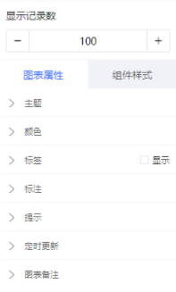

**组件样式**：图例、坐标轴、网格线、画布设置等

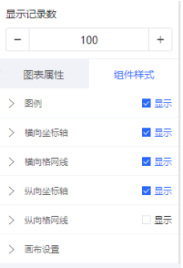

 

### 6、预览、保存、另存和发布

当完成了相关配置之后，就可以在页面的E区看到图表的最终效果：

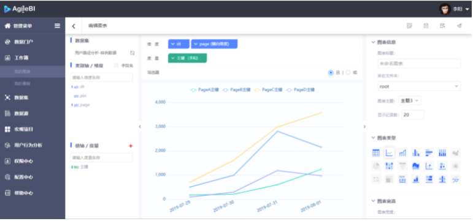

 **提示**

如果最近修改过数据集，并发现数据集中的数据未更新，请返回数据集模块，检查对应的数据集在修改之后是否再次发布。

当完成了图表配置之后，就可以进行图表的 **保存** 和 **发布** 了。

与数据集类似，页面的右上角提供了 **预览** 、 **保存** 和 **发布**按钮。

同时，为了快速创建相似的图表，图表还提供了 **另存** 功能。也就是创建一个当前图表的副本，并且初始配置与当前的图表相同。

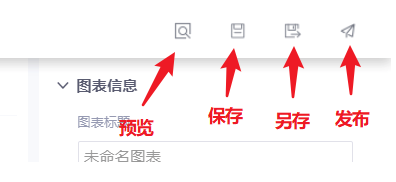

 

### 7、再次编辑图表

要编辑图表，可以在 **我的图表** 页面，找到图表对应的卡片，点击卡片下方的 **编辑** 按钮：

 

### 8、修改图表名称和存放目录

点击 **标题栏** 左侧的编辑按钮，展开输入框，可以在此修改 **看板名称** 和 **存放目录**。

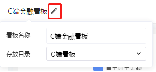