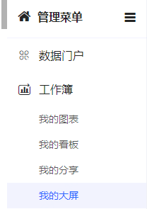
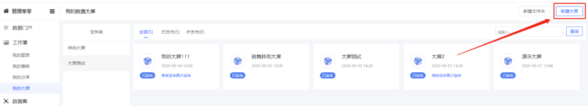
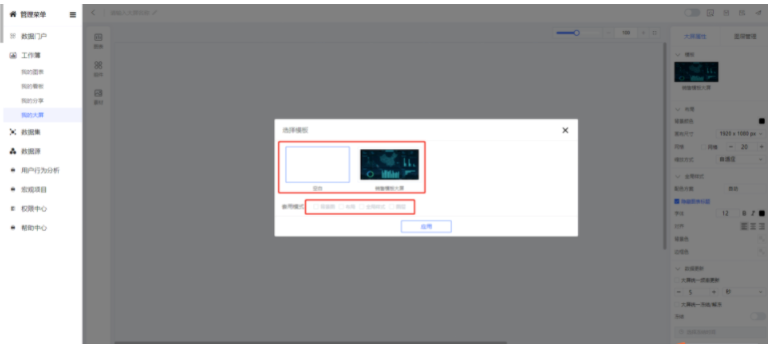
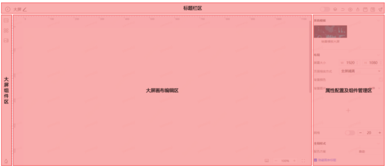
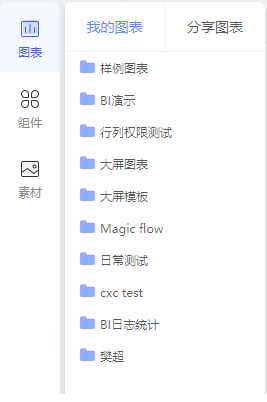
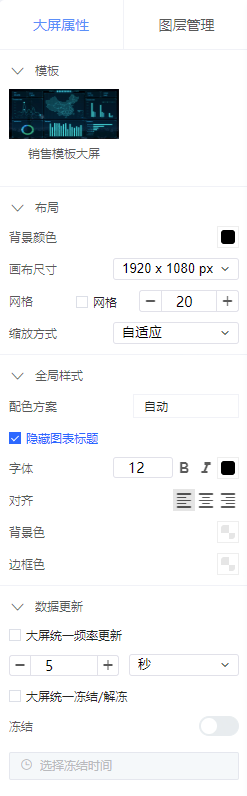
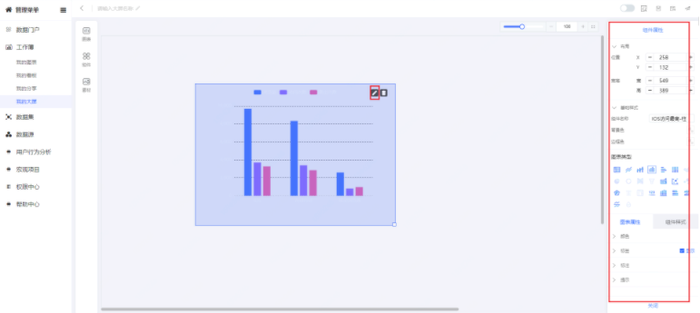
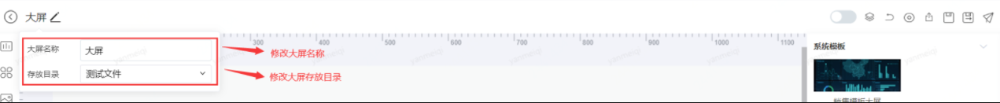
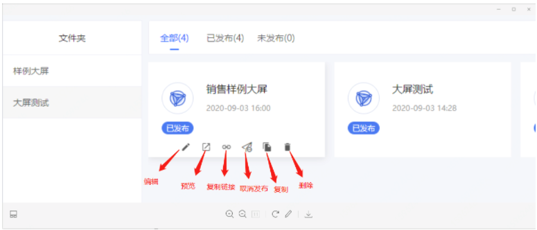

## 数据大屏

### 1、新建大屏

要使用数据大屏，依次打开【工作簿】-【我的大屏】

点击页面右上角的 **新建大屏** ；

弹出选择模板弹框，默认选中空白，用户可根据自身需求选择自己需要的模板，可选择模板套用的内容：背景图、布局、全局样式、图层；点击**应用**，跳转至大屏编辑页面；

 **提示**

与 **数据图表**、看板类似，**数据大屏** 模块同样不支持多级文件夹功能，只能设置一级文件夹。

 

### 2、大屏工作区

然后进入看大屏编辑的页面，页面分为4个区域：

- **标题栏**：左侧为大屏文件名称和大屏文件所属文件夹编辑；右侧为大屏常用预览、保存、另存为、发布等常规操作；

- **大屏组件区**：页面组件区，包括 **图表组件**、**附加组件** 和 **素材组件** 三个部分；

  - **图表组件**：包括 **当前用户** 创建并 **已经发布** 的所有图表和其他用户共享的图表；

  - **过滤组件**：包括 **时间**、**文本** 、**web**、**图片**、**矩形容器**等附加组件；
  - **素材**：包括 **背景图片**、**装饰** ；

- **属性配置及图层管理区**：包括大屏基础属性配置区（包括模板选择、布局配置、全局样式、数据更新等操作）和图层管理区（包括图层上移、下移、置顶、置底、删除等操作）；

- **大屏画布编辑区**：是编辑看板内容的主要区域。主要操作是将 **E区** 中的组件，拖拽到 **I区** 进行展示。并支持在 **I区** 调整 **组件的大小**、 **多个元素之间的位置** 、**多个组件之间连接箭头**等等；

- **大屏画布编辑区**：画布编辑区支持组件托拉拽操作、调整缩放比例、组件快捷删除、图表组件编辑、组件大小调整等功能；

 

### 3、添加图表和组件

从 **大屏组件区** 中，选择要加入大屏的图表或组件，并 **拖拽**. 到 **大屏编辑区**即可。

### 4、配置大屏属性

在**H属性配置及图层管理区**配置大屏属性，包括**模板** 、**布局** 、**全局样式**和 **数据更新**配置。

当点击看板中某一图表或组件时，页面右侧**H 属性配置区**将展示当前选中图表或组件的可配置属性，如图表组件的配置区如下图所示，包括**图表标题**、**基本设置**、**图表属性**、**组件样式**。

 

### 5、预览、保存、另存和发布

在数据大屏页面的**F区标题栏**右侧，可预览、保存、另存和发布大屏。

### 6、大屏文件管理

在大屏文件列表页，鼠标移动到大屏文件上，显示大屏基本操作按钮；主要包括以下操作：

**编辑**：点击进入大屏编辑页面；

**预览**：点击进入大屏预览页面；

**取消发布**：对于已发布的大屏，点击该按钮可取消发布；对于保存未发布的大屏，此处为 **发布** 按钮，点击可发布；

**复制**：在列表中复制此大屏，跳转到编辑页面，再次编辑后可直接保存，默认复制后的大屏文件名为“XXX_副本”；

**复制链接**：在列表中复制大屏链接，可将此链接共享给其他用户，其他用户访问该链接，登录erp即可访问已发布的大屏；

**删除**：点击删除并确认后，将删除大屏。

