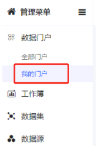
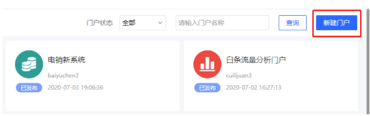
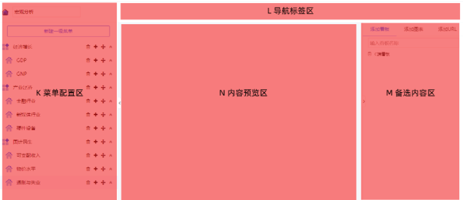
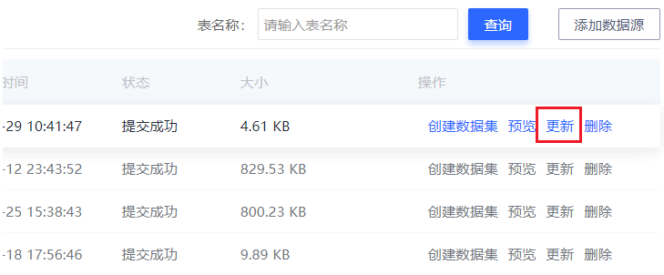
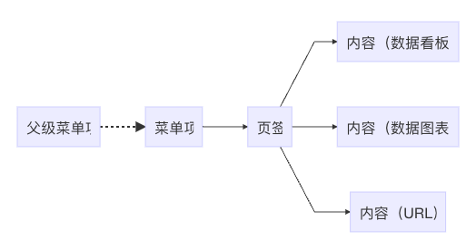
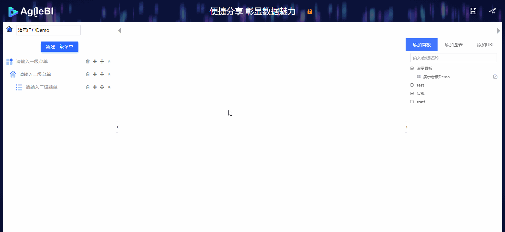
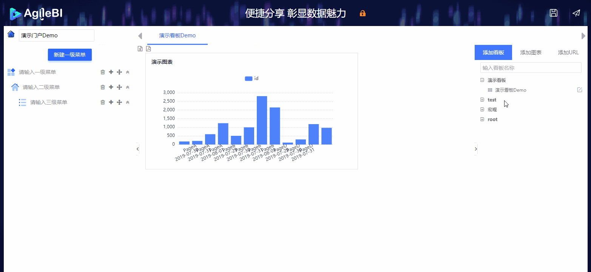
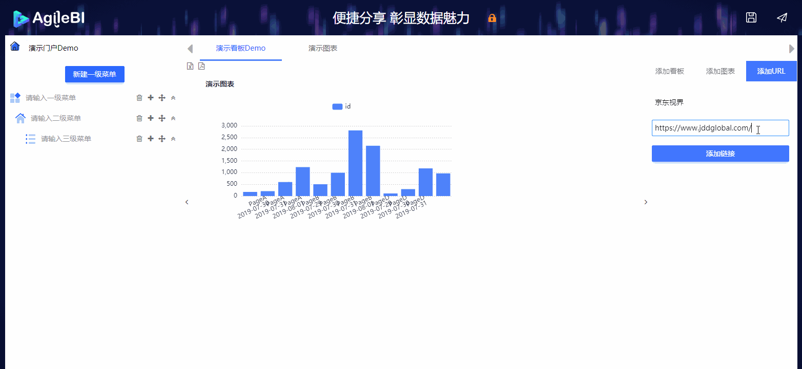
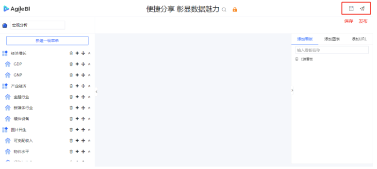
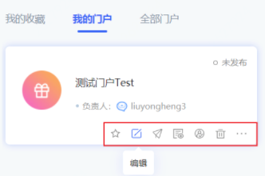

## 数据门户

### 1、新建门户

要创建数据门户，依次打开：【数据门户】-【我的门户】

在数据门户列表页点击页面右上角的 **新建门户** 按钮，并在弹窗中 **输入门户名称** ，即可开始创建门户。

 

### 2、门户工作区

新建数据门户之后，看到的是如下的数据门户配置页面。

- **K区**：在这个区域里，可以设置数据门户的**菜单结构**；
- **L区**：添加到某个菜单项的多个数据看板，会在此处显示**页签导航**；
- **M区**：这个区域列举的所有可供加入到数据门户中的内容，包括**数据看板**、**数据图表**及**URL**；
- **N区**：此处可以预览加入到门户中的内容；

 

### 3、修改门户名称

在门户编辑页面的左上角输入框中，可直接修改门户名称。

 

### 4、添加菜单

门户中的内容之间关系为：

**数据门户** 支持 **四级菜单** （ 计算页签的话一共**五级**结构 ）。各级菜单的添加方法如下：

 **提示**

页签不能与子菜单同级。例如，如果一个 **一级菜单** 下已经存在 **至少一个二级菜单** 了，就不能在这个 **一级菜单** 下再 **数据看板** 或 **数据图表** 等组件了。

否则会提示：无法新建，因存在与之平级的图表或看板或模块或url！

### 5、添加图表、看板、URL

完成门户菜单的编辑后，选中指定的菜单项，就可以在该菜单项之下添加 **数据看板** 或 **数据图表** 等组件了。

在 **K** **菜单配置区** 中选中某个菜单项后，在 **M** **备选内容区** 中选择要添加的组件。

**M 备选内容区** 中的备选组件是按照文件夹组织的，文件夹的结构与 **我的看板** 或 **我的图表** 中的目录结构一致。

在 **M** **备选内容区** 中找到要添加的 **数据看板** 或 **数据图表** 之后，**单击** 即可添加到当前门户菜单下，并以 **页签** 的方式展示。

同样的方法，可以从 **M** **备选内容区** 的 **添加图表** 中，选择图表添加到当前菜单项当中。

当同一个菜单项中添加了多个组件时，可以通过 **页签** 进行导航。

通过拖拽 **页签** ，可以轻松调整组件的摆放顺序。

如果想要在 **数据门户** 中，加入一些已经存在的系统页面，形成一个更完整的运营门户，可以使用 **添加URL** 功能。

在 **M** **备选内容区** 选择 **添加URL** ，并输入页面名称和URL地址，并点击 **添加链接** ，即可在当前菜单项中，添加一个已经存在的页面。

### 6、保存和发布

**保存**和**发布**操作按钮在门户编辑页面的右上角。

**数据门户** 的 **发布** 操作与 **数据看板** 、 **数据图表** 和 **数据集** 略有不同。

点击页面右上角的 **发布** 按钮之后，选择发布到 **PC端**。

 

### 7、再次编辑门户

在门户列表页，每个每户标签右下方的操作中点击编辑按钮，可进入门户编辑页面，再次编辑已经存在的门户。

