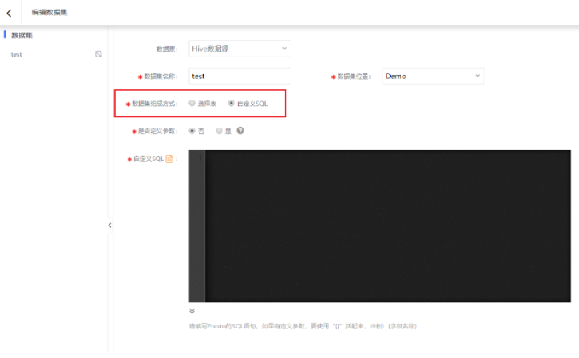
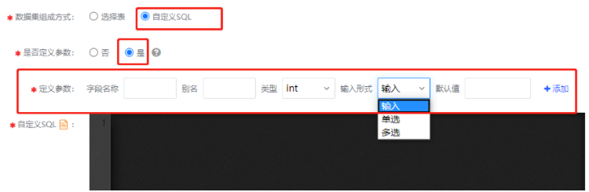
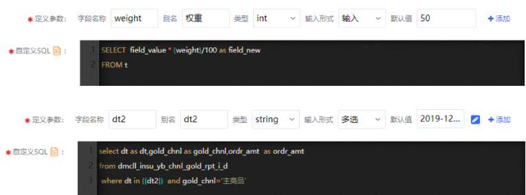

### 自定义SQL方式

创建数据集的入口有2处：数据源页面和数据集页面，页面右上角均有 **创建数据集** 入口。

提供了两种配置数据集的方式：**选择表** 和 **自定义SQL**。

其中**自定义SQL方式**，需sql基础，通过编写数据加工的SQL语句，来完成数据集的创建，可定义和引用参数。

 **注意**

Agile BI的查询引擎采用了 **Presto** 查询引擎，SQL语法参照 **Presto SQL**。

首先，需要在添加数据集页面（或在编辑数据集时）

- **数据集组成方式** 应选择 **自定义SQL**；



切换之后，页面中显示SQL语句的编辑窗口，并在编辑窗口上方展示是否定义参数的切换选项。

 

#### 1、不带参数的SQL语句

不带参数的语句也就是最普通的SQL语句，在是否定义参数中选择 **否**，由 **SELECT**、**FROM**、**WHERE**、**GROUP BY** 等子句构成的 **数据查询语句**。常见的形式如下：

 

```
[ WITH with_query [, ...] ]

SELECT [ ALL | DISTINCT ] select_expr [, ...]

[ FROM from_item [, ...] ]

[ WHERE condition ]

[ GROUP BY [ ALL | DISTINCT ] grouping_element [, ...] ]

[ HAVING condition]

[ { UNION | INTERSECT | EXCEPT } [ ALL | DISTINCT ] select ]

[ ORDER BY expression [ ASC | DESC ] [, ...] ]

[ LIMIT [ count | ALL ] ]
```


 

#### 2、带参数的SQL语句

为了实现更灵活的数据计算逻辑，我们支持在SQL语句中加入自定义参数。

带参数的SQL语句主要应用场景：

**在数据处理过程中，某些信息无法穷举，只能在用户使用时再提供**。例如：利率、占比、基数等数值型指标，就无法在编写数据集的时候计算，而是要等到用户实际使用的时候，才能确定这些指标的取值应该是多少。

如Sql中where条件包含类似 interest/cost={rate}，用户可手动输入利率数值，参与底层数据集筛选或计算，图表也随着数据变化展而变化。

 **提示：**

图表编辑和预览时，SQL语句参数控件将作为数据筛选组件，用户可切换参数查询条件，影响数据集和图表的结果；

看板上的筛选组件只能与数据集中的字段对应，与参数无关。

首先，需要在添加数据集页面（或在编辑数据集时）

- **数据集组成方式** 应选择 **自定义SQL**；
- **是否定义参数** 应选择 **是**；

配置完成后，就能看到在SQL编辑框的上方，展示了配置查询参数的工具。



其中的各项配置项为：

- 字段名称：指的是在SQL语句中**引用该参数**时使用的名称；
- 别名：指的是用于展示在前端交互页面上的名字，用来让最终的用户明白参数的含义，在图表中展示数据参数控件时使用；
- 类型：指的是数据类型，可以从 **INT** 和 **STRING** 两种类型中选择，整型和字符串；
- 输入形式：指用户在图表中使用数据参数时的输入参数值方式，包括**输入、单选、多选**；
- 默认值：指的是参数的默认值；

配置好参数之后，即可在SQL语句中引用参数加入计算。如下为两个简单的包含参数的SQL语句样例：



如果需要在SQL语句中使用多个参数，则需要点击右侧的 **添加** 按钮。之后的配置方法与第一个参数相同。

数据处理的sql编写完，可点击**预览**按钮，查看数据。

保存和发布数据集，后续可使用发布后数据集创建可视化图表，进一步完成数据分析和探索。

如果sql报错，将无法保存和发布数据集，请按提示更改。