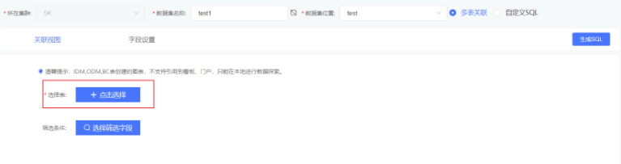
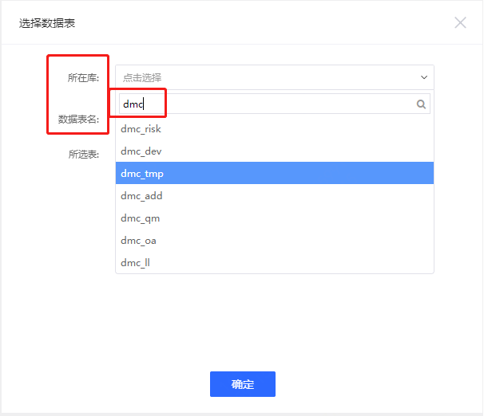
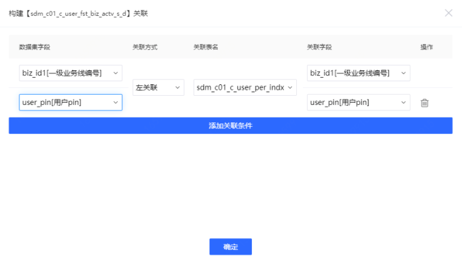
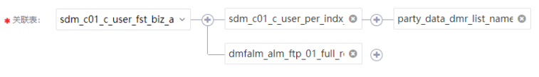
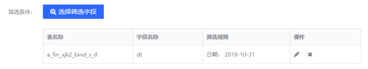
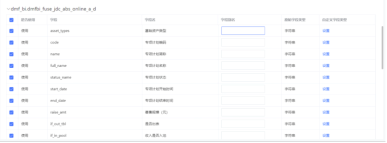
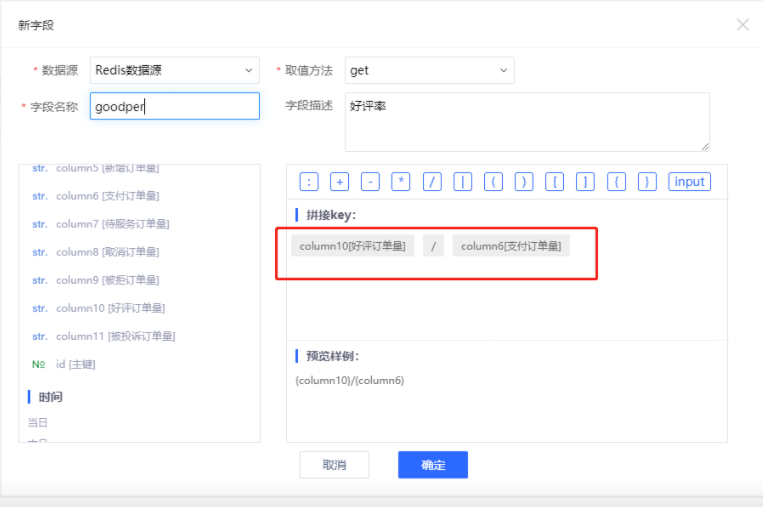

### 选择表界面操作方式

创建数据集的入口有2处：数据源页面和数据集页面，页面右上角均有 **创建数据集** 入口。

我们提供了两种配置数据集的方式：**选择表** 和 **自定义SQL**。

其中**选择表是界面操作方式**，无需sql基础，就是以最简单的 **点选** 方式创建数据集。

#### 1、选择表-数据集引用表

**选择表**，点击 **点击选择** 按钮

即可在弹框中选择用来加工数据集的数据表，先选择数据库，再选择数据表，支持模糊搜索：

每点击选择一张表，会添加到下方**所选表**，则为选中状态，可重复点选添加多张表，支持已选表删除取消选择：

完成 **选择表** 的操作之后，点击 **确定** 按钮。

可基于已选表来创建多表间的关联关系，如需使用一张表，则跳过关联表步骤。

#### 2、关联表-多表关联

第一步中若选择了多张表，可以编辑多表之间的关联逻辑。基本的操作如下图：

关联表的下拉选择，可从已选表中按需选择哪张表作为主表。

要建立多表之间的关联关系，点击表名右侧的 **加号** 图标，就会弹出配置表关联条件的弹窗。如下图所示：

其中 **数据集字段** 和 **关联字段** 即为关联条件用到的字段，数据集字段来自主表，关联字段来自从表即关联表；

**关联方式** 中可以选择 **左关联（LEFT JOIN）** 或者 **内关联（INNER JOIN）** 两种关联方式；

在 **关联表名** 中选择的数据表，即为关联右侧的数据表。例如，在 **LEFT JOIN** 的关联方式中，即为 **右表** 。

为了建立较为复杂的关联关系，可以点击 **添加关联条件** 按钮。在多个关联条件之间， **关联方式** 和 **关联表名** 是共用的，而关联字段可以自由选择，支持设置多个关联条件。

当我们想要去除新加入的关联条件是，点击右侧的垃圾桶图表即可删除这条关联条件。

**提示**：多条关联条件之间，是 **且** （**AND**）的关系;如需配置复杂的多张表关联关系，可点击表右侧的 **加号** 图标，配置对应关联条件，此处不再赘述。

****

 

#### 3、筛选条件

**筛选条件** ，在使用mysql数据源这种数据量较大的表时，尤为关键，类似sql中的where条件，合理的筛选将过滤冗余数据，缩小数据集的体量，提高查询速度和后续可视化图表看板的响应速度，一举多得。

选择筛选字段，编辑筛选项配置筛选规则，提供字符串、时间、数字三种配置方式，类似图表中筛选器。可编辑和删除已配置筛选条件，按需添加多个筛选条件；

**注意：**

添加多条筛选规则，多个规则之间是**and**关系。

**多张表，需每个表分别添加筛选条件**。

对T+1更新的数据，如需动态取**昨日**数据，可配置dt分区筛选条件如下图。注意：此配置后若表数据更新不及时，会造成当天查看昨日数据空白。也可设置动态取**近几日**等，请按实际需求场景合理配置。

 

#### 4、选择字段

**选择字段** ，在表字段很多但仅需使用部分字段时使用，类似于sql语句中的select，合理的选择同样将过滤冗余数据，缩小数据集的体量，提高查询速度和后续可视化图表看板的响应速度，一举多得。

勾选字段为数据集引用字段，取消字段将不引用。**默认全量字段选中，不需要使用的字段手动取消勾选**。

#### 5、添加计算字段

添加计算字段是基于现有表中数据添加简单计算，衍生新的字段用于后续数据分析和可视化。

例如添加销售利润，好评订单比率等，如下图：

 

 **提示**

数据集和图表均支持添加计算字段的情况下，如果在后续分析可视化频繁使用，建议在数据集环节添加计算字段，前置此操作，可节约成本，避免每张图表编辑时都临时添加一遍。