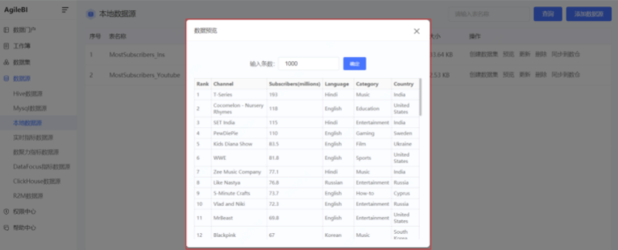
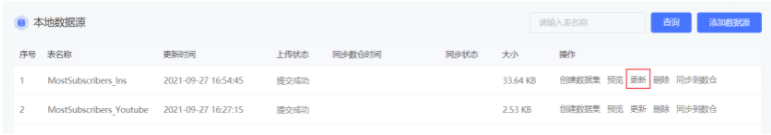

### 本地数据源

本地数据源，支持Excel文件或CSV文件，帮助用户灵活处理本地数据，完成后续数据探索、数据可视化。

#### 1、 添加数据源

依次点击【数据源】-【本地数据源】，点击页面右上角**添加数据源**，即可添加本地数据源。

#### 2、 预览上传的数据

在已经上传的本地数据源列表中，点击 **预览** 按钮。

即可在弹框中预览已经上传的Excel文件或CSV文件当中的数据内容。

#### 3、 更新上传的数据

相对于来源于MySQL数据库的数据，本地数据源并不会 **自动更新** ，而是需要经过 **人工**操作才会 **被动更新** 。

要更新已经上传的数据，在列表中点击表名右侧的 **更新** 按钮。

在弹窗中，选择并上传包含新数据的Excel文件或CSV文件。对于文件内容的要求，除了添加数据源时的要求以外，还需要补充一条：**数据文件中的表结构，必须与已经上传的数据表表结构相同。**

否则，页面上会展示提示：更新文件的表结构与原表结构不兼容。

对于本地数据源的更新，我们提供了两种更新方式： **覆盖** 和 **追加** 。

- **覆盖** 方式，指的是新上传的数据内容，将会替换原来已经上传的数据内容；即上传之后，之前的数据内容将被丢弃；
- **追加** 方式，指的是在已上传的数据的基础上，再补充新上传的数据内容；即上传之后，原有的数据内容与新上传的数据内容将同时存在；

 **备注**：我们默认采用 **追加** 的方式更新本地数据源。

数据源更新之后，可以再次采用前面的办法，查看更新后的数据源。

#### 4、 删除上传的数据源

在本地数据源列表页，点击表名右侧的 **删除** 按钮并在弹窗中点击确认，即删除该数据源。

#### 5、 创建数据集

本地数据源列表中，每个数据源右侧提供了基于本地数据源创建数据集的快捷入口，本地数据源创建数据集比其他类型数据源略简，可在上传数据基础上添加筛选条件。

 **注意：** **暂不支持** 将本地数据源中的数据，与MySQL数据源中的数据混合使用，即跨数据源类型的关联暂不支持。