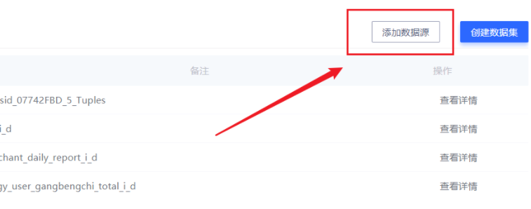
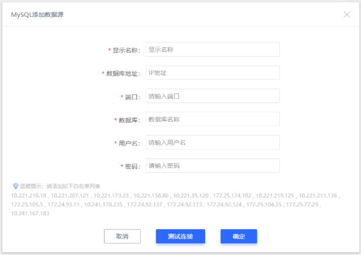
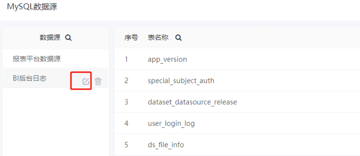

### MySQL数据源

#### 1、添加MySQL数据源

依次选择【数据源】-【MySQL数据源】，点击页面右上角的 **添加数据源** 按钮：

在弹窗中填写MySQL数据库的各项信息：

 **注意**：其中 **数据库** 一项一定不要填错。保存后，这一项将无法修改！用户名和密码会在收到的审批邮件中提供。

填写完成后，可以点击弹窗下方的 **测试链接** 按钮。确认链接无误后，点击 **确定** 保存即可。

 

#### 2、修改数据源

已经存在的MySQL数据库连接，部分信息可以进行修改。

已经保存的MySQL数据源，会出现在左侧的列表中。鼠标指向一个MySQL数据源，会展示**修改按钮**。

点击后，在展示出的弹窗中，即可编辑MySQL数据源的配置信息。

在这些信息中，**添加数据源** 时填写的数据库名称时无法修改的。在页面上会置灰展示。

 

#### 3、查看详情-数据字典

已经添加的MySQL数据源，其中的所有数据表都会展示在页面中央的列表当中；点击表名右侧的 **查看详情** ，可以查看指定数据表的表结构信息。

 

#### 4、创建数据集

MySQL数据源页面的右上角提供了基于MySQL数据源创建数据集的快捷入口，创建数据集操作步骤详见**《数据集管理》**。

 