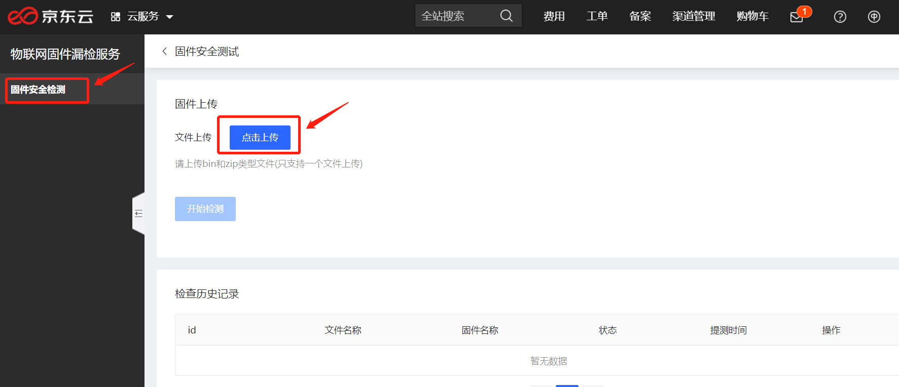
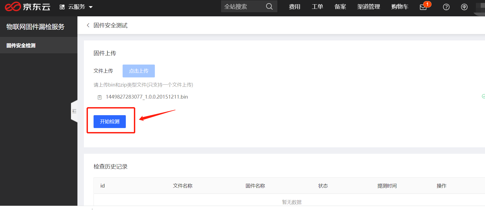
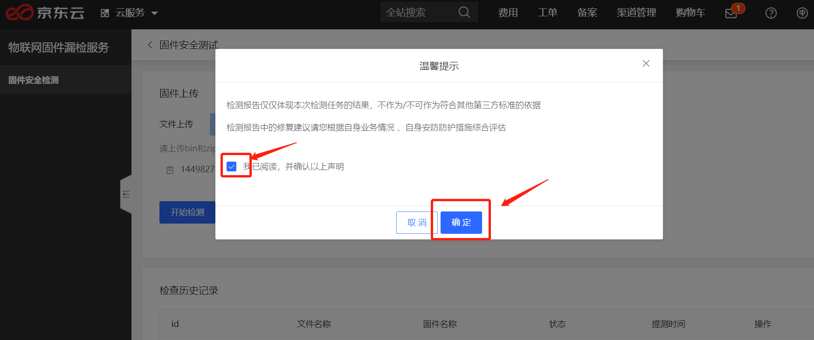
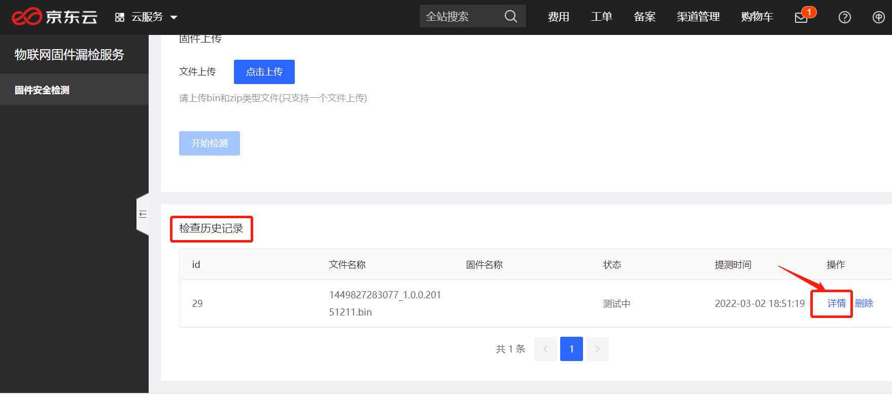
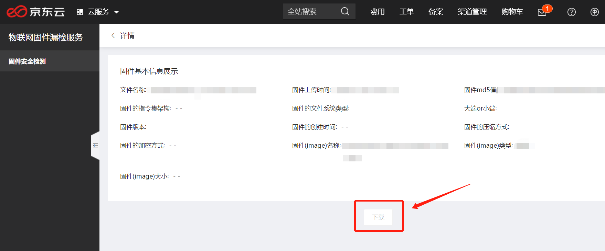

# 操作指南

## 第一步:账号实名认证
请确保您的京东云账号已经通过实名认证。
  
  
## 第二步:登录控制台

### 入口1：产品介绍页

1. 登录[京东云官网](https://www.jdcloud.com/) 。

2. 选择 **产品** -> **物联网** ->  **安全服务** -> **物联网固件漏检服务**。

3. 在产品介绍页，点击 **立即使用**,即可进入该服务控制台。

### 入口2：控制台
1. 登录[京东云官网](https://www.jdcloud.com/) 。

2. 选择 **控制台** 并登录，选择 **产品** -> **物联网** ->  **物联网固件漏检服务**，即可进入到该服务控制台。

  
## 第三步:上传固件
在**产品** -> **物联网** ->  **安全服务** -> **物联网固件漏检服务** 控制台的 **固件安全检测** 下载点击 **点击上传** 按钮即可上传固件。success代表上传成功。  

  
## 第四步:开始检测
固件完成上传后，单击**开始检测**，确认固件信息，勾选**我已阅读，并确认以上声明**，即可进行当前已上传固件的安全检测。  

  
## 第五步:查看检测报告
固件检测完成后，在下方的**检测历史记录**里，找到对应固件，点击**详情**即可查看检测报告。  

  
## 第六步:下载检测报告
在上步点击查看详情后，点击页面下方**下载**按钮即可下载检测报告。

