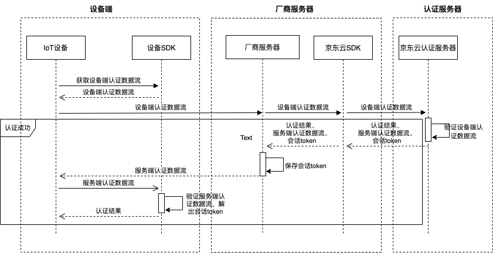

# 认证流程

本节介绍设备端、厂家服务器和认证服务器之间，进行IoT设备身份认证的简述流程。  

设备端发起设备身份认证的简述流程如下：

  

1. IoT设备通过设备SDK获取认证数据流。
2. IoT设备将设备端认证数据流传输至厂商服务器。
3. 厂商服务器将设备端认证数据流转发至认证服务器。
4. 京东云认证服务器验证设备端认证数据流，确认IoT设备身份，并返回认证结果。  
（1）认证成功，厂商服务器从京东云认证服务器获得认证结果、会话Token和服务端认证数据流。  
（2）认证失败，厂商服务器从京东云认证服务器获取认证失败原因。
5. 步骤4认证成功情况下，厂商服务器需要将京东云认证服务器返回的服务端认证数据流完整回传至IoT设备，同时记录会话 Token。 
6. IoT设备验证京东云认证服务器的服务端认证数据流，验证京东云认证服务器身份，并解出会话Token。
7. 可选：设备端和厂商服务器后续使用会话Token，对双方通讯数据进行加解密。