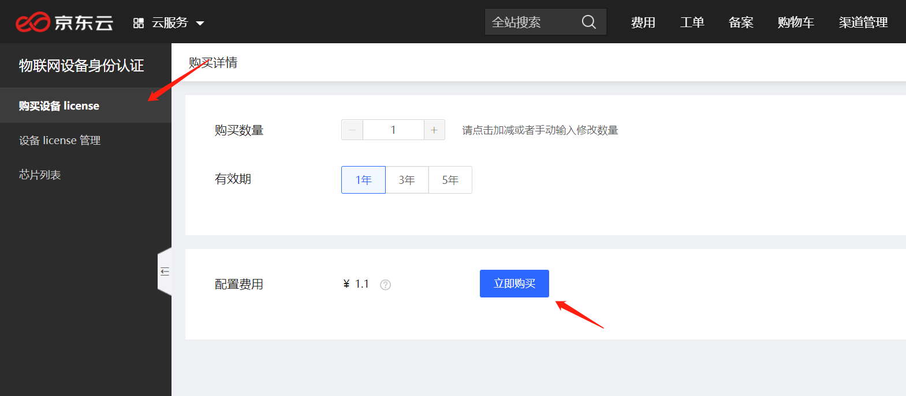
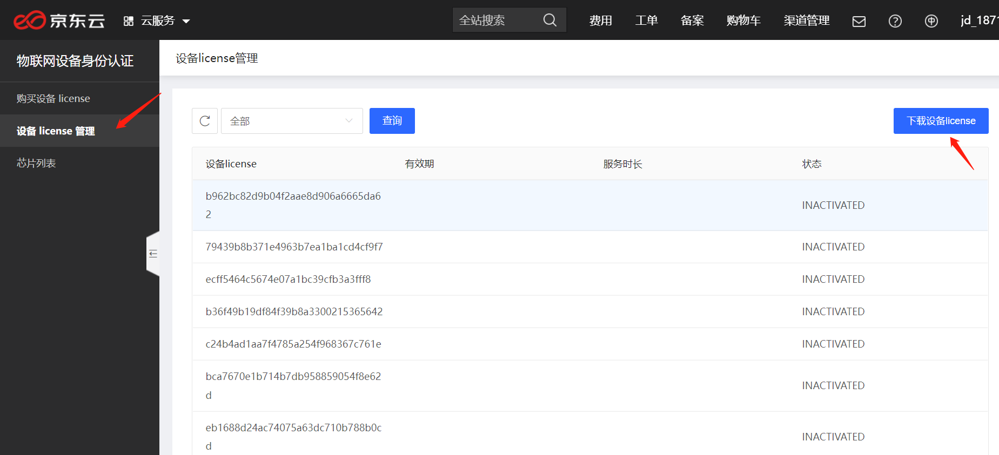

# 产品使用流程

## 1. 账号实名认证  
请确保您的京东云账号已经通过实名认证。

## 2. 购买设备license  
产品>物联网>安全服务>物联网设备身份认证，点击控制台的[购买设备license](https://deviceidentity-console.jdcloud.com/buy) ，您可以购买设备license。  

## 3.下载购买的license和对应的PSK  
产品>物联网>安全服务>物联网设备身份认证，点击控制台的[设备license管理](https://deviceidentity-console.jdcloud.com/list) ，下载购买的license和对应的PSK。  

## 4. 集成烧录
集成烧录请联系smartcloud@jd.com，我们将提供专业团队进行技术支持。

## 5. 设备身份认证SDK  
在帮助文档中的[《开发手册-设备接入》](../Developer-Guide/Device-Access.md)，下载设备身份认证SDK，并按照那个文档内容进行开发集成。

## 6. 厂商服务器对接认证服务器  
参考帮助文档的[开发手册-设备服务器对接京东云服务](../Developer-Guide/UserServer-To-JdCloudServer.md)部分进行开发集成。该步骤完成后，您就可以使用物联网设备身份认证服务了。

