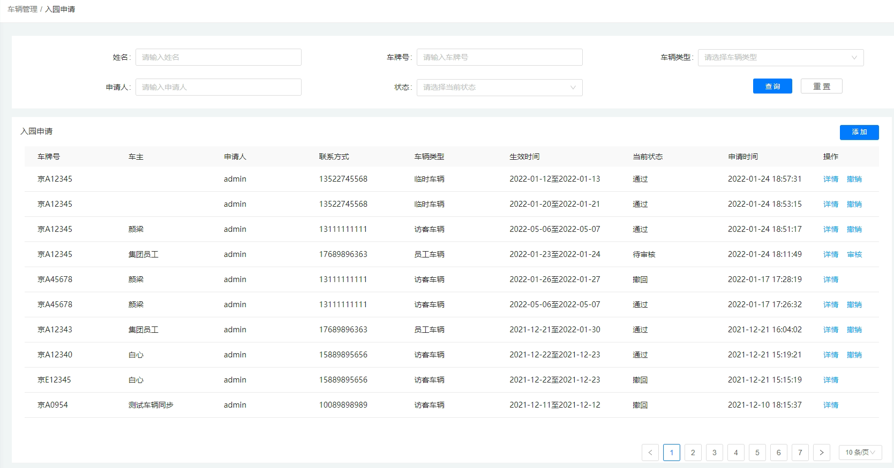
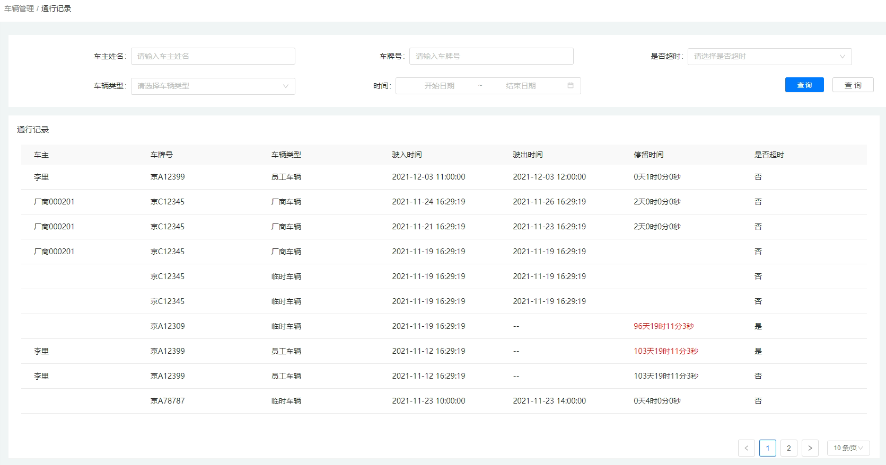
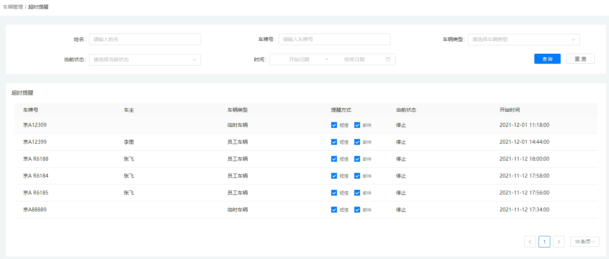
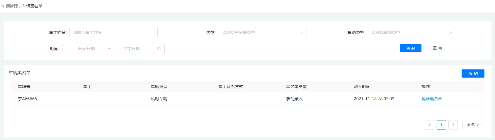

## 4.3车辆管理

### 4.3.1车辆入园

用户为车辆添加入园申请；按条件查询入园申请记录，查看申请时间，申请状态，联系方式等，点击【详情】查看申请人填写的具体信息，也可点击【撤销】申请。

### 4.3.2通行记录

对于在园区进出的所有车辆，门禁设备都会有检测记录，管理者可按条件查看具体的车辆通行过的出入口，停留时间，车牌号等信息，非常便于园区管理者核查车辆，保障园区有序运行。

### 4.3.3超时设置

若园区停车位比较紧迫，管理者需要对进入园区停留的车辆的时间长短做出相应的限定和管理，根据车辆类型等信息设定（修改）车辆在园区停留的时间长短，再采用邮箱、电话短信等方式去智能提醒用户，做出相应的反应。

### 4.3.4超时提醒

园区管理者可在此页面查看有哪些超时提醒车辆以及车辆具体的车主姓名、车牌号等信息；也可通过分析了解园区停车场的运行情况，做出相应的调整改变。

### 4.3.5车辆黑名单

园区对进入园区的车辆有一定的限制，必须符合园区的管理规定方可进入园区；若不符合，则被添加入黑名单中，黑名单中的车辆会被拒绝进入；管理员也可按条件搜索查询，为部分车辆解除黑名单。

