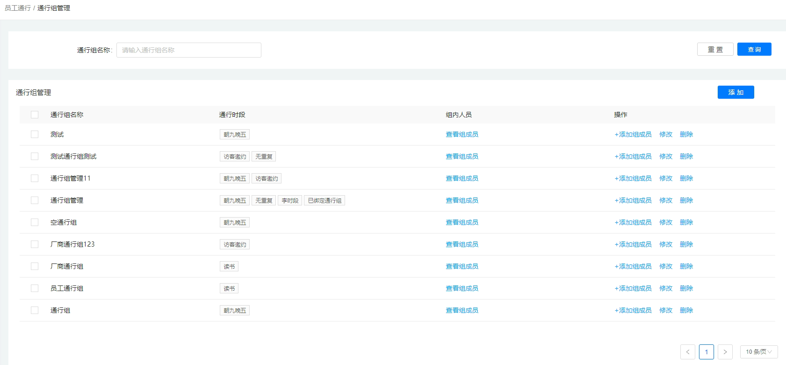
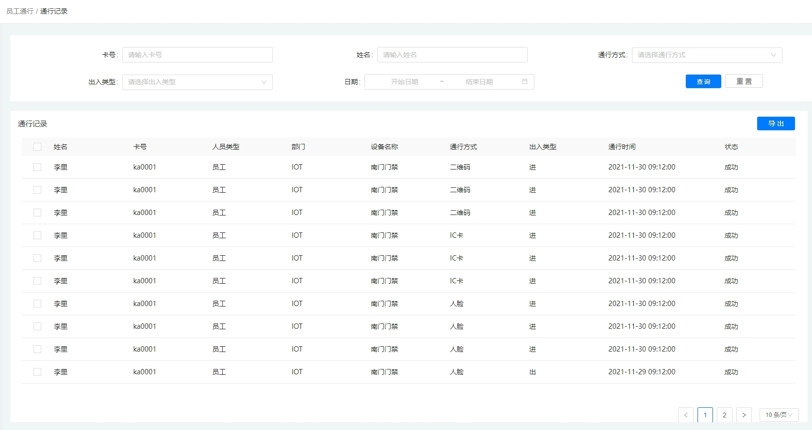
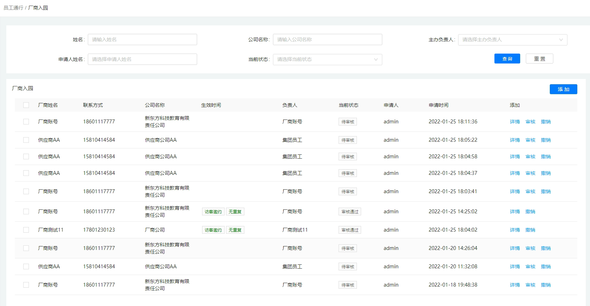

## 4.1员工通行

### 4.1.1通行组管理：

添加、查询和删除通行组与修改通行组内容，同样管理人员也可以查看拥有某个通行组权限的人员以及为某个通行组添加成员。

### 4.1.2通行记录

管理员可以按条件查询人员的通行记录查看具体通行时间、通行方式等并导出相应的具体数据。

### 4.1.3厂商入园

用户可以按条件查询厂商入园申请的记录，查看申请记录的具体状态、申请时间、申请详情以及撤销申请等，也可以为新厂商添加入园申请。

